# 前台接口文档
## 数据准备
### 数据库
```sql
/*
 Navicat Premium Data Transfer

 Source Server         : localhost_mysql8
 Source Server Type    : MySQL
 Source Server Version : 80031 (8.0.31)
 Source Host           : localhost:3307
 Source Schema         : accounting_system

 Target Server Type    : MySQL
 Target Server Version : 80031 (8.0.31)
 File Encoding         : 65001

 Date: 20/10/2024 19:13:33
*/

SET NAMES utf8mb4;
SET FOREIGN_KEY_CHECKS = 0;

-- ----------------------------
-- Table structure for menu
-- ----------------------------
DROP TABLE IF EXISTS `menu`;
CREATE TABLE `menu` (
  `id` int NOT NULL AUTO_INCREMENT COMMENT 'id',
  `name` varchar(255) DEFAULT NULL COMMENT '名称',
  `label` varchar(255) DEFAULT NULL COMMENT '标签',
  `icon` varchar(255) DEFAULT NULL COMMENT '图标',
  `url` varchar(255) DEFAULT NULL COMMENT '页面链接',
  `path` varchar(255) DEFAULT NULL COMMENT '链接',
  `parent` int DEFAULT NULL COMMENT '父级Id，没有父级为0',
  PRIMARY KEY (`id`)
) ENGINE=InnoDB AUTO_INCREMENT=32 DEFAULT CHARSET=utf8mb3;

-- ----------------------------
-- Records of menu
-- ----------------------------
BEGIN;
INSERT INTO `menu` (`id`, `name`, `label`, `icon`, `url`, `path`, `parent`) VALUES (1, 'main', '首页', 's-home', 'Home/Home', '/', 0);
INSERT INTO `menu` (`id`, `name`, `label`, `icon`, `url`, `path`, `parent`) VALUES (2, 'customer', '用户管理', 'user', NULL, NULL, 0);
INSERT INTO `menu` (`id`, `name`, `label`, `icon`, `url`, `path`, `parent`) VALUES (3, 'customerList', '管理员列表', 'setting', 'customer/customerList', '/CustomerList', 2);
INSERT INTO `menu` (`id`, `name`, `label`, `icon`, `url`, `path`, `parent`) VALUES (4, 'commonCustomer', '用户列表', 'setting', 'customer/commonCustomer', '/CommonCustomer', 2);
INSERT INTO `menu` (`id`, `name`, `label`, `icon`, `url`, `path`, `parent`) VALUES (6, 'calssifyManager', '分类管理', 'setting', NULL, NULL, 0);
INSERT INTO `menu` (`id`, `name`, `label`, `icon`, `url`, `path`, `parent`) VALUES (7, 'classifyList', '分类列表', 'setting', '/classify/list', '/classifyList', 6);
INSERT INTO `menu` (`id`, `name`, `label`, `icon`, `url`, `path`, `parent`) VALUES (8, 'dataManager', '数据管理', 'setting', '', NULL, 0);
INSERT INTO `menu` (`id`, `name`, `label`, `icon`, `url`, `path`, `parent`) VALUES (9, 'dataList', '数据列表', 'setting', '/data/list', '/dataList', 8);
INSERT INTO `menu` (`id`, `name`, `label`, `icon`, `url`, `path`, `parent`) VALUES (10, 'dataRestore', '数据恢复', 'setting', '/data/restore', '/dataRestore', 8);
INSERT INTO `menu` (`id`, `name`, `label`, `icon`, `url`, `path`, `parent`) VALUES (25, 'userInfo', '个人信息', 'user', '/upInfo', '/upInfo', 0);
COMMIT;

-- ----------------------------
-- Table structure for t_accountion_record
-- ----------------------------
DROP TABLE IF EXISTS `t_accountion_record`;
CREATE TABLE `t_accountion_record` (
  `id` int NOT NULL AUTO_INCREMENT,
  `user_id` int DEFAULT NULL COMMENT '用户Id',
  `classify_id` int DEFAULT NULL COMMENT '分类Id',
  `type` int DEFAULT NULL COMMENT '1支出 2收入',
  `price` decimal(10,2) DEFAULT NULL COMMENT '金额',
  `remark` varchar(255) DEFAULT NULL COMMENT '备注',
  `create_time` datetime NOT NULL DEFAULT CURRENT_TIMESTAMP COMMENT '创建时间',
  `update_time` datetime NOT NULL DEFAULT CURRENT_TIMESTAMP ON UPDATE CURRENT_TIMESTAMP COMMENT '修改时间',
  `delete` tinyint NOT NULL DEFAULT '0' COMMENT '0未删除1删除',
  `year` varchar(255) CHARACTER SET utf8mb4 COLLATE utf8mb4_0900_ai_ci DEFAULT NULL COMMENT '年',
  `month` varchar(255) CHARACTER SET utf8mb4 COLLATE utf8mb4_0900_ai_ci DEFAULT NULL COMMENT '月',
  `day` varchar(255) CHARACTER SET utf8mb4 COLLATE utf8mb4_0900_ai_ci DEFAULT NULL COMMENT '日',
  PRIMARY KEY (`id`) USING BTREE
) ENGINE=InnoDB AUTO_INCREMENT=9 DEFAULT CHARSET=utf8mb4 COLLATE=utf8mb4_0900_ai_ci COMMENT='收支明细';

-- ----------------------------
-- Records of t_accountion_record
-- ----------------------------
BEGIN;
INSERT INTO `t_accountion_record` (`id`, `user_id`, `classify_id`, `type`, `price`, `remark`, `create_time`, `update_time`, `delete`, `year`, `month`, `day`) VALUES (2, 1, 1, 1, 1000.00, '充话费', '2024-10-19 09:33:43', '2024-10-19 18:24:18', 0, '2024', '10', '19');
INSERT INTO `t_accountion_record` (`id`, `user_id`, `classify_id`, `type`, `price`, `remark`, `create_time`, `update_time`, `delete`, `year`, `month`, `day`) VALUES (3, 1, 2, 2, 90.20, '兼职', '2024-10-19 09:34:20', '2024-10-19 15:53:04', 0, '2024', '10', '19');
INSERT INTO `t_accountion_record` (`id`, `user_id`, `classify_id`, `type`, `price`, `remark`, `create_time`, `update_time`, `delete`, `year`, `month`, `day`) VALUES (4, 1, 1, 1, 100.00, '充话费', '2024-10-18 09:33:43', '2024-10-18 09:33:57', 0, '2024', '10', '18');
INSERT INTO `t_accountion_record` (`id`, `user_id`, `classify_id`, `type`, `price`, `remark`, `create_time`, `update_time`, `delete`, `year`, `month`, `day`) VALUES (5, 1, 2, 2, 222.00, '1212', '2024-10-19 12:14:39', '2024-10-19 12:14:39', 0, '2024', '10', '19');
INSERT INTO `t_accountion_record` (`id`, `user_id`, `classify_id`, `type`, `price`, `remark`, `create_time`, `update_time`, `delete`, `year`, `month`, `day`) VALUES (6, 1, 2, 2, 222.00, '1212', '2024-10-19 12:14:45', '2024-10-19 12:14:45', 0, '2024', '10', '19');
INSERT INTO `t_accountion_record` (`id`, `user_id`, `classify_id`, `type`, `price`, `remark`, `create_time`, `update_time`, `delete`, `year`, `month`, `day`) VALUES (7, 1, 2, 2, 222.00, '1212', '2024-10-19 12:14:51', '2024-10-19 12:14:51', 0, '2024', '10', '19');
INSERT INTO `t_accountion_record` (`id`, `user_id`, `classify_id`, `type`, `price`, `remark`, `create_time`, `update_time`, `delete`, `year`, `month`, `day`) VALUES (8, 1, 2, 2, 111.00, '1123213', '2024-10-19 12:15:44', '2024-10-19 12:15:44', 0, '2024', '10', '19');
COMMIT;

-- ----------------------------
-- Table structure for t_bank
-- ----------------------------
DROP TABLE IF EXISTS `t_bank`;
CREATE TABLE `t_bank` (
  `id` int NOT NULL AUTO_INCREMENT,
  `name` varchar(255) CHARACTER SET utf8mb4 COLLATE utf8mb4_0900_ai_ci NOT NULL,
  `user_id` int NOT NULL,
  `create_time` datetime NOT NULL,
  `delete` tinyint NOT NULL DEFAULT '0' COMMENT '0未删除1删除',
  `bank_logo` varchar(255) CHARACTER SET utf8mb4 COLLATE utf8mb4_0900_ai_ci DEFAULT NULL,
  `bank_type` varchar(255) CHARACTER SET utf8mb4 COLLATE utf8mb4_0900_ai_ci DEFAULT NULL,
  `limit_num` varchar(255) DEFAULT NULL,
  `bank_num` varchar(255) DEFAULT NULL,
  `bank_bg` varchar(255) DEFAULT NULL,
  PRIMARY KEY (`id`) USING BTREE
) ENGINE=InnoDB AUTO_INCREMENT=6 DEFAULT CHARSET=utf8mb4 COLLATE=utf8mb4_0900_ai_ci;

-- ----------------------------
-- Records of t_bank
-- ----------------------------
BEGIN;
INSERT INTO `t_bank` (`id`, `name`, `user_id`, `create_time`, `delete`, `bank_logo`, `bank_type`, `limit_num`, `bank_num`, `bank_bg`) VALUES (1, '建设银行', 1, '2024-10-20 01:17:42', 0, '/img/jianhang.5f2be68a.svg', '储蓄卡', '20', '1231230234', '#3973c4');
INSERT INTO `t_bank` (`id`, `name`, `user_id`, `create_time`, `delete`, `bank_logo`, `bank_type`, `limit_num`, `bank_num`, `bank_bg`) VALUES (2, '建设银行', 1, '2024-10-20 01:29:07', 0, 'jianhang', '储蓄卡', '20', '123', '#3973c4');
INSERT INTO `t_bank` (`id`, `name`, `user_id`, `create_time`, `delete`, `bank_logo`, `bank_type`, `limit_num`, `bank_num`, `bank_bg`) VALUES (3, '农业银行', 1, '2024-10-20 01:30:23', 0, 'nonghang', '储蓄卡', '40', '123123123123', '#32977f');
INSERT INTO `t_bank` (`id`, `name`, `user_id`, `create_time`, `delete`, `bank_logo`, `bank_type`, `limit_num`, `bank_num`, `bank_bg`) VALUES (4, '工商银行', 1, '2024-10-20 01:36:04', 0, 'nonghang', '储蓄卡', '40', '9999', '#32977f');
INSERT INTO `t_bank` (`id`, `name`, `user_id`, `create_time`, `delete`, `bank_logo`, `bank_type`, `limit_num`, `bank_num`, `bank_bg`) VALUES (5, '建设银行', 1, '2024-10-20 01:44:32', 1, '/img/jianhang.5f2be68a.svg', '储蓄卡', '20', '123', '#3973c4');
COMMIT;

-- ----------------------------
-- Table structure for t_budget
-- ----------------------------
DROP TABLE IF EXISTS `t_budget`;
CREATE TABLE `t_budget` (
  `id` int NOT NULL AUTO_INCREMENT,
  `type` varchar(255) CHARACTER SET utf8mb4 COLLATE utf8mb4_0900_ai_ci NOT NULL COMMENT '1年预算2月预算',
  `budget_price` decimal(10,2) DEFAULT NULL COMMENT '预算金额',
  `user_id` int NOT NULL COMMENT '用户Id',
  `create_time` datetime NOT NULL DEFAULT CURRENT_TIMESTAMP COMMENT '创建时间',
  `delete` tinyint NOT NULL DEFAULT '0' COMMENT '0未删除1删除',
  PRIMARY KEY (`id`) USING BTREE
) ENGINE=InnoDB AUTO_INCREMENT=4 DEFAULT CHARSET=utf8mb4 COLLATE=utf8mb4_0900_ai_ci COMMENT='预算设置表';

-- ----------------------------
-- Records of t_budget
-- ----------------------------
BEGIN;
INSERT INTO `t_budget` (`id`, `type`, `budget_price`, `user_id`, `create_time`, `delete`) VALUES (1, '1', 4561.00, 1, '2024-10-19 18:06:50', 0);
INSERT INTO `t_budget` (`id`, `type`, `budget_price`, `user_id`, `create_time`, `delete`) VALUES (2, '2', 456.00, 1, '2024-10-19 18:07:23', 0);
COMMIT;

-- ----------------------------
-- Table structure for t_classify
-- ----------------------------
DROP TABLE IF EXISTS `t_classify`;
CREATE TABLE `t_classify` (
  `id` int NOT NULL AUTO_INCREMENT,
  `name` varchar(255) NOT NULL,
  `user_id` int NOT NULL COMMENT '用户Id',
  `create_time` datetime NOT NULL DEFAULT CURRENT_TIMESTAMP COMMENT '创建时间',
  `delete` tinyint NOT NULL DEFAULT '0' COMMENT '0未删除1删除',
  `type` int DEFAULT NULL COMMENT '1支出 2收入',
  PRIMARY KEY (`id`) USING BTREE
) ENGINE=InnoDB AUTO_INCREMENT=13 DEFAULT CHARSET=utf8mb4 COLLATE=utf8mb4_0900_ai_ci COMMENT='收支分类';

-- ----------------------------
-- Records of t_classify
-- ----------------------------
BEGIN;
INSERT INTO `t_classify` (`id`, `name`, `user_id`, `create_time`, `delete`, `type`) VALUES (1, '测试22', 0, '2024-10-18 15:17:58', 1, 1);
INSERT INTO `t_classify` (`id`, `name`, `user_id`, `create_time`, `delete`, `type`) VALUES (2, '测试2221232', 1, '2024-10-19 11:44:39', 0, 2);
INSERT INTO `t_classify` (`id`, `name`, `user_id`, `create_time`, `delete`, `type`) VALUES (3, '2', 1, '2024-10-19 11:41:39', 0, 2);
INSERT INTO `t_classify` (`id`, `name`, `user_id`, `create_time`, `delete`, `type`) VALUES (4, '3333', 1, '2024-10-19 11:42:44', 0, 2);
INSERT INTO `t_classify` (`id`, `name`, `user_id`, `create_time`, `delete`, `type`) VALUES (5, '213123', 1, '2024-10-19 11:43:07', 0, 2);
INSERT INTO `t_classify` (`id`, `name`, `user_id`, `create_time`, `delete`, `type`) VALUES (6, '2', 1, '2024-10-19 11:43:41', 0, 2);
INSERT INTO `t_classify` (`id`, `name`, `user_id`, `create_time`, `delete`, `type`) VALUES (7, '12312321', 1, '2024-10-19 11:43:48', 0, 2);
INSERT INTO `t_classify` (`id`, `name`, `user_id`, `create_time`, `delete`, `type`) VALUES (8, '测试', 1, '2024-10-19 11:43:59', 0, 2);
INSERT INTO `t_classify` (`id`, `name`, `user_id`, `create_time`, `delete`, `type`) VALUES (9, '22', 1, '2024-10-19 11:44:32', 0, 2);
INSERT INTO `t_classify` (`id`, `name`, `user_id`, `create_time`, `delete`, `type`) VALUES (11, '', 1, '2024-10-19 17:55:57', 1, 2);
INSERT INTO `t_classify` (`id`, `name`, `user_id`, `create_time`, `delete`, `type`) VALUES (12, 'ccccccccccccccc', 1, '2024-10-19 17:56:23', 1, 2);
COMMIT;

-- ----------------------------
-- Table structure for t_common_file
-- ----------------------------
DROP TABLE IF EXISTS `t_common_file`;
CREATE TABLE `t_common_file` (
  `id` bigint NOT NULL,
  `file_url` varchar(255) NOT NULL,
  `file_name` varchar(255) NOT NULL,
  `create_time` datetime NOT NULL DEFAULT CURRENT_TIMESTAMP,
  PRIMARY KEY (`id`)
) ENGINE=InnoDB DEFAULT CHARSET=utf8mb3;

-- ----------------------------
-- Records of t_common_file
-- ----------------------------


-- ----------------------------
-- Table structure for t_to_do_matter
-- ----------------------------
DROP TABLE IF EXISTS `t_to_do_matter`;
CREATE TABLE `t_to_do_matter` (
  `id` int NOT NULL AUTO_INCREMENT,
  `title` varchar(255) NOT NULL COMMENT '提醒标题',
  `content` varchar(255) NOT NULL COMMENT '提醒内容',
  `user_id` int NOT NULL COMMENT '用户Id',
  `to_time` datetime NOT NULL COMMENT '提醒时间',
  `create_time` datetime NOT NULL DEFAULT CURRENT_TIMESTAMP COMMENT '创建时间',
  `delete` tinyint NOT NULL DEFAULT '0' COMMENT '0未删除1删除',
  PRIMARY KEY (`id`) USING BTREE
) ENGINE=InnoDB DEFAULT CHARSET=utf8mb4 COLLATE=utf8mb4_0900_ai_ci COMMENT='待办事项表';

-- ----------------------------
-- Records of t_to_do_matter
-- ----------------------------
BEGIN;
COMMIT;

-- ----------------------------
-- Table structure for t_user
-- ----------------------------
DROP TABLE IF EXISTS `t_user`;
CREATE TABLE `t_user` (
  `id` int NOT NULL AUTO_INCREMENT,
  `username` varchar(255) CHARACTER SET utf8mb4 COLLATE utf8mb4_0900_ai_ci NOT NULL COMMENT '用户名',
  `password` varchar(255) CHARACTER SET utf8mb4 COLLATE utf8mb4_0900_ai_ci NOT NULL COMMENT '密码',
  `name` varchar(255) CHARACTER SET utf8mb4 COLLATE utf8mb4_0900_ai_ci DEFAULT NULL COMMENT '真实姓名',
  `phone` varchar(11) CHARACTER SET utf8mb4 COLLATE utf8mb4_0900_ai_ci DEFAULT NULL COMMENT '手机号',
  `age` tinyint DEFAULT NULL COMMENT '年龄',
  `sex` tinyint DEFAULT NULL COMMENT '1男 2女',
  `create_time` datetime NOT NULL DEFAULT CURRENT_TIMESTAMP COMMENT '创建时间',
  `update_time` datetime NOT NULL DEFAULT CURRENT_TIMESTAMP ON UPDATE CURRENT_TIMESTAMP COMMENT '修改时间',
  `delete` tinyint NOT NULL DEFAULT '0' COMMENT '0未删除1删除',
  `photo` bigint DEFAULT NULL,
  PRIMARY KEY (`id`)
) ENGINE=InnoDB AUTO_INCREMENT=3 DEFAULT CHARSET=utf8mb4 COLLATE=utf8mb4_0900_ai_ci COMMENT='用户表';

-- ----------------------------
-- Records of t_user
-- ----------------------------
BEGIN;
INSERT INTO `t_user` (`id`, `username`, `password`, `name`, `phone`, `age`, `sex`, `create_time`, `update_time`, `delete`, `photo`) VALUES (1, 'zhangsan', '123', '张三', '15533041111', 21, 2, '2024-10-18 14:42:23', '2024-10-19 16:59:34', 0, 150299994238208);
INSERT INTO `t_user` (`id`, `username`, `password`, `name`, `phone`, `age`, `sex`, `create_time`, `update_time`, `delete`, `photo`) VALUES (2, 'ceshi', 'ceshi', '测试', '15533041111', 2, 2, '2024-10-18 14:54:51', '2024-10-18 14:56:16', 1, NULL);
COMMIT;

-- ----------------------------
-- Table structure for users
-- ----------------------------
DROP TABLE IF EXISTS `users`;
CREATE TABLE `users` (
  `u_id` int NOT NULL AUTO_INCREMENT,
  `username` varchar(255) DEFAULT NULL,
  `password` varchar(255) DEFAULT NULL,
  `name` varchar(255) DEFAULT NULL,
  `avatar` varchar(255) DEFAULT NULL,
  `gender` varchar(10) DEFAULT NULL,
  `role` varchar(20) DEFAULT NULL,
  PRIMARY KEY (`u_id`) USING BTREE
) ENGINE=InnoDB AUTO_INCREMENT=5 DEFAULT CHARSET=utf8mb3;

-- ----------------------------
-- Records of users
-- ----------------------------
BEGIN;
INSERT INTO `users` (`u_id`, `username`, `password`, `name`, `avatar`, `gender`, `role`) VALUES (1, 'yxy', '123456', '杨芯', 'https://yxy-study.oss-cn-nanjing.aliyuncs.com/15d82062-43d9-4450-bfb5-fb81613d1348.jpg', '男', 'ADMIN');
INSERT INTO `users` (`u_id`, `username`, `password`, `name`, `avatar`, `gender`, `role`) VALUES (2, '123', '123', '123', 'https://yxy-study.oss-cn-nanjing.aliyuncs.com/fade2efb-ff55-4974-bd92-4cdf7a7fb4bd.jpg', '男', 'ADMIN');
INSERT INTO `users` (`u_id`, `username`, `password`, `name`, `avatar`, `gender`, `role`) VALUES (3, '1234', '123', '1234', 'https://yxy-live-share.oss-cn-beijing.aliyuncs.com/%E5%BE%AE%E4%BF%A1%E5%9B%BE%E7%89%87_20240419210622.jpg', '男', 'ADMIN');
COMMIT;

SET FOREIGN_KEY_CHECKS = 1;

```
### 依赖
```xml
<?xml version="1.0" encoding="UTF-8"?>
<project xmlns="http://maven.apache.org/POM/4.0.0" xmlns:xsi="http://www.w3.org/2001/XMLSchema-instance"
	xsi:schemaLocation="http://maven.apache.org/POM/4.0.0 https://maven.apache.org/xsd/maven-4.0.0.xsd">
	<modelVersion>4.0.0</modelVersion>
	<parent>
		<groupId>org.springframework.boot</groupId>
		<artifactId>spring-boot-starter-parent</artifactId>
		<version>2.2.2.RELEASE</version>
		<relativePath/> <!-- lookup parent from repository -->
	</parent>
	<groupId>com.jlwl</groupId>
	<!-- 导入项目的名称 -->
	<artifactId>express</artifactId>
	<version>0.0.1-SNAPSHOT</version>
	<name>express</name>

	<properties>
		<java.version>1.8</java.version>
		<fastjson.version>1.2.8</fastjson.version>
		<maven-jar-plugin.version>3.1.1</maven-jar-plugin.version>
	</properties>

	<dependencies>
		<dependency>
			<groupId>org.springframework.boot</groupId>
			<artifactId>spring-boot-starter-web</artifactId>
		</dependency>
		<dependency>
			<groupId>org.mybatis.spring.boot</groupId>
			<artifactId>mybatis-spring-boot-starter</artifactId>
			<version>2.1.1</version>
		</dependency>
		<dependency>
		    <groupId>org.springframework.boot</groupId>
		    <artifactId>spring-boot-starter-jdbc</artifactId>
		</dependency>

		<dependency>
		    <groupId>mysql</groupId>
		    <artifactId>mysql-connector-java</artifactId>
		</dependency>
		<dependency>
			<groupId>org.apache.shiro</groupId>
			<artifactId>shiro-spring</artifactId>
			<version>1.3.2</version>
		</dependency>
		<dependency>
			<groupId>com.baomidou</groupId>
			<artifactId>mybatis-plus-boot-starter</artifactId>
			<version>3.4.3.1</version>
		</dependency>
		<dependency>
		    <groupId>com.google.protobuf</groupId>
		    <artifactId>protobuf-java</artifactId>
		    <version>3.10.0</version>
		</dependency>

		<dependency>
			<groupId>org.projectlombok</groupId>
			<artifactId>lombok</artifactId>
			<optional>true</optional>
		</dependency>

		<dependency>
		    <groupId>org.apache.commons</groupId>
		    <artifactId>commons-lang3</artifactId>
		    <version>3.0</version>
		</dependency>

		<dependency>
		    <groupId>javax.validation</groupId>
		    <artifactId>validation-api</artifactId>
		    <version>2.0.1.Final</version>
		</dependency>

		<dependency>
		    <groupId>commons-io</groupId>
		    <artifactId>commons-io</artifactId>
		    <version>2.5</version>
		</dependency>


		<dependency>
		    <groupId>cn.hutool</groupId>
		    <artifactId>hutool-all</artifactId>
		    <version>4.0.12</version>
		</dependency>

		<!-- FastJson -->
		<dependency>
			<groupId>com.alibaba</groupId>
			<artifactId>fastjson</artifactId>
			<version>${fastjson.version}</version>
		</dependency>

		<dependency>
		    <groupId>com.microsoft.sqlserver</groupId>
		    <artifactId>mssql-jdbc</artifactId>
		    <version>6.2.0.jre8</version>
		    <scope>runtime</scope>
		</dependency>
		<!-- 百度人工智能 -->
		<dependency>
    		<groupId>com.baidu.aip</groupId>
    		<artifactId>java-sdk</artifactId>
    		<version>4.4.1</version>
		</dependency>

        <dependency>
            <groupId>org.apache.poi</groupId>
            <artifactId>poi</artifactId>
            <version>3.11</version>
        </dependency>

        <dependency>
            <groupId>org.apache.poi</groupId>
            <artifactId>poi-ooxml</artifactId>
            <version>3.9</version>
        </dependency>
		<dependency>
			<groupId>org.springframework.boot</groupId>
			<artifactId>spring-boot-starter-data-redis</artifactId>
		</dependency>

		<dependency>
			<groupId>com.github.pagehelper</groupId>
			<artifactId>pagehelper-spring-boot-starter</artifactId>
			<version>1.4.3</version>
		</dependency>


		<dependency>
			<groupId>org.springframework.boot</groupId>
			<artifactId>spring-boot-starter-test</artifactId>
			<scope>test</scope>
			<exclusions>
				<exclusion>
					<groupId>org.junit.vintage</groupId>
					<artifactId>junit-vintage-engine</artifactId>
				</exclusion>
			</exclusions>
		</dependency>
	</dependencies>

	<build>
		<plugins>
			<plugin>
				<groupId>org.springframework.boot</groupId>
				<artifactId>spring-boot-maven-plugin</artifactId>
			</plugin>
		</plugins>
	</build>

</project>

```
## 配置代码
### 跨域拦截器类

### 异常响应类

### 工具类

### 登陆拦截器

```java
@Slf4j
@Component
public class LoginInterceptor implements HandlerInterceptor {


    @Autowired
    private RedisTemplate<String,String> redisTemplate;
    @Override
    public boolean preHandle(HttpServletRequest request, HttpServletResponse response, Object handler) throws Exception{
        if("OPTIONS".equals(request.getMethod().toUpperCase())) {
            System.out.println("Method:OPTIONS");
            return true;
        }
        String token = request.getHeader("authorization");
        // 4. 判断令牌是否存在，不存在返回登录失败
        if(StringUtils.isEmpty(token)){
            throw new BizException(401,"token不存在");
        }
        String login = redisTemplate.opsForValue().get("loginToken::" + token);
        if(StringUtils.isEmpty(login)){
            throw new BizException(401,"用户未登录");
        }
        return true;
    }

}

```
这个类是全局接口的拦截器，请求任何接口都会到这里，可以看到我们刚开始判断如果请求方式是 OPTIONS，的话我们直接放行
因为这个OPTIONS请求方式是vue的预检查请求，我们不用管，接下来我们从请求头中获取了authorization，这个就是我们
登陆接口返回的token，前端拿到以后会吧token放到请求头中，每次请求都带过来，带过来以后我们判断，如果没有带，直接
提示token不存在，如果带了，我们判断这个token是否在redis中，如果不在提示用户未登陆，因为，我们登陆接口调用
成功以后，会直接进行吧token存储到redis中
## 实体类 
### AccountionRecord
```java
package com.entity;

import com.baomidou.mybatisplus.annotation.IdType;
import com.baomidou.mybatisplus.annotation.TableField;
import com.baomidou.mybatisplus.annotation.TableId;
import com.baomidou.mybatisplus.annotation.TableName;
import java.io.Serializable;
import java.math.BigDecimal;
import java.util.Date;

import com.fasterxml.jackson.annotation.JsonFormat;
import lombok.Data;
import org.springframework.format.annotation.DateTimeFormat;

/**
 * 收支明细
 * @TableName t_accountion_record
 */
@TableName(value ="t_accountion_record")
@Data
public class AccountionRecord implements Serializable {
    /**
     *
     */
    @TableId(type = IdType.AUTO)
    private Integer id;

    /**
     * 用户Id
     */
    private Integer userId;

    /**
     * 分类Id
     */
    private Integer classifyId;

    /**
     * 1支出 2收入
     */
    private Integer type;

    /**
     * 金额
     */
    private BigDecimal price;

    /**
     * 备注
     */
    private String remark;

    /**
     * 创建时间
     */
    @JsonFormat(pattern = "yyyy-MM-dd HH:mm:ss")
    @DateTimeFormat(pattern = "yyyy-MM-dd HH:mm:ss")
    private Date createTime;

    /**
     * 修改时间
     */
    @JsonFormat(pattern = "yyyy-MM-dd HH:mm:ss")
    @DateTimeFormat(pattern = "yyyy-MM-dd HH:mm:ss")
    private Date updateTime;

    /**
     * 0未删除1删除
     */
    @TableField("`delete`")
    private Integer delete;

    @TableField(exist = false)
    private static final long serialVersionUID = 1L;

    private String year;

    private String month;

    private String day;

    @TableField(exist = false)
    private String typeName;

    @JsonFormat(pattern = "yyyy-MM-dd")
    @DateTimeFormat(pattern = "yyyy-MM-dd")
    @TableField(exist = false)
    private Date time;
}

```
### Bank
```java
package com.entity;

import com.baomidou.mybatisplus.annotation.IdType;
import com.baomidou.mybatisplus.annotation.TableField;
import com.baomidou.mybatisplus.annotation.TableId;
import com.baomidou.mybatisplus.annotation.TableName;
import java.io.Serializable;
import java.util.Date;
import lombok.Data;

/**
 *
 * @TableName t_bank
 */
@TableName(value ="t_bank")
@Data
public class Bank implements Serializable {
    /**
     *
     */
    @TableId(type = IdType.AUTO)
    private Integer id;

    /**
     *
     */
    private String name;

    /**
     *
     */
    private Integer userId;

    /**
     *
     */
    private Date createTime;

    @TableField("`delete`")
    private Integer delete;

    @TableField(exist = false)
    private static final long serialVersionUID = 1L;


    private String bankLogo;

    private String bankType;
    private String limitNum;

    private String bankBg;

    private String bankNum;
}

```
### Budget
```java
package com.entity;

import com.baomidou.mybatisplus.annotation.IdType;
import com.baomidou.mybatisplus.annotation.TableField;
import com.baomidou.mybatisplus.annotation.TableId;
import com.baomidou.mybatisplus.annotation.TableName;
import java.io.Serializable;
import java.math.BigDecimal;
import java.util.Date;

import com.fasterxml.jackson.annotation.JsonFormat;
import lombok.Data;
import org.springframework.format.annotation.DateTimeFormat;

/**
 * 预算设置表
 * @TableName t_budget
 */
@TableName(value ="t_budget")
@Data
public class Budget implements Serializable {
    /**
     *
     */
    @TableId(type = IdType.AUTO)
    private Integer id;

    /**
     * 1年预算2月预算
     */
    private Integer type;

    /**
     * 预算金额
     */
    private BigDecimal budgetPrice;

    /**
     * 用户Id
     */
    private Integer userId;

    /**
     * 创建时间
     */
    @JsonFormat(pattern = "yyyy-MM-dd HH:mm:ss")
    @DateTimeFormat(pattern = "yyyy-MM-dd HH:mm:ss")
    private Date createTime;

    /**
     * 0未删除1删除
     */
    @TableField("`delete`")
    private Integer delete;

    @TableField(exist = false)
    private static final long serialVersionUID = 1L;
}

```
### Classify
```java
package com.entity;

import com.baomidou.mybatisplus.annotation.IdType;
import com.baomidou.mybatisplus.annotation.TableField;
import com.baomidou.mybatisplus.annotation.TableId;
import com.baomidou.mybatisplus.annotation.TableName;
import java.io.Serializable;
import java.util.Date;

import com.fasterxml.jackson.annotation.JsonFormat;
import lombok.Data;
import org.springframework.format.annotation.DateTimeFormat;

/**
 * 收支分类
 * @TableName t_classify
 */
@TableName(value ="t_classify")
@Data
public class Classify implements Serializable {
    /**
     *
     */
    @TableId(type = IdType.AUTO)
    private Integer id;

    /**
     *
     */
    private String name;

    /**
     * 用户Id
     */
    private Integer userId;

    /**
     * 创建时间
     */
    @JsonFormat(pattern = "yyyy-MM-dd HH:mm:ss")
    @DateTimeFormat(pattern = "yyyy-MM-dd HH:mm:ss")
    private Date createTime;

    /**
     * 0未删除1删除
     */
    @TableField("`delete`")
    private Integer delete;

    @TableField(exist = false)
    private static final long serialVersionUID = 1L;

    /**
     * 1支出 2收入
     */
    private Integer type;
}

```
### CommonFile
```java
package com.entity;

import com.baomidou.mybatisplus.annotation.IdType;
import com.baomidou.mybatisplus.annotation.TableField;
import com.baomidou.mybatisplus.annotation.TableId;
import com.baomidou.mybatisplus.annotation.TableName;
import java.io.Serializable;
import java.util.Date;
import lombok.Data;

/**
 *
 * @TableName t_common_file
 */
@TableName(value ="t_common_file")
@Data
public class CommonFile implements Serializable {
    /**
     *
     */
    @TableId
    private Long id;

    /**
     *
     */
    private String fileUrl;

    /**
     *
     */
    private String fileName;

    /**
     *
     */
    private Date createTime;

    @TableField(exist = false)
    private static final long serialVersionUID = 1L;
}

```
### User
```java
package com.entity;

import com.baomidou.mybatisplus.annotation.IdType;
import com.baomidou.mybatisplus.annotation.TableField;
import com.baomidou.mybatisplus.annotation.TableId;
import com.baomidou.mybatisplus.annotation.TableName;
import java.io.Serializable;
import java.util.Date;

import com.fasterxml.jackson.annotation.JsonFormat;
import lombok.Data;
import org.springframework.format.annotation.DateTimeFormat;

/**
 *
 * @TableName user
 */
@TableName(value ="t_user")
@Data
public class User implements Serializable {
    /**
     *
     */
    @TableId(type = IdType.AUTO)
    private Integer id;

    /**
     * 用户名
     */
    private String username;

    /**
     * 密码
     */
    private String password;

    /**
     * 手机号
     */
    private String phone;

    /**
     * 真实姓名
     */
    private String name;

    /**
     * 0男 1女 2保密
     */
    private Integer sex;

    /**
     * 年龄
     */
    private Integer age;

    private Long photo;

    /**
     * 创建时间
     */
    @JsonFormat(pattern = "yyyy-MM-dd HH:mm:ss", timezone = "GMT+8")
    @DateTimeFormat(pattern = "yyyy-MM-dd HH:mm:ss")
    private Date createTime;


    /**
     * 创建时间
     */
    @JsonFormat(pattern = "yyyy-MM-dd HH:mm:ss", timezone = "GMT+8")
    @DateTimeFormat(pattern = "yyyy-MM-dd HH:mm:ss")
    private Date updateTime;


    /**
     * 0未删除1已删除
     */
    @TableField("`delete`")
    private Integer delete;

}

```
## 手机号账号密码登陆
### 说明
```text
描述：手机号或者账号密码登陆接口
接口：/express/user/login
请求方式：post
```
### 书写Dto
```java
@Data
public class LoginDto {

    private String phone;

    private String code;

    private String username;

    private String password;

    /**
     * 登陆类型，1手机号或者2用户名密码
     */
    @NotNull(message = "登陆类型不能为空")
    private Integer loginType;
}

```
### 书写Controller
```java
@RestController
@RequestMapping("/user")
public class UserController {
    /**
     * 登陆接口
     * @param loginDto
     * @return
     */
    @PostMapping("/login")
    public R login(@RequestBody @Validated LoginDto loginDto){
        String token = userService.login(loginDto);
        return R.ok().put("token",token);
    }
}
```
接口使用post请求方式进行调用，然后调用service层进行获取token最后返回给前端token
### 书写Service 
```java
public interface UserService extends IService<User> {
    String login(LoginDto loginDto);
}
```
### 手写ServiceImpl
```java
@Service
public class UserServiceImpl extends ServiceImpl<UserMapper, User>
    implements UserService{
    @Override
    public String login(LoginDto loginDto) {
        Integer loginType = loginDto.getLoginType();
        User user;
        switch (loginType){
            case 1:
                if(StringUtils.isEmpty(loginDto.getPhone())){
                    throw new BizException("登陆手机号不能为空");
                }
                //手机号登陆
                user = this.lambdaQuery().eq(User::getPhone, loginDto.getPhone()).eq(User::getDelete,0).one();
                if(user == null){
                    throw new BizException("用户手机号不存在");
                }
                String code = redisTemplate.opsForValue().get("loginPhone::" + user.getPhone());
                if(StringUtils.isEmpty(code) || !loginDto.getCode().equals(code)){
                    throw new BizException("验证码不正确");
                }
                break;
            case 2:
                if(StringUtils.isEmpty(loginDto.getUsername()) || StringUtils.isEmpty(loginDto.getPassword())){
                    throw new BizException("用户名或者密码不能为空");
                }
                //账号密码登陆
                user = this.lambdaQuery().eq(User::getUsername, loginDto.getUsername()).eq(User::getDelete,0).one();
                if(user == null){
                    throw new BizException("用户名不存在");
                }
                //校验密码
                String password = user.getPassword();
                if(!loginDto.getPassword().equals(password)){
                    throw new BizException("密码不正确，请重新输入");
                }
                break;
            default:
                throw new BizException("登陆类型异常");
        }
        //生成token
        String token = UUID.randomUUID().toString().replace("-","");
        //存储用户信息
        user.setPassword(null);
        redisTemplate.opsForValue().set("loginToken::"+token, JSON.toJSONString(user));
        return token;
    }
}
```
登陆这块的话，手机号登陆和验证码登陆，都放在了一个接口中，根据前端传的loginType来判断，然后最后验证通过，生成token，调用redis吧token
信息存到redis中
### 书写mapper层
```java
public interface UserMapper extends BaseMapper<User> {

}
```
### 前后端联调
浏览器输入：http://localhost:8090/#/oauth
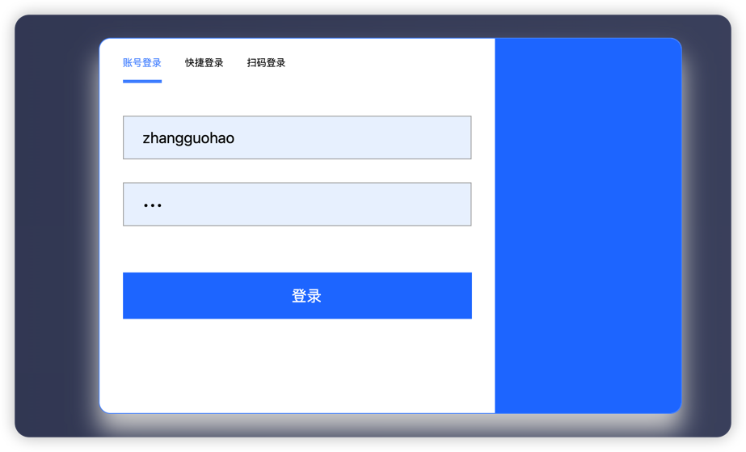
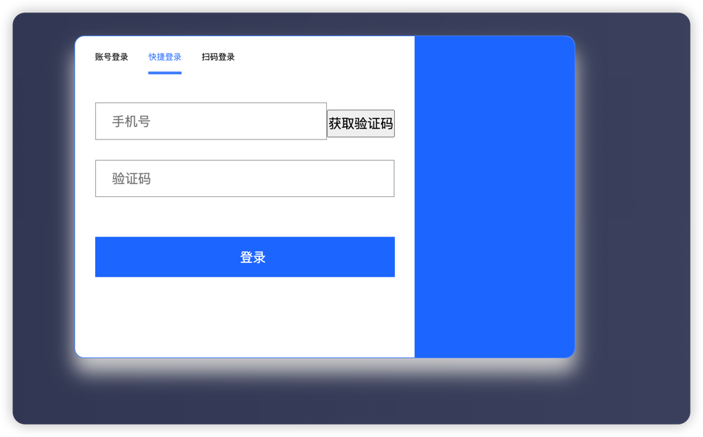
## 获取验证码接口
### 说明
```text
描述：获取验证码接口
接口：/express/user/sendVerificationCode
请求方式：get
```
### 书写Controller
```java
   /**
     * 获取验证码
     * @param phone
     * @return
     */
    @GetMapping("/sendVerificationCode")
    public R sendVerificationCode(@RequestParam("phone") String phone){
        userService.sendVerificationCode(phone);
        return R.ok();
    }

```
### 书写service
```java
  String sendVerificationCode(String phone);
```
### 书写serviceImpl
```java
   @Override
    public String sendVerificationCode(String phone) {
        User userForPhone = this.lambdaQuery().eq(User::getPhone, phone).eq(User::getDelete,0).one();
        if(userForPhone == null){
            throw new BizException("用户手机号不存在，请先去注册");
        }
        String phoneCode = redisTemplate.opsForValue().get("loginPhone::" + phone);
        if(StringUtils.isNotEmpty(phoneCode)){
            throw new BizException("请勿重复获取验证码");
        }
        //生成验证码存储到redis中
        String s = String.valueOf(generateFourDigitRandomNumber());
        redisTemplate.opsForValue().set("loginPhone::" + phone,s,1, TimeUnit.MINUTES);
        System.out.println(phone+" 手机获取验证码，验证码 = "+s);
        return s;
    }
```
### 前后端联调
浏览器输入：http://localhost:8090/#/oauth
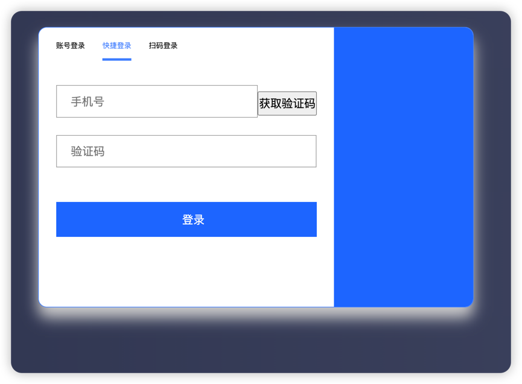
## 获取首页总支出总收入接口
### 说明
```text
描述：获取首页总支出总收入接口
接口：/express/accountion/record/totalPrice
请求方式：get
```
### 书写Vo
```java
@Data
@Data
public class TotalPriceVo {

    //每一个分类的总收入
    private List<TotalPriceVoData> classifyTotalIncome = new ArrayList<>();

    //每一份分类的总支出
    private List<TotalPriceVoData>  classifyTotalPay = new ArrayList<>();


    //总收入
    private BigDecimal totalIncome;

    //总支出
    private BigDecimal totalPay;

    @Data
    public static class TotalPriceVoData{
        private String name;

        private BigDecimal value;
    }
}
```
### 书写Controller
```java
@RestController
@RequestMapping("accountion/record")
public class AccountionRecordController {

    @Autowired
    private UserService userService;

    @Autowired
    private AccountionRecordService accountionRecordService;
    @Autowired
    private BudgetService budgetService;


    /**
     * 饼图展示
     * @return
     */
    @GetMapping("totalPrice")
    public R totalPrice(){
        TotalPriceVo totalPriceVo = accountionRecordService.totalPrice();
        return R.ok().put("data",totalPriceVo);
    }
}
```
### 书写service
```java
public interface AccountionRecordService extends IService<AccountionRecord> {

    TotalPriceVo totalPrice();
}
```
### 书写serviceImpl
```java
 @Override
    public TotalPriceVo totalPrice() {
        TotalPriceVo totalPriceVo = new TotalPriceVo();
        User loginUser = userService.getLoginUser();
        List<AccountionRecord> list = this.lambdaQuery()
                .eq(AccountionRecord::getUserId,loginUser.getId())
                .eq(AccountionRecord::getDelete,0)
                .orderByDesc(AccountionRecord::getCreateTime)
                .list();
        //支出
        BigDecimal totalPay = list.stream().filter(item -> item.getType() == 1)
                .map(AccountionRecord::getPrice)
                .reduce(BigDecimal.ZERO, BigDecimal::add);
        //收入
        BigDecimal totalIncome = list.stream().filter(item -> item.getType() == 2)
                .map(AccountionRecord::getPrice)
                .reduce(BigDecimal.ZERO, BigDecimal::add);
        totalPriceVo.setTotalPay(totalPay);
        totalPriceVo.setTotalIncome(totalIncome);

        //支出map
        Map<Integer, List<AccountionRecord>> collect = list.stream()
                .filter(item->item.getType()==1)
                .collect(
                Collectors.groupingBy(AccountionRecord::getClassifyId));
        for (Map.Entry<Integer, List<AccountionRecord>> integerListEntry : collect.entrySet()) {
            Integer key = integerListEntry.getKey();
            List<AccountionRecord> value = integerListEntry.getValue();
            //查询名称
            Classify classify = classifyService.getById(key);
            //组装数据
            TotalPriceVo.TotalPriceVoData totalPriceVoData = new TotalPriceVo.TotalPriceVoData();
            totalPriceVoData.setName(classify.getName());
            totalPriceVoData.setValue(
                    value.stream()
                            .map(AccountionRecord::getPrice)
                            .reduce(BigDecimal.ZERO, BigDecimal::add)
            );
            totalPriceVo.getClassifyTotalPay().add(totalPriceVoData);
        }
        //收入map
        Map<Integer, List<AccountionRecord>> collect2 = list.stream()
                .filter(item->item.getType()==2)
                .collect(
                        Collectors.groupingBy(AccountionRecord::getClassifyId));
        for (Map.Entry<Integer, List<AccountionRecord>> integerListEntry : collect2.entrySet()) {
            Integer key = integerListEntry.getKey();
            List<AccountionRecord> value = integerListEntry.getValue();
            Classify classify = classifyService.getById(key);
            //组装数据
            TotalPriceVo.TotalPriceVoData totalPriceVoData = new TotalPriceVo.TotalPriceVoData();
            totalPriceVoData.setName(classify.getName());
            totalPriceVoData.setValue(
                    value.stream()
                            .map(AccountionRecord::getPrice)
                            .reduce(BigDecimal.ZERO, BigDecimal::add)
            );
            totalPriceVo.getClassifyTotalIncome().add(totalPriceVoData);
        }
        return totalPriceVo;
    }

```
### 书写mapper
```java
public interface AccountionRecordMapper extends BaseMapper<AccountionRecord> {

}

```
### 前后端联调
浏览器输入：http://localhost:8090/#/home
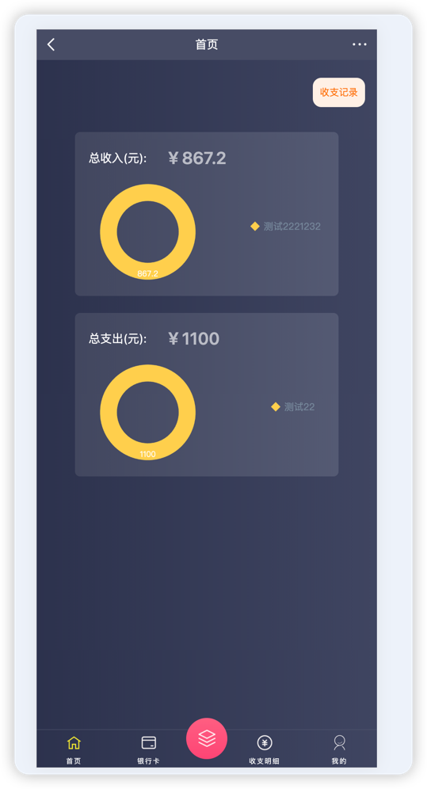
## 首页收支记录接口
### 说明
```text
描述：首页收支记录接口
接口：/express/accountion/record/list
请求方式：get
```
### 书写Controller
```java
  /**
     * 收支记录
     * @return
     */
    @GetMapping("list")
    public R list(@RequestParam String remark){
        User loginUser = userService.getLoginUser();
        if(StringUtil.isEmpty(remark)){
            List<AccountionRecord> list = accountionRecordService.lambdaQuery()
                    .eq(AccountionRecord::getUserId,loginUser.getId())
                    .orderByDesc(AccountionRecord::getId).list();
            return R.ok().put("data",list);
        }else{
            List<AccountionRecord> list = accountionRecordService.lambdaQuery()
                    .eq(AccountionRecord::getUserId,loginUser.getId())
                    .like(AccountionRecord::getRemark,remark)
                    .orderByDesc(AccountionRecord::getId)
                    .list();
            return R.ok().put("data",list);
        }

    }
```
### 前后端联调
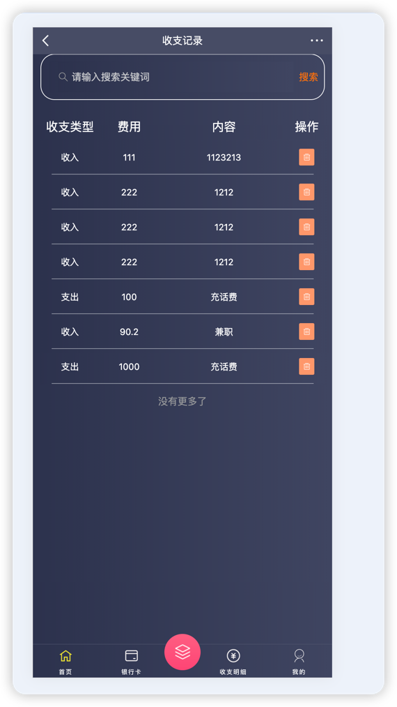
## 删除收支记录接口
### 说明
```text
描述：删除收支记录接口
接口：/express/accountion/record/delete
请求方式：get
```
### 书写Controller
```java
 @GetMapping("delete")
    public R delete(@RequestParam Integer id){
        accountionRecordService.lambdaUpdate().set(AccountionRecord::getDelete,1)
                .eq(AccountionRecord::getId,id).update();
        return R.ok();
    }
```
### 前后端联调
浏览器输入：http://localhost:8090/#/home

## 获取银行卡列表接口
### 说明
```text
描述：获取银行卡列表接口
接口：/express/bank/select
请求方式：get
```
### 书写Controller
```java
@RestController
@RequestMapping("bank")
public class BankController {

    @Autowired
    private BankService bankService;

    @Autowired
    private UserService userService;

    @GetMapping("select")
    public R select() {
        User user = userService.getLoginUser();
        List<Bank> list = bankService.lambdaQuery()
                .eq(Bank::getDelete,0)
                .eq(Bank::getUserId,user.getId())
                .list();
        for (Bank bank : list) {
            if(bank.getBankNum().length()>4){
                bank.setBankNum(bank.getBankNum().substring(0,4));
            }
        }
        return R.ok().put("data", list);
    }
}
```
### 书写Service
```java
public interface BankService extends IService<Bank> {

}
```
### 书写ServiceImpl
```java
@Service
public class BankServiceImpl extends ServiceImpl<BankMapper, Bank>
    implements BankService{

}

```
### 书写Mapper
```java
public interface BankMapper extends BaseMapper<Bank> {

}
```
### 前后端联调
浏览器输入：http://localhost:8090/#/bankCard
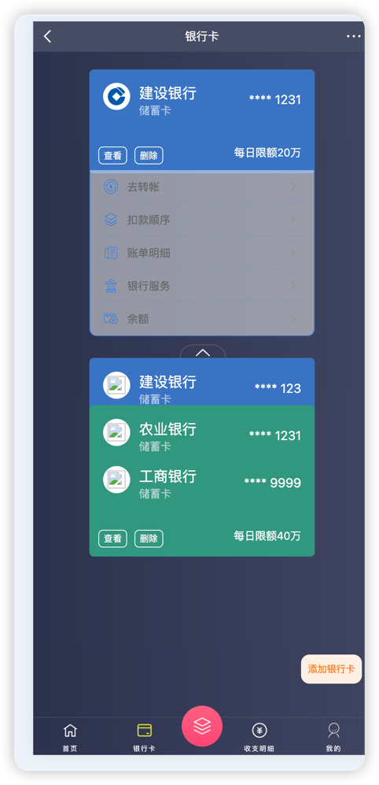
## 删除银行卡接口
### 说明
```text
描述：删除银行卡接口
接口：/express/bank/delete
请求方式：post
```
### 书写Controller
```java
    @PostMapping("delete")
    public R delete(@RequestBody Bank bank) {
        bankService.lambdaUpdate().eq(Bank::getId,bank.getId())
                .set(Bank::getDelete,1).update();
        return R.ok();
    }
```
### 前后端联调
浏览器输入：http://localhost:8090/#/bankCard
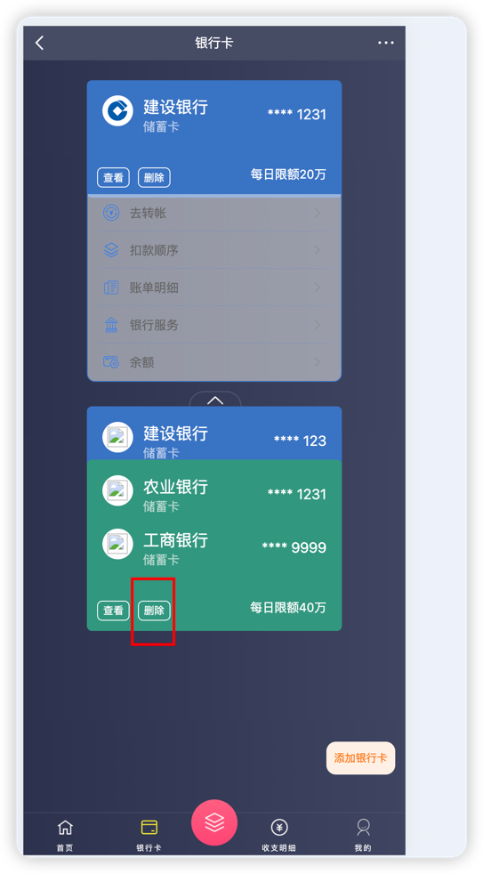
## 修改银行卡接口
### 说明
```text
描述：修改银行卡接口
接口：/express/bank/update
请求方式：post
```
### 书写Controller
```java
   @PostMapping("update")
    public R update(@RequestBody Bank bank) {
        bankService.updateById(bank);
        return R.ok();
    }
```
### 前后端联调
http://localhost:8090/#/addCard?id=4&name=%E5%B7%A5%E5%95%86%E9%93%B6%E8%A1%8C&bankNum=9999
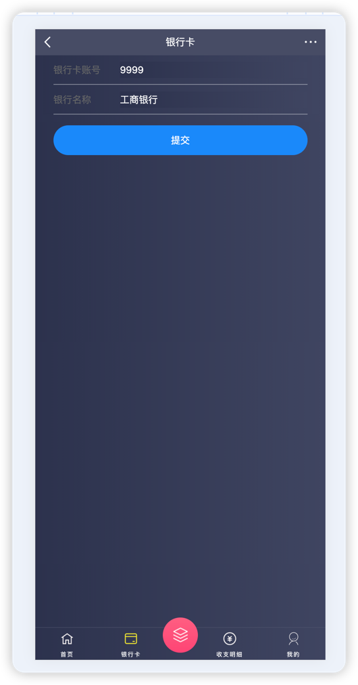
## 增加银行卡接口
### 说明
```text
描述：增加银行卡接口
接口：/express/bank/insert
请求方式：post
```
### 书写Controller
前端选择银行卡时只能选择建设银行，工商银行，农业银行
```java
@PostMapping("insert")
    public R insert(@RequestBody Bank bank) {
        User loginUser = userService.getLoginUser();
        bank.setUserId(loginUser.getId());
        bank.setCreateTime(new Date());
        bank.setBankType("储蓄卡");
        switch (bank.getName()){
            case "建设银行":
                //设置建设银行的logo信息
                bank.setBankLogo("/img/jianhang.svg");
                //设置建设银行的限额
                bank.setLimitNum("20");
                //设置建设银行的背景色
                bank.setBankBg("#3973c4");
                break;
            case "工商银行":
                //设置工商银行的logo信息
                bank.setBankLogo("/img/gongshang.svg");
                //设置工商银行的限额
                bank.setLimitNum("50");
                //设置工商银行的背景色
                bank.setBankBg("#fe6063");
                break;
            case "农业银行":
                //设置农业银行的logo信息
                bank.setBankLogo("/img/nonghang.svg");
                //设置农业银行的限额
                bank.setLimitNum("40");
                //设置农业银行的背景色
                bank.setBankBg("#32977f");
                break;
        }
        bankService.save(bank);
        return R.ok();
    }
```
### 前后端联调
浏览器输入：http://localhost:8090/#/addCard
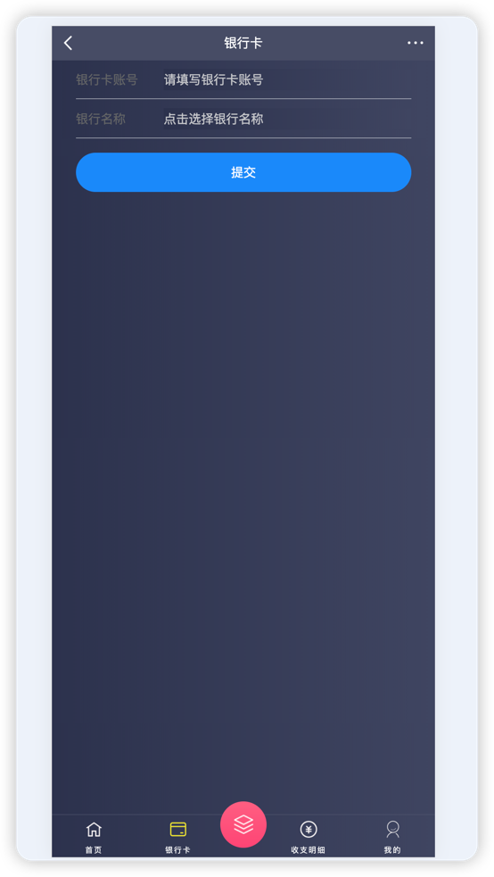
## 获取统计报表中年月度收支情况接口
### 说明
```text
描述：获取统计报表中年月度收支情况接口
接口：/express/accountion/record/selectByIndex
请求方式：get
```
### 书写Vo
```java

@Data
public class SelectByIndexVo {

    //总收入
    private BigDecimal totalIncome = new BigDecimal("0");

    //总支出
    private BigDecimal totalPay = new BigDecimal("0");

    //平均每日支出
    private BigDecimal averageDayPay = new BigDecimal("0");

    private List<DetailInfo> detailInfos = new ArrayList<>();

    @Data
    public static class DetailInfo{
        //1、1支出 2收入
        private Integer type;

        //金额
        private BigDecimal price;

        private String time;
    }
    
}

```
### 书写Controller
```java
    /**
     * 首页数据
     * @param mongth
     * @param year
     * @return
     */
    @GetMapping("selectByIndex")
    public R selectByIndex(@RequestParam(required = false) Integer mongth,
                           @RequestParam(required = false) Integer year){
        SelectByIndexVo selectByIndexVo = accountionRecordService.selectByIndex(mongth,year);
        return R.ok().put("data",selectByIndexVo);
    }
```
### 书写Service
```java
    SelectByIndexVo selectByIndex(Integer mongth, Integer year);
```
### 书写ServiceImpl
```java
 @Override
    public SelectByIndexVo selectByIndex(Integer mongth, Integer year) {
        User loginUser = userService.getLoginUser();
        SelectByIndexVo selectByIndexVo = new SelectByIndexVo();
        List<AccountionRecord> list = new ArrayList<>();
        if(mongth != null){
            list = this.lambdaQuery()
                    .eq(AccountionRecord::getMonth, mongth)
                    .eq(AccountionRecord::getDelete,0)
                    .eq(AccountionRecord::getUserId,loginUser.getId())
                    .orderByDesc(AccountionRecord::getId).list();
        }
        if(year != null){
            list = this.lambdaQuery()
                    .eq(AccountionRecord::getYear, year)
                    .eq(AccountionRecord::getDelete,0)
                    .eq(AccountionRecord::getUserId,loginUser.getId())
                    .orderByDesc(AccountionRecord::getId).list();
        }
        if(CollectionUtils.isEmpty(list)){
            return selectByIndexVo;
        }
        if(CollectionUtils.isNotEmpty(list)){
            //获取总支出
            BigDecimal totalPay = list.stream().filter(item -> item.getType() == 1)
                    .map(AccountionRecord::getPrice)
                    .reduce(BigDecimal.ZERO, BigDecimal::add);
            selectByIndexVo.setTotalPay(totalPay);
            //获取总收入
            BigDecimal totalIncome = list.stream().filter(item -> item.getType() == 2)
                    .map(AccountionRecord::getPrice)
                    .reduce(BigDecimal.ZERO, BigDecimal::add);
            selectByIndexVo.setTotalIncome(totalIncome);

        }
        if(year != null){
            //计算平均支出
            selectByIndexVo.setAverageDayPay(selectByIndexVo.getTotalPay()
                    .divide(new BigDecimal(12),2, BigDecimal.ROUND_HALF_UP));
            //组装详情信息
            List<SelectByIndexVo.DetailInfo> detailInfoList = list.stream()
                    .collect(Collectors.groupingBy(
                            AccountionRecord::getMonth, // 按照月份分组
                            Collectors.groupingBy(
                                    AccountionRecord::getType, // 按照类型分组
                                    Collectors.reducing(BigDecimal.ZERO, AccountionRecord::getPrice, BigDecimal::add) // 计算总金额
                            )
                    ))
                    .entrySet().stream()
                    .flatMap(monthEntry -> monthEntry.getValue().entrySet().stream()
                            .map(typeEntry -> {
                                SelectByIndexVo.DetailInfo detailInfo = new SelectByIndexVo.DetailInfo();
                                detailInfo.setTime(monthEntry.getKey());
                                detailInfo.setType(typeEntry.getKey());
                                detailInfo.setPrice(typeEntry.getValue());
                                return detailInfo;
                            })
                    )
                    .collect(Collectors.toList());
            selectByIndexVo.setDetailInfos(detailInfoList);
        }
        if(mongth != null){
            int daysInMonth = getDaysInMonth(Integer.parseInt(list.get(0).getYear()), mongth);
            String year1 = list.get(0).getYear();
            //计算平均支出
            selectByIndexVo.setAverageDayPay(selectByIndexVo.getTotalPay()
                    .divide(new BigDecimal(daysInMonth),2, BigDecimal.ROUND_HALF_UP));
            //组装详情信息
            List<SelectByIndexVo.DetailInfo> detailInfoList = list.stream()
                    .collect(Collectors.groupingBy(
                            AccountionRecord::getDay, // 按照月份分组
                            Collectors.groupingBy(
                                    AccountionRecord::getType, // 按照类型分组
                                    Collectors.reducing(BigDecimal.ZERO, AccountionRecord::getPrice, BigDecimal::add) // 计算总金额
                            )
                    ))
                    .entrySet().stream()
                    .flatMap(monthEntry -> monthEntry.getValue().entrySet().stream()
                            .map(typeEntry -> {
                                SelectByIndexVo.DetailInfo detailInfo = new SelectByIndexVo.DetailInfo();
                                detailInfo.setTime(monthEntry.getKey());
                                detailInfo.setType(typeEntry.getKey());
                                detailInfo.setPrice(typeEntry.getValue());
                                return detailInfo;
                            })
                    )
                    .collect(Collectors.toList());
            selectByIndexVo.setDetailInfos(detailInfoList);
        }
        return selectByIndexVo;
    }
```
### 前后端联调
浏览器输入：http://localhost:8090/#/middle
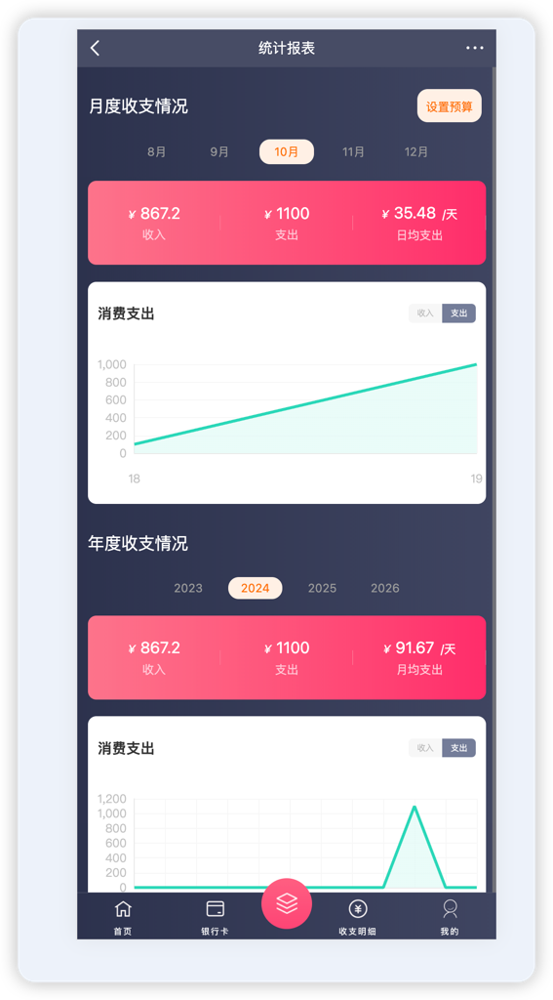
## 设置预算接口
### 说明
```text
描述：设置预算接口
接口：/express/budget/insert
请求方式：post
```
### 书写Controller
```java
@RestController
@RequestMapping("/budget/")
public class BudgetController {


    @Autowired
    private BudgetService budgetService;
    @Autowired
    private UserService userService;


    @PostMapping("insert")
    public R insert(@RequestBody Budget budget){
        User loginUser = userService.getLoginUser();
        Budget one = budgetService.lambdaQuery().eq(Budget::getUserId, loginUser.getId())
                .eq(Budget::getType, budget.getType()).one();
        if(one!=null){
            budget.setId(one.getId());
            budgetService.updateById(budget);
        }else{
            budget.setUserId(loginUser.getId());
            budgetService.save(budget);
        }
        return R.ok();
    }


}
```
### 书写Service
```java
public interface BudgetService extends IService<Budget> {

}
```
### 书写ServiceImpl
```java
@Service
public class BudgetServiceImpl extends ServiceImpl<BudgetMapper, Budget>
    implements BudgetService{

}

```
### 书写Mapper
```java
public interface BudgetMapper extends BaseMapper<Budget> {

}
```
### 前后端联调
浏览器输入：http://localhost:8090/#/middle
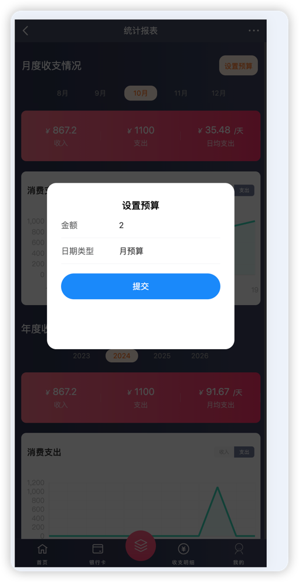
## 获取收支明细接口
### 说明
```text
描述：获取收支明细接口
接口：/expressaccountion/record/selectByDetail
请求方式：get
```
### 书写Controller
```java
 @GetMapping("selectByDetail")
    public R selectByDetail(Integer mongth){
        SimpleDateFormat sdf = new SimpleDateFormat("yyyy");
        User loginUser = userService.getLoginUser();
        List<AccountionRecord> list = accountionRecordService.lambdaQuery()
                .eq(AccountionRecord::getDelete,0)
                .eq(AccountionRecord::getUserId,loginUser.getId())
                .eq(AccountionRecord::getMonth, mongth)
                .eq(AccountionRecord::getYear, sdf.format(new Date()))
                .orderByDesc(AccountionRecord::getCreateTime)
                .list();
        return R.ok().put("data",list);
    }
```
### 前后端联调
浏览器输入：http://localhost:8090/#/income
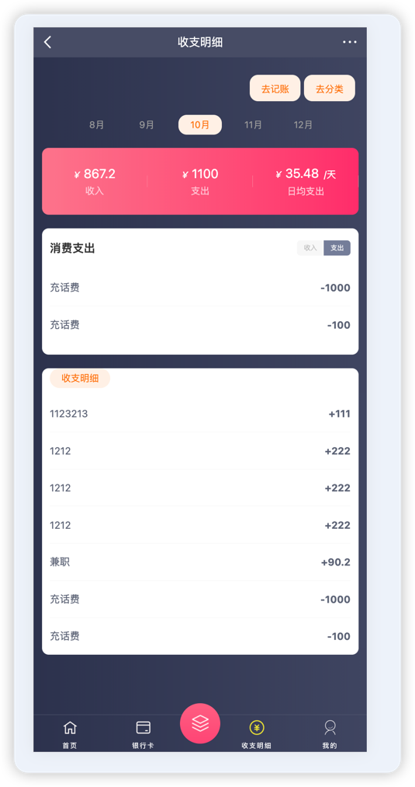
这个页面还调用了 accountion/record/selectByIndex 接口，这个接口已经写了，可以看上面的
## 新增记账接口
### 说明
```text
描述：新增记账接口
接口：/express/accountion/record/insert
请求方式：post
```
### 书写Controller
```java
  @PostMapping("insert")
    public R insert(@RequestBody AccountionRecord accountionRecord){
        accountionRecordService.insert(accountionRecord);
        return R.ok();
    }
```
### 书写Service
```java
 void insert(AccountionRecord accountionRecord);
```
### 书写ServiceImpl
```java
    @Override
    public void insert(AccountionRecord accountionRecord) {
        //查询类型
        Classify classify = classifyService.lambdaQuery().eq(Classify::getName, accountionRecord.getTypeName()).list().get(0);
        User loginUser = userService.getLoginUser();
        accountionRecord.setClassifyId(classify.getId());
        accountionRecord.setUserId(loginUser.getId());
        accountionRecord.setYear(getYear(accountionRecord.getTime()) + "");
        accountionRecord.setMonth(getMonth(accountionRecord.getTime()) + "");
        accountionRecord.setDay(getDayFromDate(accountionRecord.getTime()) + "");
        accountionRecord.setType(classify.getType());
        this.save(accountionRecord);
    }
```
### 前后端联调
浏览器输入：http://localhost:8090/#/account
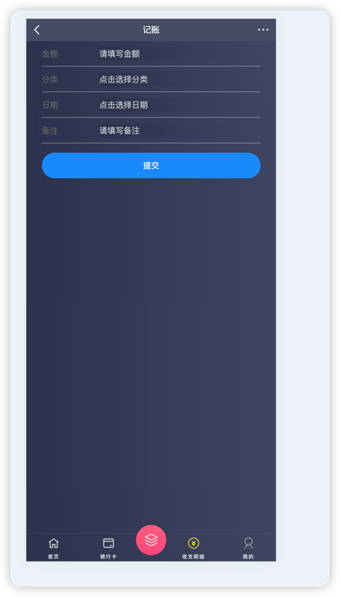
## 获取分类列表接口
### 说明
```text
描述：获取分类列表接口
接口：/express/classify/select
请求方式：get
```
### 书写Controller
```java
    @GetMapping("select")
    public R select(){
        User user = userService.getLoginUser();
        List<Classify> list = classifyService.lambdaQuery()
                .eq(Classify::getDelete, 0) // 先过滤删除标记
                .and(wrapper -> wrapper
                        .eq(Classify::getUserId, user.getId())
                        .or().eq(Classify::getUserId, 0) // 这里确保是和 delete 条件一起
                )
                .list();
        return R.ok().put("data",list);
    }
```
### 书写Service
```java
public interface ClassifyService extends IService<Classify> {

}
```
### 书写ServiceImpl
```java
@Service
public class ClassifyServiceImpl extends ServiceImpl<ClassifyMapper, Classify>
    implements ClassifyService{

}
```
### 书写Mapper
```java
public interface ClassifyMapper extends BaseMapper<Classify> {

}
```
### 前后端联调
浏览器输入：http://localhost:8090/#/classfiy
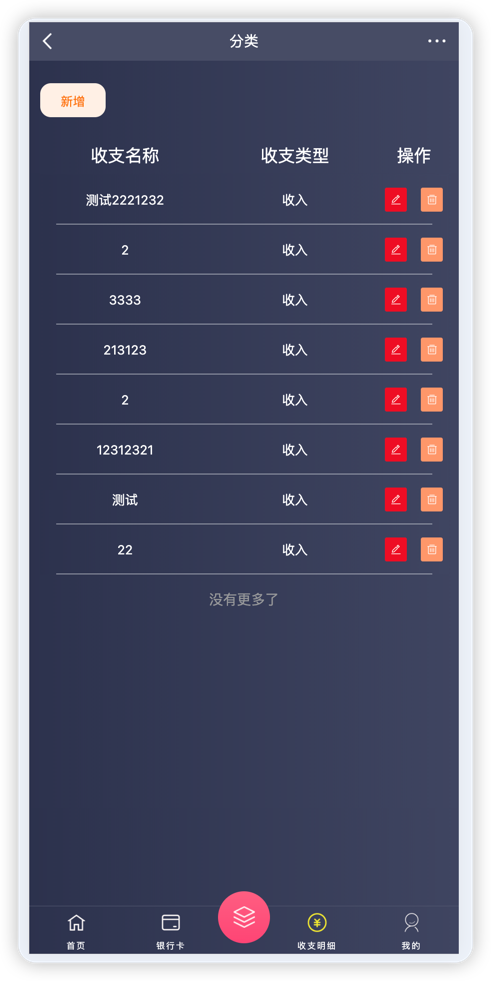
## 删除分类接口
### 说明
```text
描述：删除分类接口
接口：/express/classify/delete
请求方式：get
```
### 书写Controller
```java
@PostMapping("delete")
    public R delete(@RequestBody Classify classify){
        classifyService.lambdaUpdate().eq(Classify::getId,classify.getId())
                .set(Classify::getDelete,1).update();
        return R.ok();
    }
```
### 前后端联调
浏览器输入：http://localhost:8090/#/classfiy
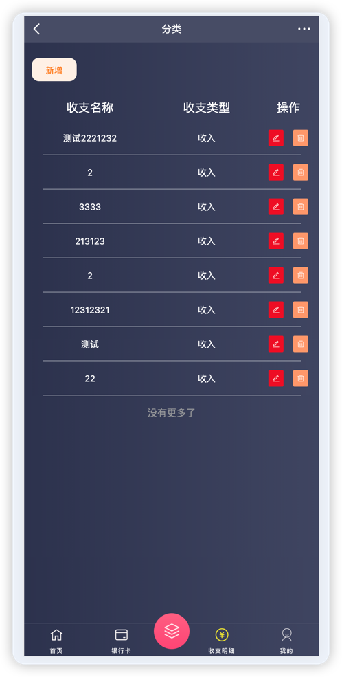
## 新增分类接口
### 说明
```text
描述：新增分类接口
接口：/express/classify/insert
请求方式：post
```
### 书写Controller
```java
    @PostMapping("insert")
    public R insert(@RequestBody Classify classify){
        User loginUser = userService.getLoginUser();
        classify.setUserId(loginUser.getId());
        classifyService.save(classify);
        return R.ok();
    }
```
### 前后端联调
浏览器输入：http://localhost:8090/#/classfiyDrtail
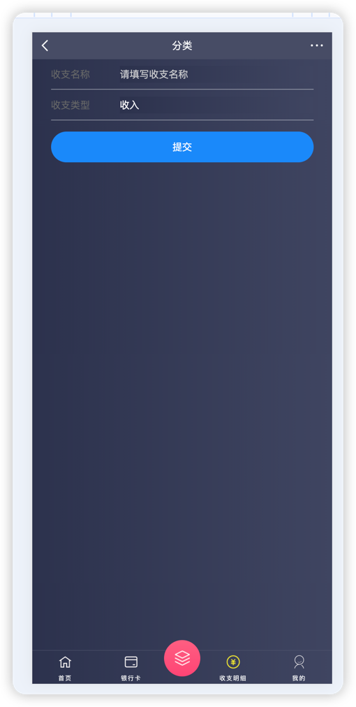
## 修改分类接口
### 说明
```text
描述：修改分类接口
接口：/express/classify/update
请求方式：post
```
### 书写Controller
```java
  @PostMapping("update")
    public R update(@RequestBody Classify classify){
        classifyService.updateById(classify);
        return R.ok();
    }

```
### 前后端联调
浏览器输入：http://localhost:8090/#/classfiyDrtail?id=2&name=%E6%B5%8B%E8%AF%952221232&type=%E6%94%B6%E5%85%A5
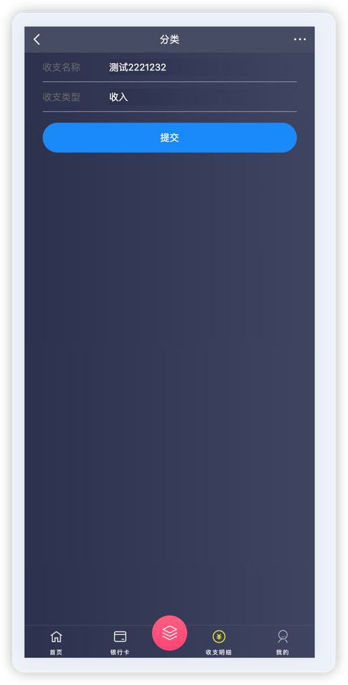
## 超出预算消息提醒接口
### 说明
```text
描述：超出预算消息提醒接口
接口：/express/accountion/record/getBudgetExceed
请求方式：get
```
### 书写Controller
```java
  @GetMapping("getBudgetExceed")
    public R getBudgetExceed(){
        User loginUser = userService.getLoginUser();
        // 获取当前日期
        LocalDate currentDate = LocalDate.now();
        // 获取当前月份（1-12）
        int currentMonth = currentDate.getMonthValue();
        List<AccountionRecord> list = accountionRecordService.lambdaQuery()
                .eq(AccountionRecord::getUserId, loginUser.getId())
                .eq(AccountionRecord::getType, 1)
                .eq(AccountionRecord::getDelete, 0)
                .eq(AccountionRecord::getMonth,currentMonth).list();
        BigDecimal totalPay = list.stream()
                .map(AccountionRecord::getPrice)
                .reduce(BigDecimal.ZERO, BigDecimal::add);
        List<Budget> budgets = budgetService.lambdaQuery().eq(Budget::getUserId, loginUser.getId())
                .eq(Budget::getType, 2).list();
        if(CollectionUtils.isEmpty(budgets)){
            return R.ok();
        }
        if(totalPay.doubleValue()>budgets.get(0).getBudgetPrice().doubleValue()){
            return R.ok().put("data","您本月预算为"
            +budgets.get(0).getBudgetPrice().doubleValue() +"元，已经支出"+
                    totalPay.doubleValue()+" 元，请注意！");
        }
        return R.ok();
    }
```
### 前后端联调
浏览器输入：http://localhost:8090/#/personalCenter
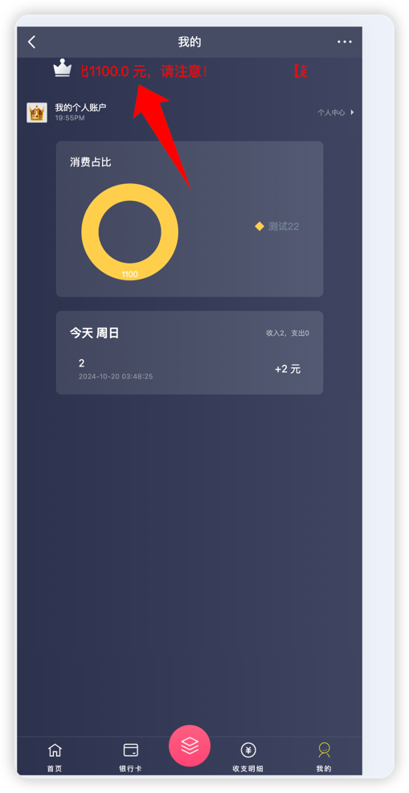
## 获取当前登陆用户接口
### 说明
```text
描述：获取当前登陆用户接口
接口：/express/user/getLoginUser
请求方式：get
```
### 书写Controller
```java
@GetMapping("/getLoginUser")
    public R getLoginUser(){
        User user = userService.getLoginUser();
        return R.ok().put("user",user);
    }
```
### 书写Service
```java
 User getLoginUser();
```
### 书写ServiceImpl
```java
  @Override
    public User getLoginUser() {
        String loginToken = request.getHeader("authorization");
        if(StringUtils.isEmpty(loginToken)){
            throw new BizException("token不能为空");
        }
        String userInfo = redisTemplate.opsForValue().get("loginToken::" + loginToken);
        if(StringUtils.isEmpty(userInfo)){
            throw new BizException("token无用户信息");
        }
        User user = JSON.parseObject(userInfo, User.class);
        Integer id = user.getId();
        User user2 = this.getById(id);
        user2.setPassword(null);
        return user2;
    }
```
### 前后端联调
浏览器输入：http://localhost:8090/#/personalCenter
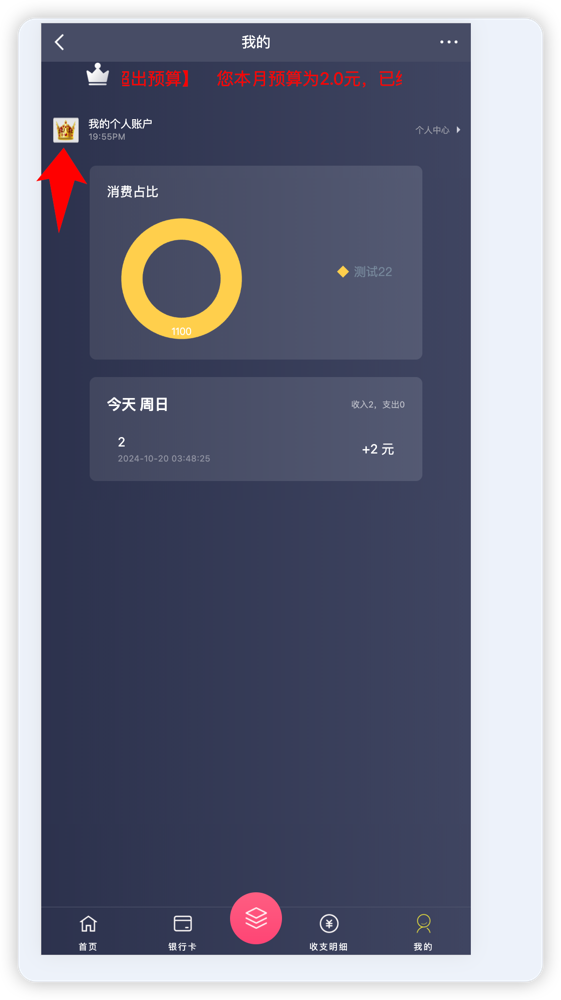
## 获取消费占比数据接口
### 说明
```text
描述：获取消费占比数据接口
接口：/express/accountion/record/totalPrice
请求方式：get
```
### 该接口上面已经存在
### 前后端联调
浏览器输入：http://localhost:8090/#/personalCenter
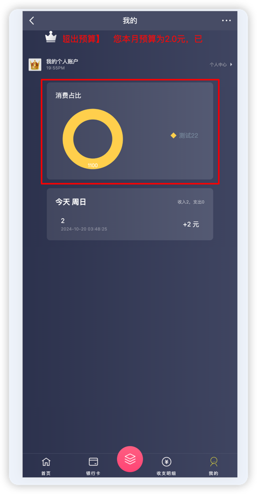
## 获取今日消费支出数据
### 说明
```text
描述：获取今日消费支出数据
接口：/express/accountion/record/selectByDay
请求方式：get
```
### 书写Vo
```java
@Data
public class DayVo {

    private List<AccountionRecord> accountionRecordList;

    //总收入
    private BigDecimal totalIncome;

    //总支出
    private BigDecimal totalPay;
}

```
### 书写Controller
```java
    /**
     * 某一天的明细数据
     * @return
     */
    @GetMapping("selectByDay")
    public R selectByDay(){
        DayVo dayVo = accountionRecordService.selectByDay(new Date());
        return R.ok().put("data",dayVo);
    }
```
### 书写Service
```java
    DayVo selectByDay(Date day);
```
### 书写ServiceImpl
```java
@Override
    public DayVo selectByDay(Date day) {
        User loginUser = userService.getLoginUser();
        DayVo dayVo = new DayVo();
        SimpleDateFormat simpleDateFormat = new SimpleDateFormat("yyyy-MM-dd");
        List<AccountionRecord> list = this.lambdaQuery()
                .like(AccountionRecord::getCreateTime,simpleDateFormat.format(day) )
                .eq(AccountionRecord::getUserId,loginUser.getId())
                .eq(AccountionRecord::getDelete,0)
                .orderByDesc(AccountionRecord::getCreateTime)
                .list();
        dayVo.setAccountionRecordList(list);
        if(CollectionUtils.isNotEmpty(list)){
            //获取总支出
            BigDecimal totalPay = list.stream().filter(item -> item.getType() == 1)
                    .map(AccountionRecord::getPrice)
                    .reduce(BigDecimal.ZERO, BigDecimal::add);
            dayVo.setTotalPay(totalPay);
            //获取总收入
            BigDecimal totalIncome = list.stream().filter(item -> item.getType() == 2)
                    .map(AccountionRecord::getPrice)
                    .reduce(BigDecimal.ZERO, BigDecimal::add);
            dayVo.setTotalIncome(totalIncome);
        }
        return dayVo;
    }
```
### 前后端联调
浏览器输入：http://localhost:8090/#/personalCenter
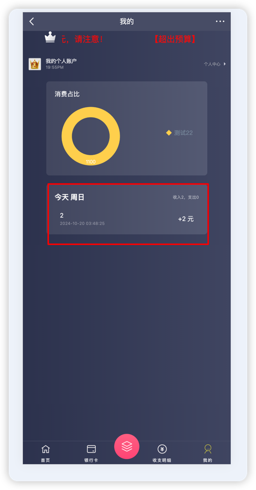
## 上传文件接口
### 说明
```text
描述：上传文件接口
接口：/express/file/upload
请求方式：post
```
### 书写Controller
```java
@RequestMapping("/file")
@Controller
public class FileController {


    public static final String FILE_PATH = ""; //改成本地路径

    @Autowired
    private CommonFileService commonFileService;

    @PostMapping("/upload")
    @ResponseBody
    public R uploadFile(@RequestParam("file") MultipartFile file) {
        if(file == null){
            throw new BizException("上传文件不能为空");
        }
        try {
            // 获取原始文件名
            String originalFilename = file.getOriginalFilename();
            // 文件保存路径
            String filePath = FILE_PATH + UUID.randomUUID().toString().replace("-","") + "-" + originalFilename;
            // 保存文件到服务器
            file.transferTo(new File(filePath));
            //存储文件数据
            CommonFile commonFile = new CommonFile();
            commonFile.setFileName(originalFilename);
            commonFile.setFileUrl(filePath);
            long uniqueId = SnowflakeUtil.getUniqueId();
            commonFile.setId(uniqueId);
            commonFileService.save(commonFile);
            //创建返回对象
            FileUploadVo fileUploadVo = new FileUploadVo();
            fileUploadVo.setFileId(uniqueId);
            return R.ok().put("data",fileUploadVo);
        } catch (Exception e) {
            e.printStackTrace();
            throw new BizException("上传文件异常");
        }
    }
    
}
```
### 书写Service
```java
public interface CommonFileService extends IService<CommonFile> {

}
```
### 书写ServiceImpl
```java
@Service
public class CommonFileServiceImpl extends ServiceImpl<CommonFileMapper, CommonFile>
    implements CommonFileService{

}

```
### 书写Mapper
```java
public interface CommonFileMapper extends BaseMapper<CommonFile> {

}
```
### 前后端联调
浏览器输入：http://localhost:8090/#/personalMessage
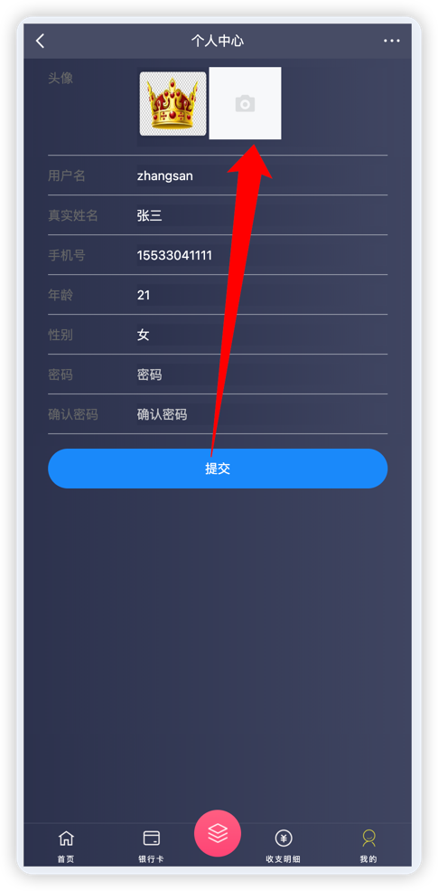
## 预览文件接口
### 说明
```text
描述：预览文件接口
接口：/express/file/download
请求方式：get
```
### 书写Controller
```java
@GetMapping("/download")
    public void downloadFile(@NotEmpty(message = "文件Id不能为空") @RequestParam String fileId, HttpServletResponse response) {
        //根据文件Id查询文件
        CommonFile commonFile = commonFileService.getById(fileId);
        if(commonFile == null){
            throw new BizException("文件Id不存在");
        }
        File file = new File(commonFile.getFileUrl());

        // 检查文件是否存在
        if (!file.exists()) {
            throw new BizException("文件不存在");
        }
        String encodedFileName = commonFile.getFileName();
        try {
            encodedFileName = URLEncoder.encode(commonFile.getFileName(), "UTF-8");
        } catch (Exception e) {
            e.printStackTrace();
        }
        // 设置响应头，指定文件名为attachment下载
        response.setContentType(MediaType.APPLICATION_OCTET_STREAM_VALUE);
        response.setHeader(HttpHeaders.CONTENT_DISPOSITION, "attachment; filename*=UTF-8''" + encodedFileName);

        // 写入文件流到响应
        try (FileInputStream fis = new FileInputStream(file)) {
            byte[] buffer = new byte[1024];
            int bytesRead;
            while ((bytesRead = fis.read(buffer)) != -1) {
                response.getOutputStream().write(buffer, 0, bytesRead);
            }
            response.flushBuffer();
        } catch (Exception e){
            e.printStackTrace();
            throw new BizException("获取文件异常");
        }
    }
```
### 前后端联调
浏览器输入：http://localhost:8090/#/personalMessage
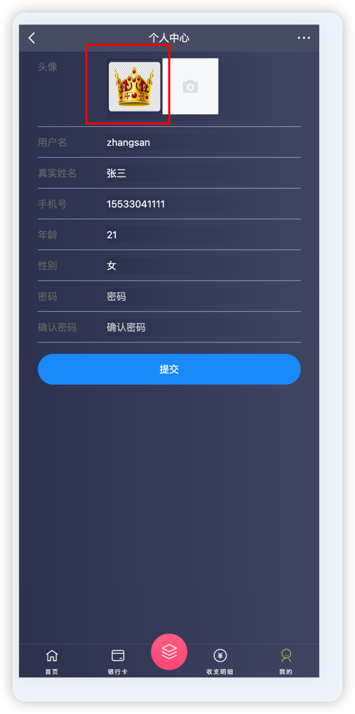
## 修改个人信息接口
### 说明
```text
描述：修改个人信息接口
接口：/express/user/updateLoginUser
请求方式：get
```
### 书写Controller
```java
   /**
     * 更新当前登陆用户信息
     * @param updateUserDto
     * @return
     */
    @PostMapping("/updateLoginUser")
    public R updateLoginUser(@RequestBody UpdateUserDto updateUserDto){
        userService.updateLoginUser(updateUserDto);
        return R.ok();
    }
```
### 书写Service
```java
    void updateLoginUser(UpdateUserDto updateUserDto);
```
### 书写ServiceImpl
```java
 @Override
    public void updateLoginUser(UpdateUserDto updateUserDto) {
        String loginToken = request.getHeader("token");
        User loginUser = getLoginUser();
        Integer id = loginUser.getId();
        User user = new User();
        BeanUtils.copyProperties(updateUserDto,user);
        user.setPhoto(updateUserDto.getImg());
        user.setId(id);
        if(StringUtils.isEmpty(updateUserDto.getPassword())){
            User selUser = this.getById(id);
            user.setPassword(selUser.getPassword());
        }
        //更新
        this.updateById(user);
        //查询新的用户信息
        User newUser = this.getById(id);
        //刷新redis
        redisTemplate.opsForValue().set("loginToken::"+loginToken, JSON.toJSONString(newUser));
    }
```
### 前后端联调
浏览器输入：http://localhost:8090/#/personalMessage
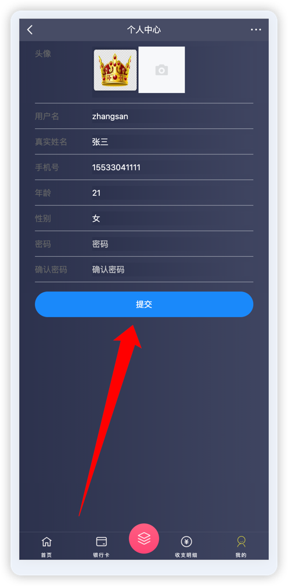
