# MQ中间件应用业务
## 一、MQ中间件介绍
MQ全称 Message Queue(消息队列)，是在消息的传输过程中保存消息的容器。多用于分布式系统之间进行通信。
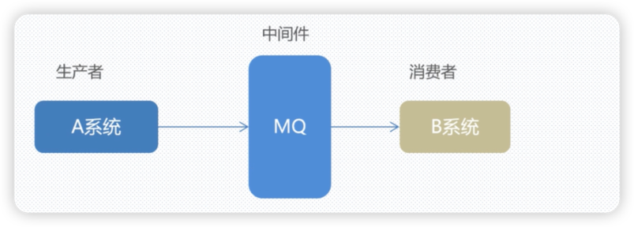
1、MQ，消息队列，存储消息的中间件

2、分布式系统通信两种方式:直接远程调用 和借助第三方 完成间接通信

3、发送方称为生产者，接收方称为消费者
## 二、为什么使用MQ
在项目中，可将一些无需即时返回且耗时的操作提取出来，进行异步处理，而这种异步处理的方式大大的节省了服务器的请求响应时间，从而提高了系统的吞吐量。
## 三、MQ的优势
1. 应用解耦
```text
以电商应用为例，应用中有订单系统、库存系统、物流系统、支付系统。用户创建订单后，如果耦合调用库存系统、物流系统、支付
系统，任何一个子系统出了故障，都会造成下单操作异常。当转变成基于消息队列的方式后，系统间调用的问题会减少很多，比如
物流系统因为发生故障，需要几分钟来修复。在这几分钟的时间里，物流系统要处理的内容被缓存在消息队列中，用户的下单操作
可以正常完成。当物流系统恢复后，继续处理订单信息即可，中间用户感受不到物流系统的故障，提升系统的可用性。
```
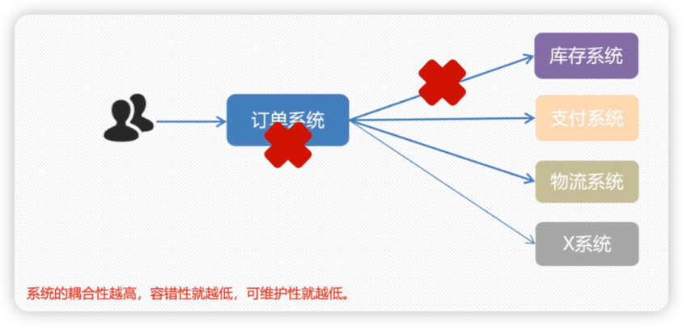
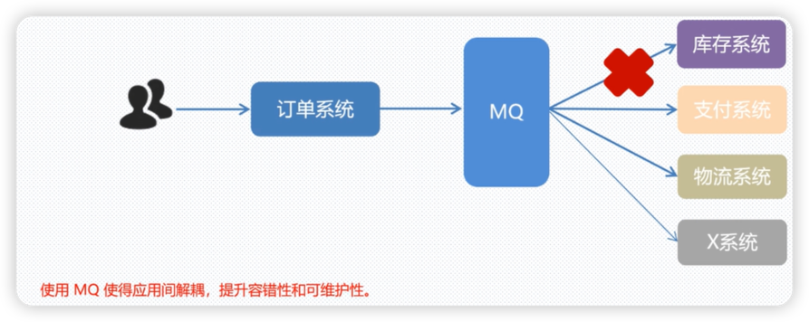
2、异步提速
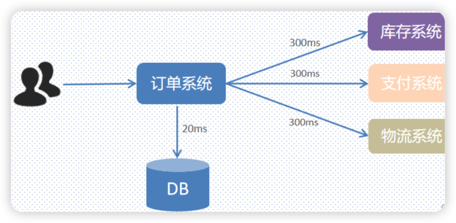
```text
上面要完成下单需要花费的时间： 20 + 300 + 300 + 300 = 920ms 用户点击完下单按钮后，需要等待920ms才能得到下单响应，太慢！
使用MQ可以解决上述问题
```
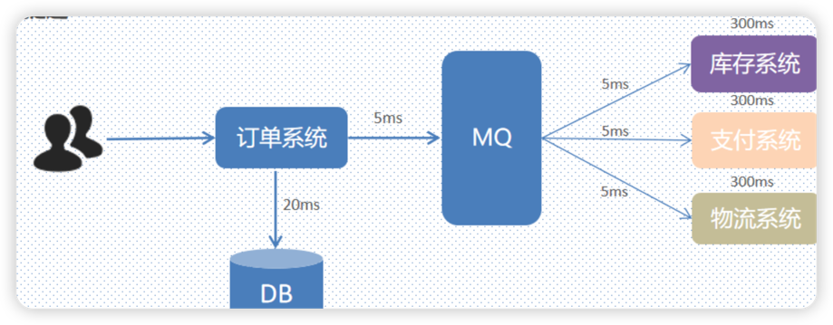
```text
用户点击完下单按钮后，只需等待25ms就能得到下单响应 (20 + 5 = 25ms)。
提升用户体验和系统吞吐量（一秒内处理请求的数量）。
因为用户只是调用了你的订单系统,而订单系统只需要保存订单信息,响应给用户即可
```
3、削峰填谷
```text
举个例子，如果订单系统最多能处理一千次订单，这个处理能力应付正常时段的下单时绰绰有余，正常时段我们下单一秒后就能返回
结果。但是在高峰期，如果有五千次下单操作系统是处理不了的，只能限制订单超过一千后不允许用户下单。使用消息队列做缓冲，
我们可以取消这个限制，把一秒内下的订单分散成一段时间来处理，这时有些用户可能在下单十几秒后才能收到下单成功的操作，但
是比不能下单的体验要好。 简单来说： 就是在访问量剧增的情况下，但是应用仍然不能停，比如“双十一”下单的人多，但是淘宝这
个应用仍然要运行，所以就可以使用消息中间件采用队列的形式减少突然访问的压力
```
## 二、如何选择合适的MQ中间件
```text
目前业界有很多的 MQ 产品，例如 RabbitMQ、RocketMQ、ActiveMQ、Kafka、ZeroMQ、MetaMq等，也有直接使用 Redis 充当
消息队列的案例，而这些消息队列产品，各有侧重，在实际选型时，需要结合自身需求及 MQ 产品特征
```

在项目中我们将集成RabbitMq
## 三、MQ中间件安装流程
### 3.1、使用exe安装包安装
1、第一步

安装otp_win64_20.2.exe
右键以管理员身份运行
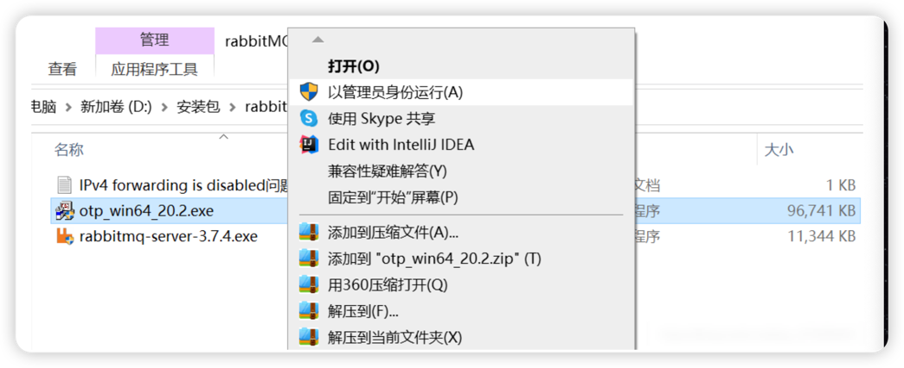
2、第二步

安装rabbitmq-server-3.7.4.exe

双击文件rabbitmq-server-3.7.4.exe，傻瓜式安装，（注意不要安装在包含中文和空格的目录下！安装后window服务中就存在rabbitMQ了，并且是启动状态。 ）

接着安装管理界面（插件）

    进入rabbitMQ安装目录的sbin目录
    点击上方的路径框输入cmd，按下回车键
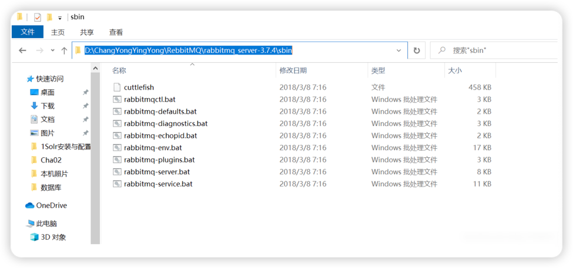
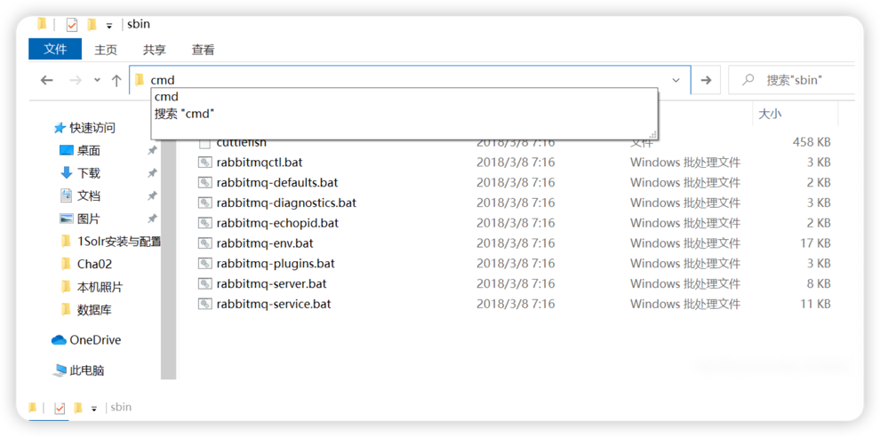
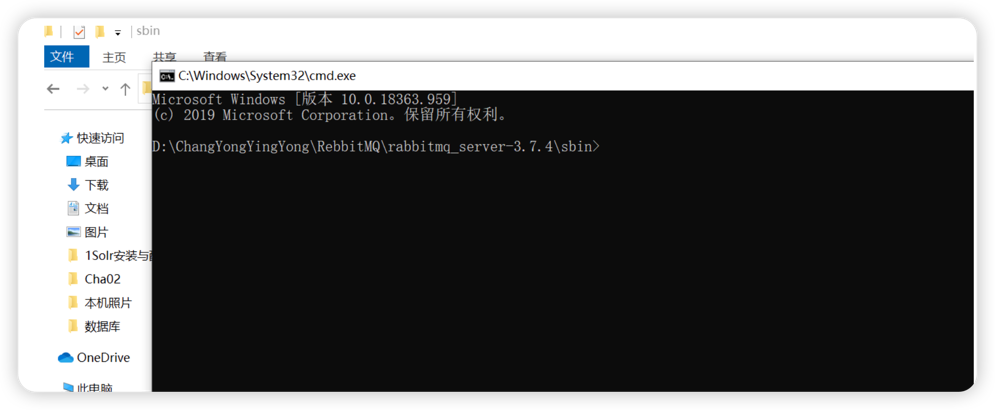
3、输入命令点击回车
```text
rabbitmq-plugins enable rabbitmq_management
```
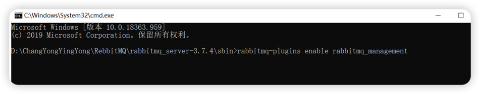
3、第三步

1.重启服务，双击rabbitmq-server.bat（双击后可能需要等待一会）
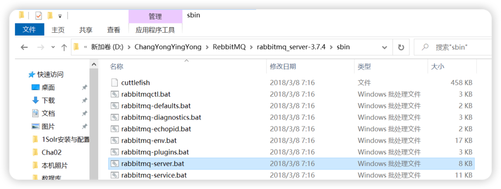
2.打开浏览器，地址栏输入http://127.0.0.1:15672 ,即可看到管理界面的登陆页

输入用户名和密码，都为guest 进入主界面：
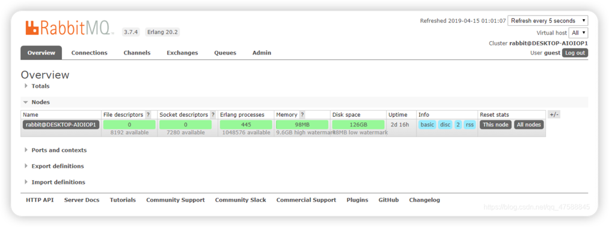
### 3.2、使用docker安装
1、使用 docker pull 进行拉取镜像
```shell
docker pull rabbitmq:3-management
```
2、运行镜像为容器
```shell
docker run -d --name rabbitmq -p 5672:5672 -p 15672:15672 rabbitmq
```
吧5672端口和本地的5672端口进行映射，吧15672和本地的15672端口进行映射
3、地址栏输入http://127.0.0.1:15672，即可看到管理界面的登陆页

输入用户名和密码，都为guest 进入主界面
## 四、RabbitMq介绍
1. RabbitMQ 的概念

RabbitMQ 是一个消息中间件：它接受并转发消息。你可以把它当做一个快递站点， 当你要发送一个包裹时，你把你的包裹放到快递站，快递员最终会把你的快递送到收件 人那里，按照这种逻辑 RabbitMQ 是一个快递站，一个快递员帮你传递快件。 RabbitMQ 与快递站的主要区别在于，它不处理快件而是接收， 存储和转发消息数据。

2. 四大核心概念

(1)生产者

产生数据发送消息的程序是生产者

(2)交换机

交换机是 RabbitMQ 非常重要的一个部件，一方面它接收来自生产者的消息，另一 方面它将消息推送到队列中。交换机必须确切知道如何处理它接收到的消息，是将这些 消息推送到特定队列还是推送到多个队列，亦或者是把消息丢弃，这个得有交换机类型 决定

(3)队列

队列是 RabbitMQ 内部使用的一种数据结构，尽管消息流经 RabbitMQ 和应用程 序，但它们只能存储在队列中。队列仅受主机的内存和磁盘限制的约束，本质上是一个 大的消息缓冲区。许多生产者可以将消息发送到一个队列，许多消费者可以尝试从一个 队列接收数据。这就是我们使用队列的方式

(4)消费者

消费与接收具有相似的含义。消费者大多时候是一个等待接收消息的程序。请注意生 产者，消费者和消息中间件很多时候并不在同一机器上。同一个应用程序既可以是生产 者又是可以是消费者。

3.RabbitMQ工作原理

Broker：接收和分发消息的应用，RabbitMQ Server 就是 Message Broker

Virtual host：出于多租户和安全因素设计的，把 AMQP 的基本组件划分到一个虚 拟的分组中，类似于网络中的 namespace 概念。当多个不同的用户使用同一个 RabbitMQ server 提供的服务时，可以划分出多个 vhost，每个用户在自己的 vhost 创建 exchange／queue 等

Connection：publisher／consumer 和 broker 之间的 TCP 连接

Channel：如果每一次访问 RabbitMQ 都建立一个 Connection，在消息量大的时候 建立 TCP Connection 的开销将是巨大的，效率也较低。Channel 是在 connection 内部建立的逻辑连接，如果应用程序支持多线程，通常每个 thread 创 建单独的 channel 进行通讯，AMQP method 包含了 channel id 帮助客户端和 message broker 识别 channel，所以 channel 之间是完全隔离的。Channel 作为轻 量级的Connection 极大减少了操作系统建立 TCP connection 的开销

Exchange：message 到达 broker 的第一站，根据分发规则，匹配查询表中的 routing key，分发消息到 queue 中去。常用的类型有：direct (point-to-point), topic (publish-subscribe) and fanout (multicast)

Queue：消息最终被送到这里等待 consumer 取走

Binding：exchange 和queue 之间的虚拟连接，binding 中可以包含 routing key， Binding 信息被保存到 exchange 中的查询表中，用于 message 的分发依据

3、RabbitMQ消息传递模式
```text
1、简单的一对一模型（最基本的队列模型： 一个生产者发送消息到一个队列，一个消费者从队列中取消息。）
2、工作队列模型 ，一个生产者将消息分发给多个消费者
3、发布/订阅模型 ，生产者发布消息，多个消费者同时收取
4、路由模型 ，生产者通过关键字发送消息给特定消费者
5、主题模型 ，路由模式基础上，在关键字里加入了通配符
```

## 四、springboot如何集成RabbitMq
1、Spring Boot 项目依赖
```xml
<dependency>
    <groupId>org.springframework.boot</groupId>
    <artifactId>spring-boot-starter-amqp</artifactId>
</dependency>

```
2、application.yml中配置 RabbitMQ 的连接信息
```yaml
spring:
  rabbitmq:
    host: localhost
    port: 5672
    username: guest
    password: guest
    virtual-host: /
```
```text
host 和 port: 指定 RabbitMQ 的地址和端口。
username 和 password: RabbitMQ 用户名和密码，默认为 guest/guest。
virtual-host: 虚拟主机，用于隔离不同的应用，默认是 /。
```
3、测试mq可用性

3.1、创建 RabbitMqConfig 类注解定义交换器和队列
```java
@Configuration
public class RabbitMqConfig {

    @Bean
    public DirectExchange directExchange() {
        return new DirectExchange("testExchange");
    }

    @Bean
    public Queue testQueue() {
        return new Queue("testQueue");
    }

    @Bean
    public Binding binding(Queue testQueue, DirectExchange directExchange) {
        return BindingBuilder.bind(testQueue).to(directExchange).with("testRoutingKey");
    }
}

```
3.2、编写发送消息Service类
```java
@Service
public class RabbitMqSender {

    //Spring AMQP (Advanced Message Queuing Protocol) 提供的一个类，用于与 RabbitMQ 消息代理进行通信
    @Autowired
    private RabbitTemplate rabbitTemplate;

    public void send(String exchange, String routingKey, String message) {
        //调用 convertAndSend 方法进行发送消息，message是消息内容
        rabbitTemplate.convertAndSend(exchange, routingKey, message);
        //打印发送成功
        System.out.println("消息已经发送： " + message);
    }
}

```
•	exchange：表示 RabbitMQ 中的交换机（Exchange）名称。交换机负责根据路由键（routing key）将消息路由到一个或多个队列。
•	routingKey：用于路由消息的键。根据交换机类型和这个键，RabbitMQ 决定将消息发送到哪些队列。
•	message：要发送的消息内容，通常是一个字符串。
3.3、编写接收Service类
```java
@Service
public class RabbitMqReceiver {

    // @RabbitListener 注解进行监听 testQueue 队列中的数据
    @RabbitListener(queues = "testQueue")
    public void receive(String message) {
        System.out.println("我收到了一条消息,消息内容为: " + message);
    }
}
```
```text
@RabbitListener(queues = "testQueue")：
这是一个注解，用于标记一个方法为消息监听器。它表示该方法会监听名为 "testQueue" 的 RabbitMQ 队列。
当有新消息到达 testQueue 时，RabbitMQ 会自动调用这个方法，并将消息内容传递给它。
```
3.4、编写Controller接口
```java
@RestController
@RequestMapping("/mq/test")
public class MqTestController {

    @Autowired
    private RabbitMqSender rabbitMqSender;

    @RequestMapping("/sendMsg")
    public R sendMsg(){
        rabbitMqSender.send("testExchange","testRoutingKey","我是一条消息");
        return R.ok();
    }
}
```
注意这是测试接口，需要在 WebMvcConfig 配置中进行配置，这个路径为免登陆接口
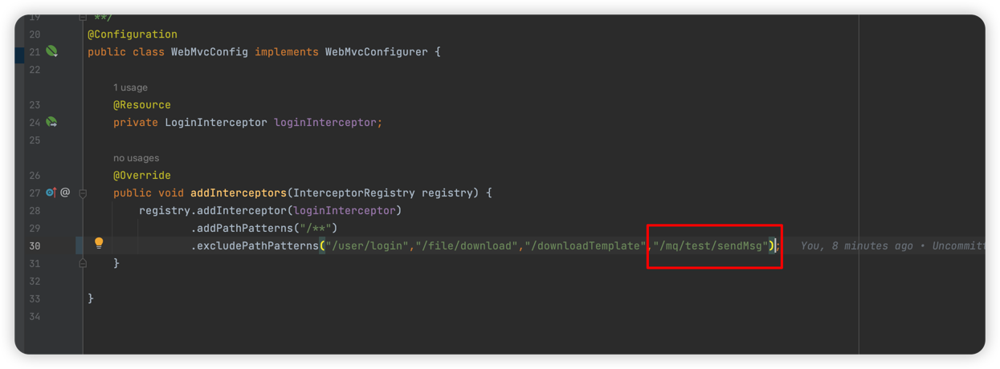
可以看到该接口进行调用了 RabbitMqSender service中的send方法，向mq中发送一条消息
3.5、进行测试调用
浏览器进行访问 http://127.0.0.1:8089/express/mq/test/sendMsg 链接，调用接口。调用成功以后我们可以看到控制台输出
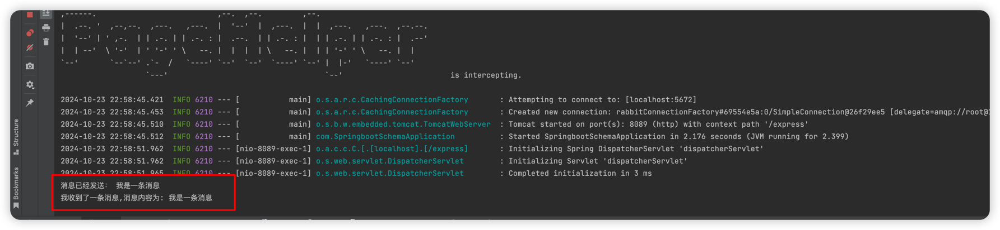
第一条则是RabbitMqSender中send方法打印的，代表我们消息发送成功了，当我们发送成功以后，我们可以看到下面
会有一个输出，则为“我收到了一条消息,消息内容为: 我是一条消息”，这个输出内容则是我们 RabbitMqReceiver中
receive方法监听到的，到这步就已经证明我们的mq可以正常发送和接收消息
## 六、业务中集成MQ
### 1、业务集成mq说明
收支明细中有导入文件按钮，点击导入文件会进行调用接口，然后解析Excel，解析之后会把消息发发送到 importDataQueue 队列中，该
队列接收到消息以后，就进行插入数据，这样用户体验效果会更好，用户在前台上传文件响应非常及时，实际上业务处理都是通过mq进行发送了消息，
后台进行处理导入数据的
### 2、具体实现
#### 2.1、需要先实现导入功能,创建基础类
```java
@Data
public class ImportDataVo {

    @ExcelProperty("金额(*必填)")
    private BigDecimal price;

    @ExcelProperty("分类(*必填)")
    private String category;

    @ExcelProperty("日期(*必填 格式:年-月-日)")
    private String date;

    @ExcelProperty("备注")
    private String remark;
}
```
ImportDataVo类为导入excel模板映射类
#### 2.2、新建导入业务专属的topic队列
```java
  @Bean
    public Queue importDataQueue() {
        return new Queue("importDataQueue");
    }

    @Bean
    public Binding importData(Queue importDataQueue, DirectExchange directExchange) {
        return BindingBuilder.bind(importDataQueue).to(directExchange).with("importData");
    }
```
在RabbitMqConfig中添加这个两个方法即可，就创建了一个名为 importDataQueue 的队列
#### 2.3、新建controller接口，接收到用户传输的excel文件之后解析数据吧数据放入队列中
```java
@RestController
public class TemplateController {


    @Autowired
    private RabbitMqSender rabbitMqSender;
    @Autowired
    private UserService userService;


    @PostMapping("/importData")
    public R importData(@RequestParam("file") MultipartFile file) throws IOException {
        if (file.isEmpty()) {
            return R.error("上传文件为空");
        }
        SimpleDateFormat sdf = new SimpleDateFormat("yyyy-MM-dd");
        try {
            List<ImportDataVo> dataList = EasyExcel.read(file.getInputStream())
                    .head(ImportDataVo.class)
                    .sheet()
                    .doReadSync();
            if(CollectionUtils.isEmpty(dataList)){
                return R.error("表格中数据不能为空");
            }
            List<AccountionRecord> accountionRecordList = new ArrayList<>();
            int i = 0;
            for (ImportDataVo importDataVo : dataList) {
                i++;
                if(importDataVo.getPrice() == null){
                    return R.error("第"+i+"行数据金额为空");
                }
                if(StringUtils.isEmpty(importDataVo.getDate())){
                    return R.error("第"+i+"行数据日期为空");
                }
                try {
                    Date parse = sdf.parse(importDataVo.getDate());
                } catch (ParseException e) {
                    e.printStackTrace();
                    return R.error("第"+i+"行数据日期格式错误，格式应为 年-月-日");
                }
                if(StringUtils.isEmpty(importDataVo.getCategory())){
                    return R.error("第"+i+"行数据分类为空");
                }
                String[] split = importDataVo.getCategory().split("-");
                AccountionRecord accountionRecord = new AccountionRecord();
                accountionRecord.setTypeName(split[1]);
                try {
                    accountionRecord.setTime(sdf.parse(importDataVo.getDate()));
                } catch (ParseException e) {
                    throw new RuntimeException(e);
                }
                accountionRecord.setPrice(importDataVo.getPrice());
                accountionRecord.setRemark(importDataVo.getRemark());
                accountionRecord.setUserId(userService.getLoginUser().getId());
                accountionRecordList.add(accountionRecord);
            }
            rabbitMqSender.send("testExchange","importData", JSON.toJSONString(accountionRecordList));
            return R.ok("文件上传并处理成功");
        } catch (IOException e) {
            e.printStackTrace();
            return R.error("文件处理失败: " + e.getMessage());
        }


    }
    
}
```
这块的接口进行解析excel数据，然后解析之后，吧数据发送到 importDataQueue 队列中。
#### 2.2、创建监听方法
```java

@Autowired
private AccountionRecordService accountionRecordService;

@RabbitListener(queues = "importDataQueue")
    public void importData(String message) {
        System.out.println("我收到了一条消息,消息内容为: " + message);
        try {
            if(!StringUtils.isEmpty(message)){
                List<AccountionRecord> accountionRecordList = JSON.parseArray(message, AccountionRecord.class);
                for (AccountionRecord accountionRecord : accountionRecordList) {
                    accountionRecordService.insert(accountionRecord);
                }
            }
        }catch (Exception e){
            e.printStackTrace();
        }
    }
```
在 RabbitMqReceiver 类中进行创建一个监听 importDataQueue 队列的方法，这块监听到数据以后，进行调用记账模块进行保存数据
