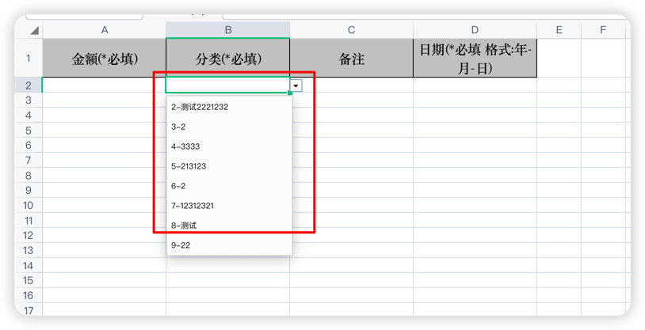

# EasyExcel应用
## 一、EasyExcel介绍
```text
1、数据导入：减轻录入工作量

2、数据导出：统计信息归档

3、数据传输：异构系统之间数据传输
```
## 二、EasyExcel特点
```text
Java领域解析、生成Excel比较有名的框架有Apache poi、jxl等。但他们都存在一个严重的问题就是非常的耗内存。如果你的系统并发量不大的话可能还行，但是一旦并发上来后一定会OOM或者JVM频繁的full gc。
EasyExcel是阿里巴巴开源的一个excel处理框架，以使用简单、节省内存著称。EasyExcel能大大减少占用内存的主要原因是在解析Excel时没有将文件数据一次性全部加载到内存中，而是从磁盘上一行行读取数据，逐个解析。
EasyExcel采用一行一行的解析模式，并将一行的解析结果以观察者的模式通知处理（AnalysisEventListener）
```
## 三、EasyExcel核心优势
```text
内存效率：特别针对大文件进行了优化，能够以极低的内存占用处理大规模数据，解决了Apache POI在处理大文件时内存消耗大的弊端。
简化操作：提供了直观的API，如使用注解@ExcelProperty来标记Excel列与Java对象属性的映射，使得读写Excel的操作更为简便快捷。
版本兼容性：支持Excel 03及07以上版本的读写，同时根据项目需求灵活选择不同版本的依赖，确保与现有技术栈的兼容。
流式处理：支持数据的分批读写，特别适合需要边读取边处理或数据来源为数据库分页查询的场景，进一步减轻内存负担。
```
## 四、springboot集成EasyExcel
### 1、pom文件中引入依赖
```xml
<dependency>
    <groupId>commons-io</groupId>
    <artifactId>commons-io</artifactId>
    <version>2.11.0</version> <!-- Use the latest version available -->
</dependency>
<dependency>
    <groupId>com.alibaba</groupId>
    <artifactId>easyexcel</artifactId>
    <version>3.0.5</version>
</dependency>
```
### 2、业务场景中应用下载模板,实现Excel模板动态化设置
#### 2.1、新建模板类
```java

@Data
@ExcelIgnoreUnannotated
public class TemplateVo {

    @ColumnWidth(25)
    @ExcelProperty(value = "金额(*必填)", index = 0)
    private BigDecimal price;

    /**
     * 分类
     */
    @ColumnWidth(25)
    @ExcelProperty(value = "分类(*必填)", index = 1)
    private String classify;

    /**
     * 备注
     */
    @ColumnWidth(25)
    @ExcelProperty(value = "备注", index = 2)
    private String remark;


    @ColumnWidth(25)
    @ExcelProperty(value = "日期(*必填 格式:年-月-日)",index = 3)
    private String time;
}

```
这块中需要注意，@ExcelProperty 是EasyExcel的注解，代表是表属性，value是表字段的填充内容，index是横向排序，从这个上面的模板类
可以看出来，实际就是吧这些内容进行填充到了excel上的第一行，由此呈现出来表格
#### 2.2、创建excel拦截器
```java

public class CommonSheetWriteHandler implements SheetWriteHandler {

    /**
     * 下拉框对应列数据关系信息
     */
    private final Map<Integer, String[]> mapDropDown;

    public CommonSheetWriteHandler(Map<Integer, String[]> mapDropDown) {
        this.mapDropDown = mapDropDown;
    }

    @Override
    public void beforeSheetCreate(WriteWorkbookHolder writeWorkbookHolder, WriteSheetHolder writeSheetHolder) {

    }

    @Override
    public void afterSheetCreate(WriteWorkbookHolder writeWorkbookHolder, WriteSheetHolder writeSheetHolder) {
        // 获取一个workbook
        Sheet sheet = writeSheetHolder.getSheet();
        // 设置下拉框
        DataValidationHelper helper = sheet.getDataValidationHelper();
        // 定义sheet的名称
        String hiddenName = "hidden";
        // 1.创建一个隐藏的sheet 名称为 hidden
        Workbook workbook = writeWorkbookHolder.getWorkbook();
        Sheet hidden = workbook.createSheet(hiddenName);
        Name category1Name = workbook.createName();
        category1Name.setNameName(hiddenName);
        for (Map.Entry<Integer, String[]> entry : mapDropDown.entrySet()) {
            // 下拉框的起始行,结束行,起始列,结束列
            CellRangeAddressList addressList = new CellRangeAddressList(1, 1000, entry.getKey(), entry.getKey());
            // 获取excel列名
            String excelLine = getExcelLine(entry.getKey());
            // 2.循环赋值
            String[] values = entry.getValue();
            for (int i = 0, length = values.length; i < length; i++) {
                // 3.表示你开始的行数
                Row row = hidden.getRow(i);
                if (row == null) {
                    row = hidden.createRow(i);
                }
                row.createCell(entry.getKey()).setCellValue(values[i]);
            }
            // 4.=hidden!$H:$1:$H$50  sheet为hidden的H1列开始H50行数据获取下拉数组
            String refers = "=" + hiddenName + "!$" + excelLine +
                    "$1:$" + excelLine + "$" + (values.length);
            // 5.将刚才设置的sheet引用到你的下拉列表中
            DataValidationConstraint constraint = helper.createFormulaListConstraint(refers);
            DataValidation dataValidation = helper.createValidation(constraint, addressList);
            writeSheetHolder.getSheet().addValidationData(dataValidation);
        }
        // 设置列为隐藏
        int hiddenIndex = workbook.getSheetIndex("hidden");
        if (!workbook.isSheetHidden(hiddenIndex)) {
            workbook.setSheetHidden(hiddenIndex, true);
        }
    }

    /**
     * 获取excel列名
     *
     * @param num 列
     * @return 数据
     */
    private String getExcelLine(int num) {
        String line = "";
        int first = num / 26;
        int second = num % 26;
        if (first > 0) {
            line = (char) ('A' + first - 1) + "";
        }
        line += (char) ('A' + second) + "";
        return line;
    }
}

```
拦截器是进行拦截excel导出的，下载模板也属于导出excel，进行设置表头字段的宽度背景色等等
#### 2.3、开发下载模板接口
```java


@RestController
public class TemplateController {

    @Autowired
    private ClassifyService classifyService;

    @GetMapping("/downloadTemplate")
    public void downloadTemplate(HttpServletResponse response) throws IOException {
        response.setContentType("application/vnd.openxmlformats-officedocument.spreadsheetml.sheet");
        response.setCharacterEncoding("utf-8");
        try {
            String fileName = URLEncoder.encode("记账导入模板", String.valueOf(StandardCharsets.UTF_8)).replaceAll("\\+", "%20");
            response.setHeader("Content-disposition", "attachment;filename*=utf-8''" + fileName + ".xlsx");
            //获取分类
            List<Classify> list = classifyService.lambdaQuery().eq(Classify::getDelete, 0).list();
            //转成指定结构
            List<String> idNameList = list.stream()
                    .map(classify -> classify.getId() + "-" + classify.getName())
                    .collect(Collectors.toList());
            //创建一个选择框集合
            Map<Integer, String[]> mapDropDown = new HashMap<>(1);
            //放进去
            mapDropDown.put(1, idNameList.toArray(new String[0]));
            EasyExcel.write(response.getOutputStream(), TemplateVo.class)
                    .head(TemplateVo.class)
                    .registerWriteHandler(new CommonSheetWriteHandler(mapDropDown))
                    .sheet("记账导入模板")
                    .doWrite(new ArrayList<>());
        } catch (Exception e) {
            e.printStackTrace();
        }
    }
}
```
代码中有mapDropDown这个属性，这个属性存储了模板excel中可以选择的内容，请看以下截图,这块是吧系统上所有的分类都做成了下拉框，
供用户进行选择

### 3、业务场景中应用导入excel数据
进行创建导入对象，excel中的数据都会转成这个对象，注意@ExcelProperty注解，这个注解中的内容对应excel中的行头，必须名称一致，
才能进行序列化数据成功
```java
@Data
public class ImportDataVo {

    @ExcelProperty("金额(*必填)")
    private BigDecimal price;

    @ExcelProperty("分类(*必填)")
    private String category;

    @ExcelProperty("日期(*必填 格式:年-月-日)")
    private String date;

    @ExcelProperty("备注")
    private String remark;
}

```
开发导入接口
```java
    @PostMapping("/importData")
    public R importData(@RequestParam("file") MultipartFile file) throws IOException {
        if (file.isEmpty()) {
            return R.error("上传文件为空");
        }
        SimpleDateFormat sdf = new SimpleDateFormat("yyyy-MM-dd");
        try {
            //这段是吧文件流Excel数据进行转成ImportDataVo对象，然后下面解析数据以后，吧数据进行发送到MQ中，MQ后台进行处理导入数据
            List<ImportDataVo> dataList = EasyExcel.read(file.getInputStream())
                    .head(ImportDataVo.class)
                    .sheet()
                    .doReadSync();
            if(CollectionUtils.isEmpty(dataList)){
                return R.error("表格中数据不能为空");
            }
            List<AccountionRecord> accountionRecordList = new ArrayList<>();
            int i = 0;
            for (ImportDataVo importDataVo : dataList) {
                i++;
                if(importDataVo.getPrice() == null){
                    return R.error("第"+i+"行数据金额为空");
                }
                if(StringUtils.isEmpty(importDataVo.getDate())){
                    return R.error("第"+i+"行数据日期为空");
                }
                try {
                    Date parse = sdf.parse(importDataVo.getDate());
                } catch (ParseException e) {
                    e.printStackTrace();
                    return R.error("第"+i+"行数据日期格式错误，格式应为 年-月-日");
                }
                if(StringUtils.isEmpty(importDataVo.getCategory())){
                    return R.error("第"+i+"行数据分类为空");
                }
                String[] split = importDataVo.getCategory().split("-");
                AccountionRecord accountionRecord = new AccountionRecord();
                accountionRecord.setTypeName(split[1]);
                try {
                    accountionRecord.setTime(sdf.parse(importDataVo.getDate()));
                } catch (ParseException e) {
                    throw new RuntimeException(e);
                }
                accountionRecord.setPrice(importDataVo.getPrice());
                accountionRecord.setRemark(importDataVo.getRemark());
                accountionRecord.setUserId(userService.getLoginUser().getId());
                accountionRecordList.add(accountionRecord);
            }
            rabbitMqSender.send("testExchange","importData", JSON.toJSONString(accountionRecordList));
            return R.ok("文件上传并处理成功");
        } catch (IOException e) {
            e.printStackTrace();
            return R.error("文件处理失败: " + e.getMessage());
        }


    }
```
