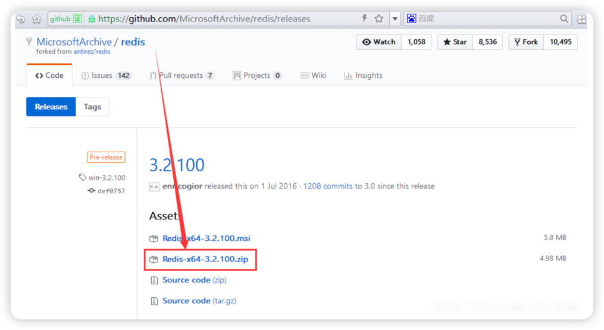
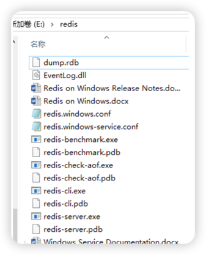
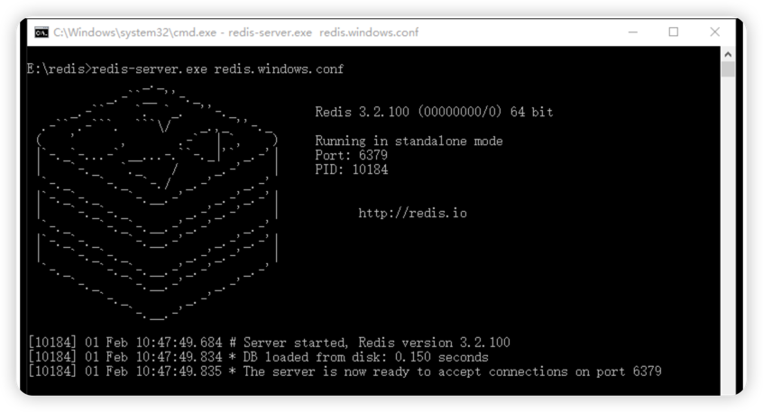
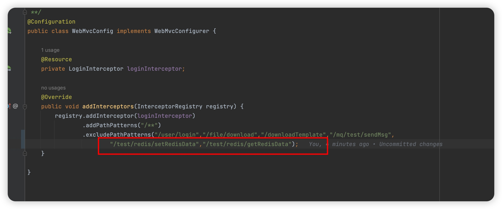
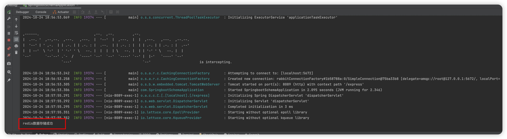
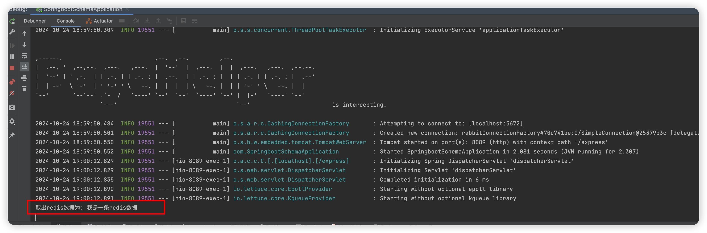

# Redis应用
## 一、关系数据库与非关系型数据库介绍
1、关系型数据库
  
关系型数据库是一个结构化的数据库，创建在关系模型（二维表格模型）基础上，一般面向于记录。

SQL 语句（标准数据查询语言）就是一种基于关系型数据库的语言，用于执行对关系型数据库中数据的检索和操作。

主流的关系型数据库包括 Oracle、MySQL、SQL Server、Microsoft Access、DB2 等。

优点：

① 易于维护：都是使用表结构，格式一致

② 使用方便：SQL语言通用，可用于复杂查询

③ 支持复杂操作：支持SQL，可用于一个表以及多个表之间非常复杂的查询

缺点：

① 读写性能比较差，尤其是海量数据的高效率读写

② 固定的表结构，灵活度稍欠

③ 对于高并发读写的需求，传统关系型数据库节点的硬盘I/O是一个很大的瓶颈

2、非关系型数据库
   
NoSQL(NoSQL = Not Only SQL )，意思是“不仅仅是 SQL”，是非关系型数据库的总称。

除了主流的关系型数据库外的数据库，都认为是非关系型。

主流的 NoSQL 数据库有 Redis、MongBD、Hbase、CouhDB 等。

3、关系数据库与非关系型数据库区别

数据存储方式不同

关系型和非关系型数据库的主要差异是数据存储的方式。关系型数据天然就是表格式的，因此存储在数据表的行和列中。数据表可以彼此关联协作存储，也很容易提取数据。

与其相反，非关系型数据不适合存储在数据表的行和列中，而是大块组合在一起。非关系型数据通常存储在数据集中，就像文档、键值对或者图结构。你的数据及其特性是选择数据存储和提取方式的首要影响因素。

扩展方式不同
SQL和NoSQL数据库最大的差别可能是在扩展方式上，要支持日益增长的需求当然要扩展。

要支持更多并发量，SQL数据库是纵向扩展，也就是说提高处理能力，使用速度更快速的计算机，这样处理相同的数据集就更快了。因为数据存储在关系表中，操作的性能瓶颈可能涉及很多个表，这都需要通过提高计算机性能来客服。虽然SQL数据库有很大扩展空间，但最终肯定会达到纵向扩展的上限。

而NoSQL数据库是横向扩展的。因为非关系型数据存储天然就是分布式的，NoSQL数据库的扩展可以通过给资源池添加更多普通的数据库服务器(节点)来分担负载。

对事务性的支持不同
如果数据操作需要高事务性或者复杂数据查询需要控制执行计划，那么传统的SQL数据库从性能和稳定性方面考虑是你的最佳选择。SQL数据库支持对事务原子性细粒度控制，并且易于回滚事务。

虽然NoSQL数据库也可以使用事务操作，但稳定性方面没法和关系型数据库比较，所以它们真正闪亮的价值是在操作的扩展性和大数据量处理方面。
## 二、Redis简介
Redis 基于内存运行并支持持久化，采用key-value（键值对）的存储形式，是目前分布式架构中不可或缺的一环。

1、Redis的单线程模式

Redis服务器程序是单进程模型，也就是在一台服务器上可以同时启动多个Redis进程，Redis的实际处理速度则是完全依靠于主进程的执行效率。若在服务器上只运行一个Redis进程，当多个客户端同时访问时，服务器的处理能力是会有一定程度的下降；若在同一台服务器上开启多个Redis进程，Redis在提高并发处理能力的同时会给服务器的CPU造成很大压力。即：在实际生产环境中，需要根据实际的需求来决定开启多少个Redis进程。若对高并发要求更高一些，可能会考虑在同一台服务器上开启多个进程。若 CPU 资源比较紧张，采用单进程即可。

2、Redis 优点

具有极高的数据读写速度：数据读取的速度最高可达到 110000 次/s，数据写入速度最高可达到 81000 次/s。

支持丰富的数据类型：支持 key-value、Strings字符串（可以为整型、浮点型和字符串，通称为元素）、Lists列表（实现队列，元素不唯一，先入先出原则）、Hashes：hash散列值（hash的key必须是唯一的）、Sets集合（各不相同的元素）及 Ordered Sets有序集合 等数据类型操作。

支持数据的持久化：可以将内存中的数据保存在磁盘中，重启的时候可以再次加载进行使用。

原子性：Redis 所有操作都是原子性的。

支持数据备份：即 master-salve 模式的数据备份。

3、Redis 缺点

数据容量收到物理内存的限制，不能用于海量数据的高性能读写，因此Redis适合的场景主要局限在较小数据量的高性能操作和运算上
## 三、Redis安装
### 1、Windows环境下安装Redis
Windows版本下载地址：https://github.com/MicrosoftArchive/redis/releases

下载 Redis-x64-3.2.100.zip



解压后目录如下:


打开cmd命令进入redis目录，执行
```sheel
redis-server.exe redis.windows.conf
```
显示如下图所示，表示 Redis 服务已启动



### 2、docker安装Redis
```text
安装redis镜像：拉取官方的最新版本的镜像
docker pull redis:latest
查看redis镜像：查看是否已安装了 redis
docker images
运行容器
docker run -itd --name myRedis -p 6379:6379 redis
查看容器安装成功
docker ps
```
吧Redis中的6379端口给映射到本地6379端口中
## 四、Redis 数据库常用命令
常用数据类型
Redis存储的是key-value结构的数据，其中key是字符串类型，value有五种常用到的数据类型

String —— 字符串类型（最常用）

Hash —— 字典类型（最常用）

List —— 列表类型

Set —— 集合类型

ZSet —— 有序集合类型

2.2、字符串常用命令
字符串类型string：普通字符串，Redis中最简单的数据类型

|指令|	说明|
|----|----|
|set key value	|设置指定key的值|
|get key	|获取指定key的值|
|setex key seconds value	|设置置顶key的值，并将key的过期时间设置为seconds秒|
|setnx key value	|只有在key不存在时设置value的值|
```
// 设置指定key所对应值
set name lihua
// 获取指定key的值
get name
// 设置指定key的有效时间为20秒
setex age 20 zhang
// 当设置的key不存在时才会设置对应的值，存在时不设置
setnx score 98      // 不存在时返回1，存在时返回0
```
2.3、哈希常用命令
哈希hash：也叫散列，类似于java中的HashMap结构，hash特别适合存储对象
|指令	|说明|
|----|----|
|hset key field value|	将哈希表中的字段field的值设置为value|
|hget key field	|获取存储在哈希表中指定字段的值|
|hdel key field	|删除存储在哈希表中指定字段的值|
|hkeys key	|获取哈希表中的所有字段|
|hvals key	|获取哈希表中所有值|
```
// 设置ID属性为2的人的name属性为zhang
hset 2 name zhang
// 获取ID属性为2的问的name属性的值
hget 2 name
// 删除id属性为2的人的name属性的值
hdel 2 name
// 获取ID属性为2的人的所有字段
hkeys 2
// 获取ID属性为2的人的所有字段值
hvals 2
```
2.4、列表常用命令
列表list：按照插入顺序排序，可以有重复元素，类似java中的linkelist
| 指令 | 说明 |
|------|------|
|   lpush key value1 [value2]   |  将一个或多个值插入到列表的头部    |
|   lrange key start stop   |  获取列表指定范围内的元素    |
|   rpop key   |  移除并获取列表最后一个元素    |
|   llen key   |  获取类表的长度    |
```
// 向对应key中插如两个值
lpush mylist 23 43
// 获取对应key的指定范围内的元素（头部到尾部使用0 -1表示）
lrange mylist 0 -1
// 删除并获取列表中的最后一个
rpop mylist
// 获取指定列表的长度
llen mylist
```
2.5、集合常用命令
集合set：无序集合，没有重复元素，类似于java中的HashSet
| 指令                        | 说明                      |  |
|-----------------------------|---------------------------|---|
| sadd key member1 [member2]	 | 向集合中添加一个或多个成员 |  |
| smembers key                | 返回集合中的所有成员      |  |
| scard key                   | 获取集合的成员数          |  |
| sinter key1 [key2]          | 返回所有指定集合的交集    |  |
| sunion key1 [key2]          | 返回所有集合的并集        |  |
| srem key member1 [member2]  | 删除集合中一个或多个成员   |  |

```
// 向集合中添加两个成员
sadd myset 223 344
// 返回集合中的所有元素
smembers myset
// 获取集合的成员数
scard myset
// 返回两个集合的交集
sinter myset1 myset2
// 返回两个集合的并集
sunion myset2 myset2
// 删除集合中的元素
srem myset 223
```
2.6、有序集合常用命令
有序集合sorted set ｜zset：集合中每个元素关联一个double类型的分数，根据分数生序排序，没有重复元素
	
| 指令                                     | 说明                                         |  |
|------------------------------------------|----------------------------------------------|---|
| zadd key score1 member1 [score2 member2] | 向有序集合中体添加一个或多个成员              |  |
| zrange key start stop [withscores]       | 通过索引区间返回有序集合中的指定区间的元素   |  |
| zincrby key increament member            | 有序集合中对指定成员的分数加上增量increament |  |
| zrem key member [member]                 | 移除有序集合中的一个或者多个元素              |  |

```
// 向有序集合中添加一个成员并指定a的score值为10.0
zadd zset 10.0 a
// 查看有序集合中的所有成员的元素
zrange zset 0 -1
// 查看有序集合中的所有成员的元素和分数
zrange zset 0 -1 withscore
// 对有序成员中的a元素的分数值加5
zincrby zset 5.0 a
// 删除有序集合中的指定元素
zrem zset b
```
2.7、通用命令
Redis的通用命令就是部分数据类型的，都可以使用的命令

| 命令              | 说明  |
|-----------------| ----  |
| keys pattem     | 查找所有符合给定模式pattem的key |
| exists key      | 检查给定的key是否存在 |
| type key        | 返回key所存储的数据类型 |
| del key1 [key2] | 删除指定存在的key |
```text
// 返回所有的key
keys *
// 返回以set开头的所有key
keys set*
// 检查具体key是否存在
exists tex
// 返回对应key存储的数据类型
type tex
// 删除key
del tex
```
## 五、Redis高可用
在web服务器中，高可用是指服务器可以正常访问的时间，衡量的标准是在多长时间内可以提供正常服务（99.9%、99.99%、99.999%等等）。

但是在Redis语境中，高可用的含义似乎要宽泛一些，除了保证提供正常服务（如主从分离、快速容灾技术），还需要考虑数据容量的扩展、数据安全不会丢失等。

在Redis中，实现高可用的技术主要包括持久化、主从复制、哨兵和 Cluster集群，下面分别说明它们的作用，以及解决了什么样的问题。

●持久化：持久化是最简单的高可用方法(有时甚至不被归为高可用的手段)，主要作用是数据备份，即将数据存储在硬盘，保证数据不会因进程退出而丢失。

●主从复制：主从复制是高可用Redis的基础，哨兵和集群都是在主从复制基础上实现高可用的。主从复制主要实现了数据的多机备份，以及对于读操作的负载均衡和简单的故障恢复。缺陷：故障恢复无法自动化；写操作无法负载均衡；存储能力受到单机的限制。

●哨兵：在主从复制的基础上，哨兵实现了自动化的故障恢复。缺陷：写操作无法负载均衡；存储能力受到单机的限制。

●Cluster集群：通过集群，Redis解决了写操作无法负载均衡，以及存储能力受到单机限制的问题，实现了较为完善的高可用方案。
## 六、Redis持久化
持久化的功能：Redis是内存数据库，数据都是存储在内存中，为了避免服务器断电等原因导致Redis进程异常退出后数据的永久丢失，需要定期将Redis中的数据以某种形式（数据或命令）从内存保存到硬盘；当下次Redis重启时，利用持久化文件实现数据恢复。除此之外，为了进行灾难备份，可以将持久化文件拷贝到一个远程位置。

1.Redis 提供两种方式进行持久化
RDB 持久化：原理是将 Reids在内存中的数据库记录定时保存到磁盘上。

AOF 持久化（append only file）：原理是将 Reids 的操作日志以追加的方式写入文件，类似于MySQL的binlog。

由于AOF持久化的实时性更好，即当进程意外退出时丢失的数据更少，因此AOF是目前主流的持久化方式，不过RDB持久化仍然有其用武之地。

2.RDB 持久化
RDB持久化是指在指定的时间间隔内将内存中当前进程中的数据生成快照保存到硬盘(因此也称作快照持久化)，用二进制压缩存储，保存的文件后缀是rdb；当Redis重新启动时，可以读取快照文件恢复数据。

3.AOF 持久化
RDB持久化是将进程数据写入文件，而AOF持久化，则是将Redis执行的每次写、删除命令记录到单独的日志文件中，查询操作不会记录； 当Redis重启时再次执行AOF文件中的命令来恢复数据。
与RDB相比，AOF的实时性更好，因此已成为主流的持久化方案。

## 七、springBoot集成Redis
1、添加依赖
```xml
<!-- 集成redis依赖  -->
<dependency>
    <groupId>org.springframework.boot</groupId>
    <artifactId>spring-boot-starter-data-redis</artifactId>
</dependency>

```
2、application.yml配置文件添加配置
```yaml
spring:
  redis:
    host: localhost
    port: 6379
    password: 123456
    database: 0
```
3、项目中使用
```java
@AAutowired
private RedisTemplate redisTemplate;
```
直接注入使用即可

## 八、Redis测试案例
### 1、向redis中进行保存数据
```java
@RestController
@RequestMapping("/test/redis")
public class RedisTestController {

    @Autowired
    private RedisTemplate<String,String> redisTemplate;

    @GetMapping("setRedisData")
    public void setRedisData(){
        //吧数据存入到redis中，key为testKey
        redisTemplate.opsForValue().set("testKey","我是一条redis数据");
        //控制台输出redis数据存储成功
        System.out.println("redis数据存储成功");
    }

}
```


### 2、获取Redis中数据接口
```java
     @GetMapping("getRedisData")
    public void getRedisData(){
        //从redis中获取testKey数据，并且输出带控制台
        System.out.println("取出redis数据为: " + redisTemplate.opsForValue().get("testKey"));;
    }
```

### 3、吧test接口进行配置为不鉴权，不然测试的话还需要token信息,修改 WebMvcConfig 类

### 4、测试接口
4.1、测试存储redis数据接口
浏览器直接访问 http://127.0.0.1:8089/express/test/redis/setRedisData
访问之后可以看到控制台打印：redis数据存储成功

4.2、测试获取redis数据接口
浏览器直接访问 http://127.0.0.1:8089/express/test/redis/getRedisData
访问之后可以看到控制台打印，存储的数据

测试到此结束
## 九、Redis实际应用业务
### 1、登陆存储Token场景
一般应用场景为用户登陆吧用户登陆token信息存入数据库中，即当用户登陆时进行判断用户名或者密码是否正确，正确以后，生成Token，吧token存入到Redis中，然后添加拦截器，进行拦截接口，当拦截到接口以后，拿着用户token去reids中检索是否存在，存在即返回正确，不存在即返回异常
登陆接口使用redis关键代码
```java
    public String login(LoginDto loginDto) {
        Integer loginType = loginDto.getLoginType();
        User user;
        switch (loginType){
            case 1:
                if(StringUtils.isEmpty(loginDto.getPhone())){
                    throw new BizException("登陆手机号不能为空");
                }
                //手机号登陆
                user = this.lambdaQuery().eq(User::getPhone, loginDto.getPhone()).eq(User::getDelete,0).one();
                if(user == null){
                    throw new BizException("用户手机号不存在");
                }
                String code = redisTemplate.opsForValue().get("loginPhone::" + user.getPhone());
                if(StringUtils.isEmpty(code) || !loginDto.getCode().equals(code)){
                    throw new BizException("验证码不正确");
                }
                break;
            case 2:
                if(StringUtils.isEmpty(loginDto.getUsername()) || StringUtils.isEmpty(loginDto.getPassword())){
                    throw new BizException("用户名或者密码不能为空");
                }
                //账号密码登陆
                user = this.lambdaQuery().eq(User::getUsername, loginDto.getUsername()).eq(User::getDelete,0).one();
                if(user == null){
                    throw new BizException("用户名不存在");
                }
                //校验密码
                String password = user.getPassword();
                if(!loginDto.getPassword().equals(password)){
                    throw new BizException("密码不正确，请重新输入");
                }
                break;
            default:
                throw new BizException("登陆类型异常");
        }
        //生成token
        String token = UUID.randomUUID().toString().replace("-","");
        //存储用户信息
        user.setPassword(null);
        redisTemplate.opsForValue().set("loginToken::"+token, JSON.toJSONString(user));
        return token;
    }
```
可以看到我们 UUID.randomUUID().toString().replace("-","")这快代码，我们进行生成了一个UUID当作用户token，并且吧这个token当作key存储到redis中，并且吧user信息当作值存进去

拦截器校验Token正确性
```java
@Override
    public boolean preHandle(HttpServletRequest request, HttpServletResponse response, Object handler) throws Exception{
        if("OPTIONS".equals(request.getMethod().toUpperCase())) {
            System.out.println("Method:OPTIONS");
            return true;
        }
        String token = request.getHeader("authorization");
        // 4. 判断令牌是否存在，不存在返回登录失败
        if(StringUtils.isEmpty(token)){
            throw new BizException(401,"token不存在");
        }
        //从redis中获取登陆用户数据
        String login = redisTemplate.opsForValue().get("loginToken::" + token);
        if(StringUtils.isEmpty(login)){
            throw new BizException(401,"用户未登录");
        }
        return true;
    }
```
### 2、业务数据存储场景
```java
    //吧数据同步到redis中
    public void syncRedisData(){
        User loginUser = userService.getLoginUser();
        R select = this.select();
        //获取所有分类数据
        List<Classify> list = (List<Classify>) select.get("data");
        //吧数据存入到redis中，并且key定义为用户Id，因为每个用户的数据都不一致
        redisTemplate.opsForValue().set("calssify::data:"+loginUser.getId(), JSON.toJSONString(list));
    }

    @PostMapping("insert")
    public R insert(@RequestBody Classify classify){
        User loginUser = userService.getLoginUser();
        classify.setUserId(loginUser.getId());
        classifyService.save(classify);
        //重新同步Redis分类数据
        syncRedisData();
        return R.ok();
    }

    @PostMapping("delete")
    public R delete(@RequestBody Classify classify){
        classifyService.lambdaUpdate().eq(Classify::getId,classify.getId())
                .set(Classify::getDelete,1).update();
        //重新同步Redis分类数据
        syncRedisData();
        return R.ok();
    }

    @PostMapping("update")
    public R update(@RequestBody Classify classify){
        classifyService.updateById(classify);
        //重新同步Redis分类数据
        syncRedisData();
        return R.ok();
    }


    @GetMapping("select")
    public R select(){
        User user = userService.getLoginUser();
        //根据用户Id从redis中获取存储的分类数据
        String calssifyDataList = redisTemplate.opsForValue().get("calssify::data:" + user.getId());
        //如果redis中的key的数据是空，则进行查询数据并且返回
        if(StringUtils.isEmpty(calssifyDataList)){
            List<Classify> list = classifyService.lambdaQuery()
                    .eq(Classify::getDelete, 0) // 先过滤删除标记
                    .and(wrapper -> wrapper
                            .eq(Classify::getUserId, user.getId())
                            .or().eq(Classify::getUserId, 0) // 这里确保是和 delete 条件一起
                    )
                    .list();
            return R.ok().put("data",list);
        }else{
            List<Classify> list = JSON.parseArray(calssifyDataList, Classify.class);
            return R.ok().put("data",list);
        }

    }
```