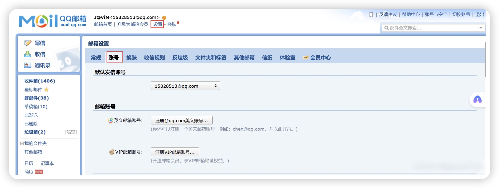
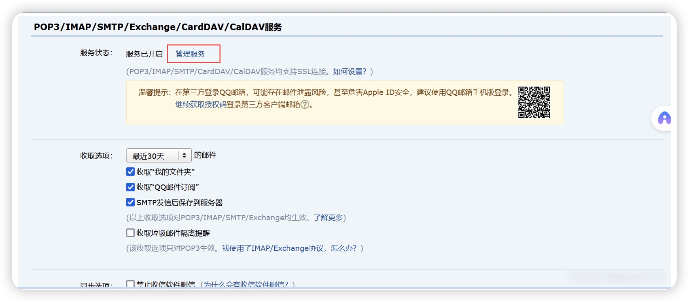
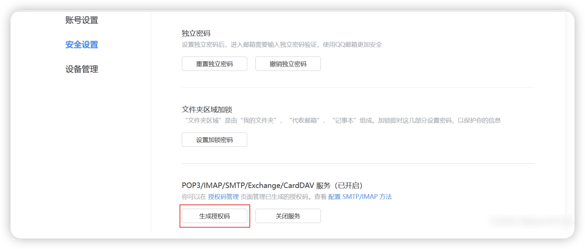
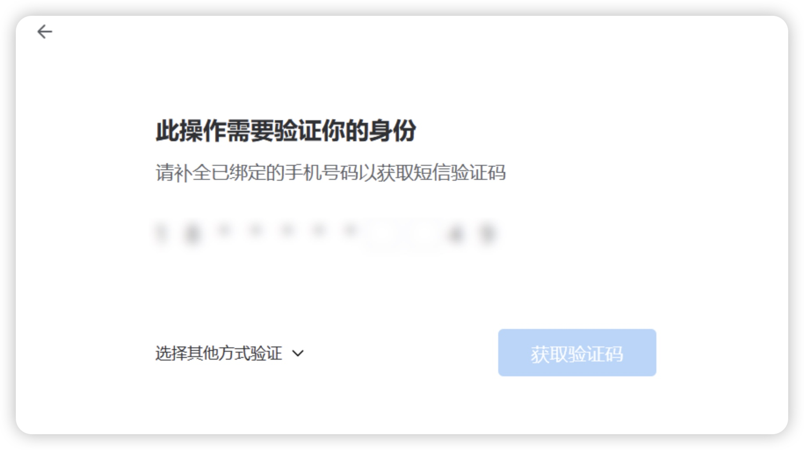
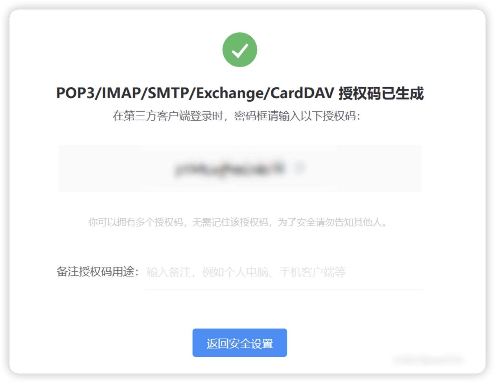

# 添加注册功能
## 1、新增数据库表结构
```sql
CREATE TABLE `district` (
  `id` varchar(32) NOT NULL COMMENT '编号',
  `parent_id` varchar(32) NOT NULL DEFAULT '0' COMMENT '上级行政区id',
  `city_code` varchar(100) DEFAULT NULL COMMENT '城市编码',
  `adcode` varchar(100) NOT NULL COMMENT '区域编码',
  `name` varchar(100) NOT NULL COMMENT '行政区名称',
  `polyline` varchar(100) DEFAULT NULL COMMENT '行政区边界坐标点',
  `center` varchar(100) DEFAULT NULL COMMENT '区域中心点',
  `level` varchar(50) NOT NULL COMMENT '行政区划级别 country:国家  province:省份（直辖市会在province和city显示） city:市（直辖市会在province和city显示） district:区县 street:街道',
  `remark` varchar(255) DEFAULT NULL COMMENT '备注',
  `create_by` varchar(50) DEFAULT NULL COMMENT '创建人',
  `create_time` datetime DEFAULT NULL COMMENT '创建时间',
  `update_by` varchar(50) DEFAULT NULL COMMENT '更新人',
  `update_time` datetime DEFAULT NULL COMMENT '更新时间',
  `deleted` tinyint(1) DEFAULT '0' COMMENT '是否删除  -1：已删除  0：正常',
  PRIMARY KEY (`id`) USING BTREE,
  KEY `district_parent_id_index` (`parent_id`) USING BTREE
) ENGINE=InnoDB DEFAULT CHARSET=utf8mb3 COMMENT='省份区域信息表';
```
创建省市区表，并且导入district.sql 文件，初始化地理信息
```sql
ALTER TABLE `accounting_system`.`t_user` 
ADD COLUMN `address` varchar(255) NULL AFTER `photo`,
ADD COLUMN `email` varchar(255) NULL AFTER `address`;
```
更新t_user表进行添加 address字段和email字段
## 2、获取省市区接口
### 1、创建实体
```java

@Data
@TableName("district")
public class District {

    @TableId
    private String id;

    @TableField("parent_id")
    private String parentId;

    @TableField("city_code")
    private String cityCode;

    @TableField("adcode")
    private String adcode;

    @TableField("name")
    private String name;

    @TableField("polyline")
    private String polyline;

    @TableField("center")
    private String center;

    @TableField("level")
    private String level;

    @TableField("remark")
    private String remark;

    @TableField("create_by")
    private String createBy;

    @TableField("create_time")
    private Date createTime;

    @TableField("update_by")
    private String updateBy;

    @TableField("update_time")
    private Date updateTime;

    @TableField("deleted")
    private Integer deleted;
}

```
### 2、书写Controller
```java
@RestController
@RequestMapping("/district")
public class DistrictController {

    @Resource
    private DistrictService districtService;

    /**
     * 获取省份区域信息
     *
     * @param districtId 区域id
     * @param level      区域级别
     * @return
     */
    @GetMapping("/listDistrict")
    public R listDistrict(@RequestParam(value = "districtId", required = false) String districtId,
                          @RequestParam(value = "level", required = false) String level) {
        return R.ok().put("data",districtService.getDistrict(districtId, level));
    }

}
```
### 3、书写Service
```java
public interface DistrictService extends IService<District> {


    /**
     * 获取省份区域信息
     *
     * @param districtId 区域id
     * @param level      区域级别
     */
    List<District> getDistrict(String districtId, String level);
}
```
### 4、书写ServiceImpl
```java
@Service
public class DistrictServiceImpl extends ServiceImpl<DistrictMapper, District>
        implements DistrictService {
    /**
     * 获取省份区域信息
     *
     * @param districtId 区域id
     * @param level      区域级别
     */
    @Override
    public List<District> getDistrict(String districtId, String level) {
        if (StrUtil.isAllBlank(districtId, level)) {
            throw new RuntimeException("id和level不能同时为空");
        }
        // 如果传递id，则查询该id下的下一级
        if (StrUtil.isNotBlank(districtId)) {
            return this.list(Wrappers.<District>lambdaQuery().eq(District::getParentId, districtId));
        }
        // 如果传递level，则查询该level对应的数据
        return this.list(Wrappers.<District>lambdaQuery().eq(District::getLevel, level));
    }
}
```
### 5、书写Mapper
```java
public interface DistrictMapper extends BaseMapper<District> {
    
}
```
## 2、获取QQ邮箱授权码教程
登录QQ邮箱：依次点击：设置--账号

点击管理服务

在安全设置中点击“生成授权码”：

进行验证后

复制保存授权码：


## 3、发送邮箱验证码接口
### 1、pom中添加依赖
引入短信依赖，修改pom.xml
```text
		<dependency>
			<groupId>org.apache.poi</groupId>
			<artifactId>poi-ooxml</artifactId>
			<version>5.2.3</version>
		</dependency>
```
配置文件添加邮箱信息，本次采用QQ邮箱
```yaml
email:
  account:  //发送者邮箱地址
  authorizationCode:  //邮箱授权码
```
### 2、书写Controller（UserController）
```java
@GetMapping("/sendEmailCode")
    public R sendEmailCode(@RequestParam("email") String email){
        //调用service层进行发送验证码
        userService.sendEmailCoe(email);
        return R.ok();
    }
```
### 3、编写 EmailSender 工具类，开发发送邮件方法
```java

@Component
public class EmailSender {


    //这个注解进行取配置文件中配置的发送账户
    @Value("${email.account}")
    private String account;
    
    //进行获取配置文件中配置的授权码
    @Value("${email.authorizationCode}")
    private String authorizationCode;


    public void sendVerificationCode(String to, String verificationCode) {
        // QQ邮箱SMTP服务器
        String host = "smtp.qq.com";
        String from = account; // 替换为你的QQ邮箱
        String password = authorizationCode; // 替换为你的QQ邮箱授权码

        // 配置邮件会话
        Properties properties = new Properties();
        properties.put("mail.smtp.host", host);
        properties.put("mail.smtp.auth", "true");
        properties.put("mail.smtp.port", "465"); // QQ邮箱支持的端口
        properties.put("mail.smtp.socketFactory.port", "465");
        properties.put("mail.smtp.socketFactory.class", "javax.net.ssl.SSLSocketFactory");

        // 创建会话
        Session session = Session.getInstance(properties);
        session.setDebug(true); // 可选，调试用

        try {
            // 创建邮件消息
            MimeMessage message = new MimeMessage(session);
            message.setFrom(new InternetAddress(from));
            message.setRecipient(Message.RecipientType.TO, new InternetAddress(to));
            message.setSubject("验证码");
            message.setText("【收支系统】您正在注册，您的验证码为: " + verificationCode+"，请注意保管，不要透露给任何人");

            // 发送邮件
            Transport transport = session.getTransport("smtp");
            transport.connect(host, from, password);
            transport.sendMessage(message, message.getAllRecipients());
            transport.close();

            System.out.println("验证码邮件发送成功！");
        } catch (MessagingException e) {
            e.printStackTrace();
            System.out.println("发送邮件失败：" + e.getMessage());
        }
    }

}
```
### 4、书写Service（UserService）
```java
void sendEmailCoe(String email);
```
### 5、书写ServiceImpl（UserServiceImpl）
```java
@Override
    public void sendEmailCoe(String email) {
        //调用方法获取一个4位数验证码
        String code = String.valueOf(generateFourDigitRandomNumber());
        //吧验证码和注册邮箱存储到redis，后面注册时进行校验
        redisTemplate.opsForValue().set("registerEmail::" + email,code,5, TimeUnit.MINUTES);
        try {
            //调用邮箱工具类进行发送短信
            emailSender.sendVerificationCode(email,code);
        } catch (Exception e) {
            e.printStackTrace();
            throw new RuntimeException(e);
        }
    }
```
## 4、注册接口
### 1、User实体添加新增属性
```java
    private String email;

    private String address;
    
    @TableField(exist = false)
    private List<String> addressList;
```
### 2、书写Controller
```java
    @PostMapping("/register")
    public R register(@RequestBody @Validated User user){
        //校验验证码
        String userRegisterCode = redisTemplate.opsForValue().get("registerEmail::" + user.getEmail());
        if(StringUtils.isEmpty(userRegisterCode)){
            //如果redis中没有验证码，那么证明他没有获取验证码
            return R.error("清先获取邮箱验证码");
        }
        if(!userRegisterCode.equals(user.getEmailCode())){
            //如果验证码和用户输入的验证码不一致，提示验证码错误
            return R.error("验证码错误");
        }
        if(user.getAddressList().size()==2){
            //查询地址中的省份
            District provice = districtService.getById(user.getAddressList().get(0));
            //查询地址中的城市
            District city = districtService.getById(user.getAddressList().get(1));
            //设置地址
            user.setAddress(provice.getName()+city.getName());
        }else{
            //查询地址中的省份
            District provice = districtService.getById(user.getAddressList().get(0));
            //查询地址中的城市
            District city = districtService.getById(user.getAddressList().get(1));
            //查询地址中的区
            District area = districtService.getById(user.getAddressList().get(2));
            //设置地址
            user.setAddress(provice.getName()+city.getName()+area.getName());
        }
        //保存用户信息
        userService.save(user);
        return R.ok();
    }
```
