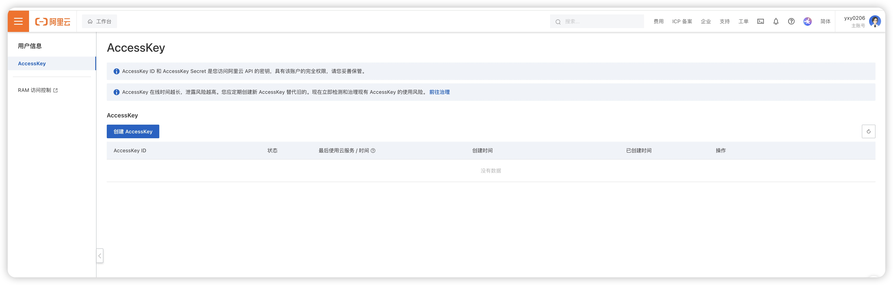
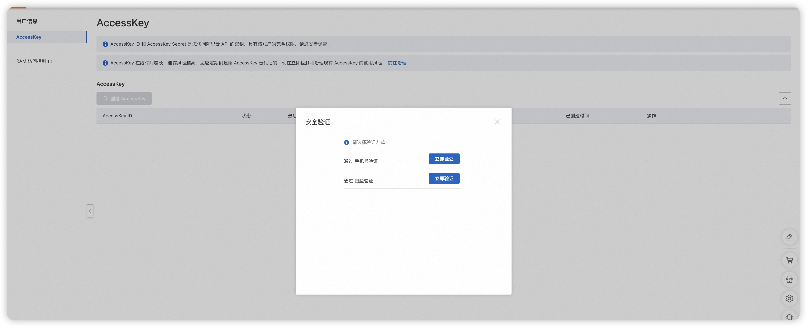
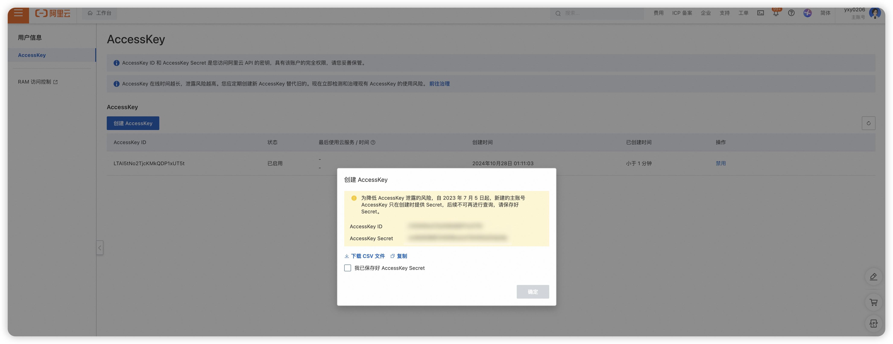
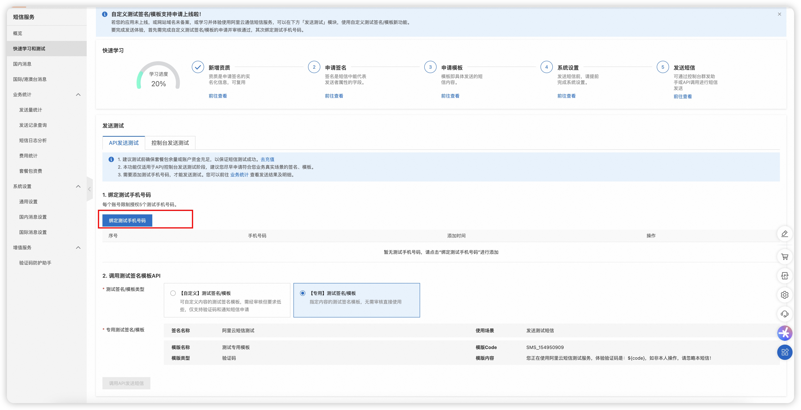

# 集成阿里云短信发送
## 1. 注册阿里云账号和创建Access Key
        首先，你需要注册一个阿里云账号（如果还没有），然后在控制台中创建Access Key。这个Access Key将用于通过API调用阿里云短信服务。在控制台中创建Access Key非常简单，只需遵循阿里云的步骤即可。
1、先登陆阿里云 https://www.aliyun.com/?spm=5176.28366559.console-base_top-nav.dlogo.211e336auXl1Th
2、进入首页以后，鼠标点击用户头像，然后选择AccessKey，点击
    
3、进入后这样

4、点击创建AccessKey

选择方式验证
5、验证之后就会生成AccessKey ID和AccessKey Secret，一定要保留好

## 2.申请测试模板
现在使用测试模板实现发送短信功能,进行申请测试模板

这块记得绑定你自己的手机号，绑定之后就OK了
    
## 2. 添加相关的依赖
```xml
        <dependency>
            <groupId>com.aliyun</groupId>
            <artifactId>dysmsapi20170525</artifactId>
            <version>3.0.0</version>
        </dependency>

```
## 3. 创建工具类MsgController
阿里云短信服务Utils： 
```java
package com.utils;


import com.aliyun.dysmsapi20170525.Client;

import java.util.Random;

public class SendMsgUtil {

    /**
     * 使用AK&SK初始化账号Client
     * @return Client
     * @throws Exception
     */
    public static Client createClient() throws Exception {
        com.aliyun.teaopenapi.models.Config config = new com.aliyun.teaopenapi.models.Config()
                // 上面申请的 AccessKeyId，需要使用自己的
                .setAccessKeyId("")

                // 上面申请的 AccessKeySecret，需要使用自己的
                .setAccessKeySecret("");
        config.endpoint = "dysmsapi.aliyuncs.com";
        return new Client(config);
    }

    /**
     * API 相关
     * @return OpenApi.Params
     */
    public static com.aliyun.teaopenapi.models.Params createApiInfo() throws Exception {
        com.aliyun.teaopenapi.models.Params params = new com.aliyun.teaopenapi.models.Params()
                .setAction("SendSms")
                .setVersion("2017-05-25")
                .setProtocol("HTTPS")
                .setMethod("POST")
                .setAuthType("AK")
                .setStyle("RPC")
                .setPathname("/")
                .setReqBodyType("json")
                .setBodyType("json");
        return params;
    }

    public static void sendCode(String phone,String code) throws Exception {
        Client client = createClient();
        com.aliyun.teaopenapi.models.Params params = createApiInfo();
        java.util.Map<String, Object> queries = new java.util.HashMap<>();
        //发送者手机号
        queries.put("PhoneNumbers", phone);
        //阿里云平台短信模块查找,测试模板不用动
        queries.put("SignName", "阿里云短信测试");
        //阿里云平台短信模块查找 ，测试模板不用动
        queries.put("TemplateCode", "SMS_154950909"); //您正在申请手机注册，验证码为：${code}，5分钟内有效！
        //验证码参数
        queries.put("TemplateParam", "{\"code\":\"" + code + "\"}");
        com.aliyun.teautil.models.RuntimeOptions runtime = new com.aliyun.teautil.models.RuntimeOptions();
        com.aliyun.teaopenapi.models.OpenApiRequest request = new com.aliyun.teaopenapi.models.OpenApiRequest()
                .setQuery(com.aliyun.openapiutil.Client.query(queries));
        client.callApi(params, request, runtime);
    }

}
```
4、获取验证码接口改造接入发送阿里云验证码
修改UserServiceImpl文件中的sendVerificationCode方法
```java
@Override
    public String sendVerificationCode(String phone) {
        User userForPhone = this.lambdaQuery().eq(User::getPhone, phone).eq(User::getDelete,0).one();
        if(userForPhone == null){
            throw new BizException("用户手机号不存在，请先去注册");
        }
        String phoneCode = redisTemplate.opsForValue().get("loginPhone::" + phone);
        if(StringUtils.isNotEmpty(phoneCode)){
            throw new BizException("请勿重复获取验证码");
        }
        //生成验证码存储到redis中
        String s = String.valueOf(generateFourDigitRandomNumber());
        try {
            //调用阿里云发送短信
            SendMsgUtil.sendCode(phone,s);
        } catch (Exception e) {
            e.printStackTrace();
            throw new RuntimeException("验证码发送失败 e={}",e);
        }
        redisTemplate.opsForValue().set("loginPhone::" + phone,s,1, TimeUnit.MINUTES);
        System.out.println(phone+" 手机获取验证码，验证码 = "+s);
        return s;
    }
```
