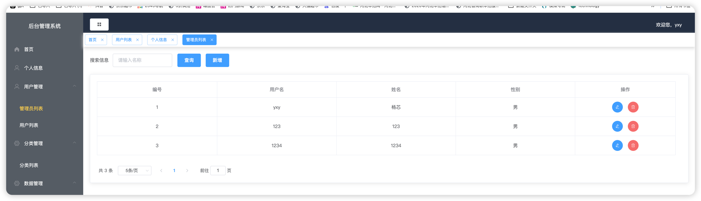
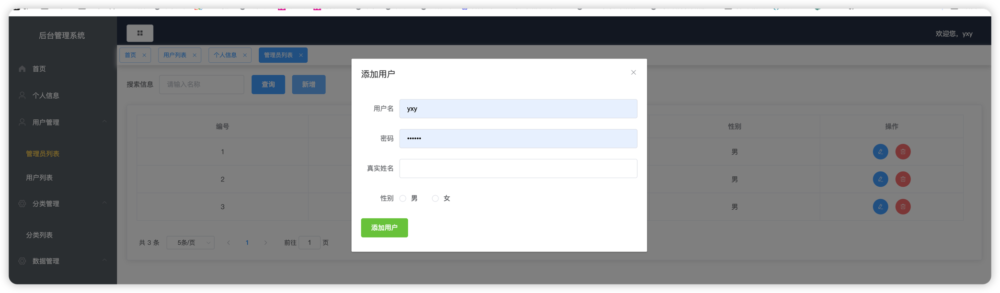
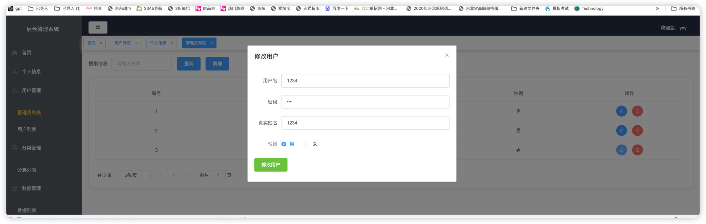
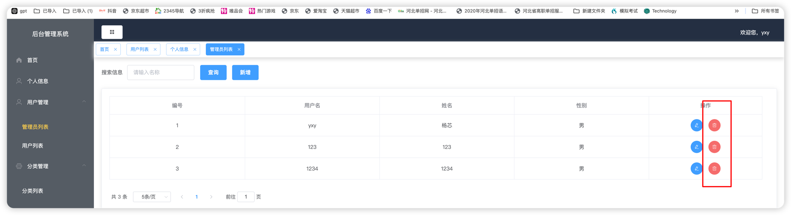
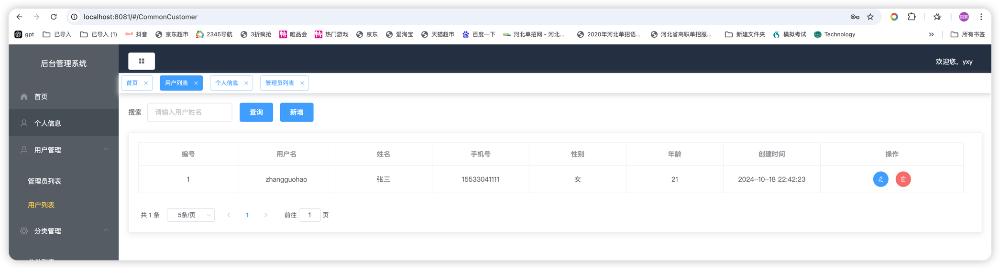
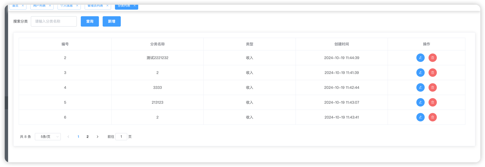
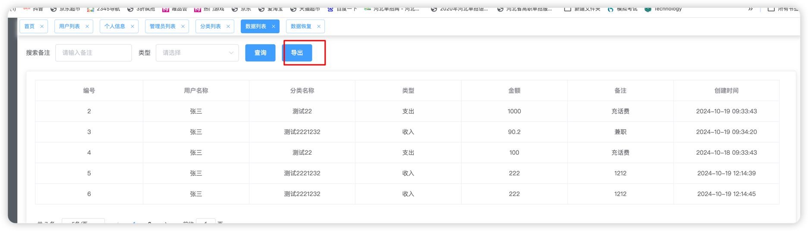

# 前台接口文档
## 数据准备
### 数据库
```sql
/*
 Navicat Premium Data Transfer

 Source Server         : localhost_mysql8
 Source Server Type    : MySQL
 Source Server Version : 80031 (8.0.31)
 Source Host           : localhost:3307
 Source Schema         : accounting_system

 Target Server Type    : MySQL
 Target Server Version : 80031 (8.0.31)
 File Encoding         : 65001

 Date: 20/10/2024 19:13:33
*/

SET NAMES utf8mb4;
SET FOREIGN_KEY_CHECKS = 0;

-- ----------------------------
-- Table structure for menu
-- ----------------------------
DROP TABLE IF EXISTS `menu`;
CREATE TABLE `menu` (
  `id` int NOT NULL AUTO_INCREMENT COMMENT 'id',
  `name` varchar(255) DEFAULT NULL COMMENT '名称',
  `label` varchar(255) DEFAULT NULL COMMENT '标签',
  `icon` varchar(255) DEFAULT NULL COMMENT '图标',
  `url` varchar(255) DEFAULT NULL COMMENT '页面链接',
  `path` varchar(255) DEFAULT NULL COMMENT '链接',
  `parent` int DEFAULT NULL COMMENT '父级Id，没有父级为0',
  PRIMARY KEY (`id`)
) ENGINE=InnoDB AUTO_INCREMENT=32 DEFAULT CHARSET=utf8mb3;

-- ----------------------------
-- Records of menu
-- ----------------------------
BEGIN;
INSERT INTO `menu` (`id`, `name`, `label`, `icon`, `url`, `path`, `parent`) VALUES (1, 'main', '首页', 's-home', 'Home/Home', '/', 0);
INSERT INTO `menu` (`id`, `name`, `label`, `icon`, `url`, `path`, `parent`) VALUES (2, 'customer', '用户管理', 'user', NULL, NULL, 0);
INSERT INTO `menu` (`id`, `name`, `label`, `icon`, `url`, `path`, `parent`) VALUES (3, 'customerList', '管理员列表', 'setting', 'customer/customerList', '/CustomerList', 2);
INSERT INTO `menu` (`id`, `name`, `label`, `icon`, `url`, `path`, `parent`) VALUES (4, 'commonCustomer', '用户列表', 'setting', 'customer/commonCustomer', '/CommonCustomer', 2);
INSERT INTO `menu` (`id`, `name`, `label`, `icon`, `url`, `path`, `parent`) VALUES (6, 'calssifyManager', '分类管理', 'setting', NULL, NULL, 0);
INSERT INTO `menu` (`id`, `name`, `label`, `icon`, `url`, `path`, `parent`) VALUES (7, 'classifyList', '分类列表', 'setting', '/classify/list', '/classifyList', 6);
INSERT INTO `menu` (`id`, `name`, `label`, `icon`, `url`, `path`, `parent`) VALUES (8, 'dataManager', '数据管理', 'setting', '', NULL, 0);
INSERT INTO `menu` (`id`, `name`, `label`, `icon`, `url`, `path`, `parent`) VALUES (9, 'dataList', '数据列表', 'setting', '/data/list', '/dataList', 8);
INSERT INTO `menu` (`id`, `name`, `label`, `icon`, `url`, `path`, `parent`) VALUES (10, 'dataRestore', '数据恢复', 'setting', '/data/restore', '/dataRestore', 8);
INSERT INTO `menu` (`id`, `name`, `label`, `icon`, `url`, `path`, `parent`) VALUES (25, 'userInfo', '个人信息', 'user', '/upInfo', '/upInfo', 0);
COMMIT;

-- ----------------------------
-- Table structure for t_accountion_record
-- ----------------------------
DROP TABLE IF EXISTS `t_accountion_record`;
CREATE TABLE `t_accountion_record` (
  `id` int NOT NULL AUTO_INCREMENT,
  `user_id` int DEFAULT NULL COMMENT '用户Id',
  `classify_id` int DEFAULT NULL COMMENT '分类Id',
  `type` int DEFAULT NULL COMMENT '1支出 2收入',
  `price` decimal(10,2) DEFAULT NULL COMMENT '金额',
  `remark` varchar(255) DEFAULT NULL COMMENT '备注',
  `create_time` datetime NOT NULL DEFAULT CURRENT_TIMESTAMP COMMENT '创建时间',
  `update_time` datetime NOT NULL DEFAULT CURRENT_TIMESTAMP ON UPDATE CURRENT_TIMESTAMP COMMENT '修改时间',
  `delete` tinyint NOT NULL DEFAULT '0' COMMENT '0未删除1删除',
  `year` varchar(255) CHARACTER SET utf8mb4 COLLATE utf8mb4_0900_ai_ci DEFAULT NULL COMMENT '年',
  `month` varchar(255) CHARACTER SET utf8mb4 COLLATE utf8mb4_0900_ai_ci DEFAULT NULL COMMENT '月',
  `day` varchar(255) CHARACTER SET utf8mb4 COLLATE utf8mb4_0900_ai_ci DEFAULT NULL COMMENT '日',
  PRIMARY KEY (`id`) USING BTREE
) ENGINE=InnoDB AUTO_INCREMENT=9 DEFAULT CHARSET=utf8mb4 COLLATE=utf8mb4_0900_ai_ci COMMENT='收支明细';

-- ----------------------------
-- Records of t_accountion_record
-- ----------------------------
BEGIN;
INSERT INTO `t_accountion_record` (`id`, `user_id`, `classify_id`, `type`, `price`, `remark`, `create_time`, `update_time`, `delete`, `year`, `month`, `day`) VALUES (2, 1, 1, 1, 1000.00, '充话费', '2024-10-19 09:33:43', '2024-10-19 18:24:18', 0, '2024', '10', '19');
INSERT INTO `t_accountion_record` (`id`, `user_id`, `classify_id`, `type`, `price`, `remark`, `create_time`, `update_time`, `delete`, `year`, `month`, `day`) VALUES (3, 1, 2, 2, 90.20, '兼职', '2024-10-19 09:34:20', '2024-10-19 15:53:04', 0, '2024', '10', '19');
INSERT INTO `t_accountion_record` (`id`, `user_id`, `classify_id`, `type`, `price`, `remark`, `create_time`, `update_time`, `delete`, `year`, `month`, `day`) VALUES (4, 1, 1, 1, 100.00, '充话费', '2024-10-18 09:33:43', '2024-10-18 09:33:57', 0, '2024', '10', '18');
INSERT INTO `t_accountion_record` (`id`, `user_id`, `classify_id`, `type`, `price`, `remark`, `create_time`, `update_time`, `delete`, `year`, `month`, `day`) VALUES (5, 1, 2, 2, 222.00, '1212', '2024-10-19 12:14:39', '2024-10-19 12:14:39', 0, '2024', '10', '19');
INSERT INTO `t_accountion_record` (`id`, `user_id`, `classify_id`, `type`, `price`, `remark`, `create_time`, `update_time`, `delete`, `year`, `month`, `day`) VALUES (6, 1, 2, 2, 222.00, '1212', '2024-10-19 12:14:45', '2024-10-19 12:14:45', 0, '2024', '10', '19');
INSERT INTO `t_accountion_record` (`id`, `user_id`, `classify_id`, `type`, `price`, `remark`, `create_time`, `update_time`, `delete`, `year`, `month`, `day`) VALUES (7, 1, 2, 2, 222.00, '1212', '2024-10-19 12:14:51', '2024-10-19 12:14:51', 0, '2024', '10', '19');
INSERT INTO `t_accountion_record` (`id`, `user_id`, `classify_id`, `type`, `price`, `remark`, `create_time`, `update_time`, `delete`, `year`, `month`, `day`) VALUES (8, 1, 2, 2, 111.00, '1123213', '2024-10-19 12:15:44', '2024-10-19 12:15:44', 0, '2024', '10', '19');
COMMIT;

-- ----------------------------
-- Table structure for t_bank
-- ----------------------------
DROP TABLE IF EXISTS `t_bank`;
CREATE TABLE `t_bank` (
  `id` int NOT NULL AUTO_INCREMENT,
  `name` varchar(255) CHARACTER SET utf8mb4 COLLATE utf8mb4_0900_ai_ci NOT NULL,
  `user_id` int NOT NULL,
  `create_time` datetime NOT NULL,
  `delete` tinyint NOT NULL DEFAULT '0' COMMENT '0未删除1删除',
  `bank_logo` varchar(255) CHARACTER SET utf8mb4 COLLATE utf8mb4_0900_ai_ci DEFAULT NULL,
  `bank_type` varchar(255) CHARACTER SET utf8mb4 COLLATE utf8mb4_0900_ai_ci DEFAULT NULL,
  `limit_num` varchar(255) DEFAULT NULL,
  `bank_num` varchar(255) DEFAULT NULL,
  `bank_bg` varchar(255) DEFAULT NULL,
  PRIMARY KEY (`id`) USING BTREE
) ENGINE=InnoDB AUTO_INCREMENT=6 DEFAULT CHARSET=utf8mb4 COLLATE=utf8mb4_0900_ai_ci;

-- ----------------------------
-- Records of t_bank
-- ----------------------------
BEGIN;
INSERT INTO `t_bank` (`id`, `name`, `user_id`, `create_time`, `delete`, `bank_logo`, `bank_type`, `limit_num`, `bank_num`, `bank_bg`) VALUES (1, '建设银行', 1, '2024-10-20 01:17:42', 0, '/img/jianhang.5f2be68a.svg', '储蓄卡', '20', '1231230234', '#3973c4');
INSERT INTO `t_bank` (`id`, `name`, `user_id`, `create_time`, `delete`, `bank_logo`, `bank_type`, `limit_num`, `bank_num`, `bank_bg`) VALUES (2, '建设银行', 1, '2024-10-20 01:29:07', 0, 'jianhang', '储蓄卡', '20', '123', '#3973c4');
INSERT INTO `t_bank` (`id`, `name`, `user_id`, `create_time`, `delete`, `bank_logo`, `bank_type`, `limit_num`, `bank_num`, `bank_bg`) VALUES (3, '农业银行', 1, '2024-10-20 01:30:23', 0, 'nonghang', '储蓄卡', '40', '123123123123', '#32977f');
INSERT INTO `t_bank` (`id`, `name`, `user_id`, `create_time`, `delete`, `bank_logo`, `bank_type`, `limit_num`, `bank_num`, `bank_bg`) VALUES (4, '工商银行', 1, '2024-10-20 01:36:04', 0, 'nonghang', '储蓄卡', '40', '9999', '#32977f');
INSERT INTO `t_bank` (`id`, `name`, `user_id`, `create_time`, `delete`, `bank_logo`, `bank_type`, `limit_num`, `bank_num`, `bank_bg`) VALUES (5, '建设银行', 1, '2024-10-20 01:44:32', 1, '/img/jianhang.5f2be68a.svg', '储蓄卡', '20', '123', '#3973c4');
COMMIT;

-- ----------------------------
-- Table structure for t_budget
-- ----------------------------
DROP TABLE IF EXISTS `t_budget`;
CREATE TABLE `t_budget` (
  `id` int NOT NULL AUTO_INCREMENT,
  `type` varchar(255) CHARACTER SET utf8mb4 COLLATE utf8mb4_0900_ai_ci NOT NULL COMMENT '1年预算2月预算',
  `budget_price` decimal(10,2) DEFAULT NULL COMMENT '预算金额',
  `user_id` int NOT NULL COMMENT '用户Id',
  `create_time` datetime NOT NULL DEFAULT CURRENT_TIMESTAMP COMMENT '创建时间',
  `delete` tinyint NOT NULL DEFAULT '0' COMMENT '0未删除1删除',
  PRIMARY KEY (`id`) USING BTREE
) ENGINE=InnoDB AUTO_INCREMENT=4 DEFAULT CHARSET=utf8mb4 COLLATE=utf8mb4_0900_ai_ci COMMENT='预算设置表';

-- ----------------------------
-- Records of t_budget
-- ----------------------------
BEGIN;
INSERT INTO `t_budget` (`id`, `type`, `budget_price`, `user_id`, `create_time`, `delete`) VALUES (1, '1', 4561.00, 1, '2024-10-19 18:06:50', 0);
INSERT INTO `t_budget` (`id`, `type`, `budget_price`, `user_id`, `create_time`, `delete`) VALUES (2, '2', 456.00, 1, '2024-10-19 18:07:23', 0);
COMMIT;

-- ----------------------------
-- Table structure for t_classify
-- ----------------------------
DROP TABLE IF EXISTS `t_classify`;
CREATE TABLE `t_classify` (
  `id` int NOT NULL AUTO_INCREMENT,
  `name` varchar(255) NOT NULL,
  `user_id` int NOT NULL COMMENT '用户Id',
  `create_time` datetime NOT NULL DEFAULT CURRENT_TIMESTAMP COMMENT '创建时间',
  `delete` tinyint NOT NULL DEFAULT '0' COMMENT '0未删除1删除',
  `type` int DEFAULT NULL COMMENT '1支出 2收入',
  PRIMARY KEY (`id`) USING BTREE
) ENGINE=InnoDB AUTO_INCREMENT=13 DEFAULT CHARSET=utf8mb4 COLLATE=utf8mb4_0900_ai_ci COMMENT='收支分类';

-- ----------------------------
-- Records of t_classify
-- ----------------------------
BEGIN;
INSERT INTO `t_classify` (`id`, `name`, `user_id`, `create_time`, `delete`, `type`) VALUES (1, '测试22', 0, '2024-10-18 15:17:58', 1, 1);
INSERT INTO `t_classify` (`id`, `name`, `user_id`, `create_time`, `delete`, `type`) VALUES (2, '测试2221232', 1, '2024-10-19 11:44:39', 0, 2);
INSERT INTO `t_classify` (`id`, `name`, `user_id`, `create_time`, `delete`, `type`) VALUES (3, '2', 1, '2024-10-19 11:41:39', 0, 2);
INSERT INTO `t_classify` (`id`, `name`, `user_id`, `create_time`, `delete`, `type`) VALUES (4, '3333', 1, '2024-10-19 11:42:44', 0, 2);
INSERT INTO `t_classify` (`id`, `name`, `user_id`, `create_time`, `delete`, `type`) VALUES (5, '213123', 1, '2024-10-19 11:43:07', 0, 2);
INSERT INTO `t_classify` (`id`, `name`, `user_id`, `create_time`, `delete`, `type`) VALUES (6, '2', 1, '2024-10-19 11:43:41', 0, 2);
INSERT INTO `t_classify` (`id`, `name`, `user_id`, `create_time`, `delete`, `type`) VALUES (7, '12312321', 1, '2024-10-19 11:43:48', 0, 2);
INSERT INTO `t_classify` (`id`, `name`, `user_id`, `create_time`, `delete`, `type`) VALUES (8, '测试', 1, '2024-10-19 11:43:59', 0, 2);
INSERT INTO `t_classify` (`id`, `name`, `user_id`, `create_time`, `delete`, `type`) VALUES (9, '22', 1, '2024-10-19 11:44:32', 0, 2);
INSERT INTO `t_classify` (`id`, `name`, `user_id`, `create_time`, `delete`, `type`) VALUES (11, '', 1, '2024-10-19 17:55:57', 1, 2);
INSERT INTO `t_classify` (`id`, `name`, `user_id`, `create_time`, `delete`, `type`) VALUES (12, 'ccccccccccccccc', 1, '2024-10-19 17:56:23', 1, 2);
COMMIT;

-- ----------------------------
-- Table structure for t_common_file
-- ----------------------------
DROP TABLE IF EXISTS `t_common_file`;
CREATE TABLE `t_common_file` (
  `id` bigint NOT NULL,
  `file_url` varchar(255) NOT NULL,
  `file_name` varchar(255) NOT NULL,
  `create_time` datetime NOT NULL DEFAULT CURRENT_TIMESTAMP,
  PRIMARY KEY (`id`)
) ENGINE=InnoDB DEFAULT CHARSET=utf8mb3;


-- ----------------------------
-- Table structure for t_to_do_matter
-- ----------------------------
DROP TABLE IF EXISTS `t_to_do_matter`;
CREATE TABLE `t_to_do_matter` (
  `id` int NOT NULL AUTO_INCREMENT,
  `title` varchar(255) NOT NULL COMMENT '提醒标题',
  `content` varchar(255) NOT NULL COMMENT '提醒内容',
  `user_id` int NOT NULL COMMENT '用户Id',
  `to_time` datetime NOT NULL COMMENT '提醒时间',
  `create_time` datetime NOT NULL DEFAULT CURRENT_TIMESTAMP COMMENT '创建时间',
  `delete` tinyint NOT NULL DEFAULT '0' COMMENT '0未删除1删除',
  PRIMARY KEY (`id`) USING BTREE
) ENGINE=InnoDB DEFAULT CHARSET=utf8mb4 COLLATE=utf8mb4_0900_ai_ci COMMENT='待办事项表';

-- ----------------------------
-- Records of t_to_do_matter
-- ----------------------------
BEGIN;
COMMIT;

-- ----------------------------
-- Table structure for t_user
-- ----------------------------
DROP TABLE IF EXISTS `t_user`;
CREATE TABLE `t_user` (
  `id` int NOT NULL AUTO_INCREMENT,
  `username` varchar(255) CHARACTER SET utf8mb4 COLLATE utf8mb4_0900_ai_ci NOT NULL COMMENT '用户名',
  `password` varchar(255) CHARACTER SET utf8mb4 COLLATE utf8mb4_0900_ai_ci NOT NULL COMMENT '密码',
  `name` varchar(255) CHARACTER SET utf8mb4 COLLATE utf8mb4_0900_ai_ci DEFAULT NULL COMMENT '真实姓名',
  `phone` varchar(11) CHARACTER SET utf8mb4 COLLATE utf8mb4_0900_ai_ci DEFAULT NULL COMMENT '手机号',
  `age` tinyint DEFAULT NULL COMMENT '年龄',
  `sex` tinyint DEFAULT NULL COMMENT '1男 2女',
  `create_time` datetime NOT NULL DEFAULT CURRENT_TIMESTAMP COMMENT '创建时间',
  `update_time` datetime NOT NULL DEFAULT CURRENT_TIMESTAMP ON UPDATE CURRENT_TIMESTAMP COMMENT '修改时间',
  `delete` tinyint NOT NULL DEFAULT '0' COMMENT '0未删除1删除',
  `photo` bigint DEFAULT NULL,
  PRIMARY KEY (`id`)
) ENGINE=InnoDB AUTO_INCREMENT=3 DEFAULT CHARSET=utf8mb4 COLLATE=utf8mb4_0900_ai_ci COMMENT='用户表';

-- ----------------------------
-- Records of t_user
-- ----------------------------
BEGIN;
INSERT INTO `t_user` (`id`, `username`, `password`, `name`, `phone`, `age`, `sex`, `create_time`, `update_time`, `delete`, `photo`) VALUES (1, 'zhangsan', '123', '张三', '15533041111', 21, 2, '2024-10-18 14:42:23', '2024-10-19 16:59:34', 0, 150299994238208);
INSERT INTO `t_user` (`id`, `username`, `password`, `name`, `phone`, `age`, `sex`, `create_time`, `update_time`, `delete`, `photo`) VALUES (2, 'ceshi', 'ceshi', '测试', '15533041111', 2, 2, '2024-10-18 14:54:51', '2024-10-18 14:56:16', 1, NULL);
COMMIT;

-- ----------------------------
-- Table structure for users
-- ----------------------------
DROP TABLE IF EXISTS `users`;
CREATE TABLE `users` (
  `u_id` int NOT NULL AUTO_INCREMENT,
  `username` varchar(255) DEFAULT NULL,
  `password` varchar(255) DEFAULT NULL,
  `name` varchar(255) DEFAULT NULL,
  `avatar` varchar(255) DEFAULT NULL,
  `gender` varchar(10) DEFAULT NULL,
  `role` varchar(20) DEFAULT NULL,
  PRIMARY KEY (`u_id`) USING BTREE
) ENGINE=InnoDB AUTO_INCREMENT=5 DEFAULT CHARSET=utf8mb3;

-- ----------------------------
-- Records of users
-- ----------------------------
BEGIN;
INSERT INTO `users` (`u_id`, `username`, `password`, `name`, `avatar`, `gender`, `role`) VALUES (1, 'yxy', '123456', '杨芯', 'https://yxy-study.oss-cn-nanjing.aliyuncs.com/15d82062-43d9-4450-bfb5-fb81613d1348.jpg', '男', 'ADMIN');
INSERT INTO `users` (`u_id`, `username`, `password`, `name`, `avatar`, `gender`, `role`) VALUES (2, '123', '123', '123', 'https://yxy-study.oss-cn-nanjing.aliyuncs.com/fade2efb-ff55-4974-bd92-4cdf7a7fb4bd.jpg', '男', 'ADMIN');
INSERT INTO `users` (`u_id`, `username`, `password`, `name`, `avatar`, `gender`, `role`) VALUES (3, '1234', '123', '1234', 'https://yxy-live-share.oss-cn-beijing.aliyuncs.com/%E5%BE%AE%E4%BF%A1%E5%9B%BE%E7%89%87_20240419210622.jpg', '男', 'ADMIN');
COMMIT;

SET FOREIGN_KEY_CHECKS = 1;

```
### 依赖
```xml
<?xml version="1.0" encoding="UTF-8"?>
<project xmlns="http://maven.apache.org/POM/4.0.0" xmlns:xsi="http://www.w3.org/2001/XMLSchema-instance"
         xsi:schemaLocation="http://maven.apache.org/POM/4.0.0 https://maven.apache.org/xsd/maven-4.0.0.xsd">
    <modelVersion>4.0.0</modelVersion>
    <groupId>com.iweb</groupId>
    <artifactId>manage-api</artifactId>
    <version>0.0.1-SNAPSHOT</version>
    <name>manage-api</name>
    <description>manage-api</description>
    <properties>
        <java.version>1.8</java.version>
        <project.build.sourceEncoding>UTF-8</project.build.sourceEncoding>
        <project.reporting.outputEncoding>UTF-8</project.reporting.outputEncoding>
        <spring-boot.version>2.6.13</spring-boot.version>
    </properties>
    <dependencies>
        <dependency>
            <groupId>org.springframework.boot</groupId>
            <artifactId>spring-boot-starter-web</artifactId>
        </dependency>

        <dependency>
            <groupId>com.mysql</groupId>
            <artifactId>mysql-connector-j</artifactId>
            <scope>runtime</scope>
        </dependency>
        <dependency>
            <groupId>org.projectlombok</groupId>
            <artifactId>lombok</artifactId>
            <optional>true</optional>
        </dependency>
        <!--Hutool Java工具包-->
        <dependency>
            <groupId>cn.hutool</groupId>
            <artifactId>hutool-all</artifactId>
            <version>5.8.18</version>
        </dependency>
        <dependency>
            <groupId>org.springframework.boot</groupId>
            <artifactId>spring-boot-starter-test</artifactId>
            <scope>test</scope>
        </dependency>
        <!--mybatis-plus核心库-->
        <dependency>
            <groupId>com.baomidou</groupId>
            <artifactId>mybatis-plus-boot-starter</artifactId>
            <version>3.4.3.1</version>
        </dependency>
        <!--代码生成器依赖-->
        <dependency>
            <groupId>com.baomidou</groupId>
            <artifactId>mybatis-plus-generator</artifactId>
            <version>3.4.1</version>
        </dependency>
        <!--JWT(Json Web Token)登录支持-->
        <dependency>
            <groupId>io.jsonwebtoken</groupId>
            <artifactId>jjwt</artifactId>
            <version>0.9.1</version>
        </dependency>
        <!--freemarker-->
        <dependency>
            <groupId>org.freemarker</groupId>
            <artifactId>freemarker</artifactId>
            <version>2.3.30</version>
        </dependency>
        <!--德鲁伊-->
        <dependency>
            <groupId>com.alibaba</groupId>
            <artifactId>druid-spring-boot-starter</artifactId>
            <version>1.2.4</version>
        </dependency>


        <!-- https://mvnrepository.com/artifact/ch.ethz.ganymed/ganymed-ssh2 -->
        <dependency>
            <groupId>ch.ethz.ganymed</groupId>
            <artifactId>ganymed-ssh2</artifactId>
            <version>262</version>
        </dependency>

        <dependency>
            <groupId>cn.hutool</groupId>
            <artifactId>hutool-all</artifactId>
            <version>5.7.21</version>
        </dependency>


        <dependency>
            <groupId>com.alibaba</groupId>
            <artifactId>fastjson</artifactId>
            <version>1.2.78</version>
        </dependency>

        <dependency>
            <groupId>com.aliyun.oss</groupId>
            <artifactId>aliyun-sdk-oss</artifactId>
            <version>3.15.1</version>
        </dependency>


        <dependency>
            <groupId>org.springframework.boot</groupId>
            <artifactId>spring-boot-starter-data-redis</artifactId>
        </dependency>
        <dependency>
            <groupId>redis.clients</groupId>
            <artifactId>jedis</artifactId>
        </dependency>

        <dependency>
            <groupId>com.fasterxml.jackson.datatype</groupId>
            <artifactId>jackson-datatype-jsr310</artifactId>
            <version>2.13.3</version>
        </dependency>

        <dependency>
            <groupId>com.alibaba</groupId>
            <artifactId>easyexcel</artifactId>
            <version>3.3.2</version> <!-- Or the latest version -->
        </dependency>

        <!--        es  -->

        <dependency>
            <groupId>co.elastic.clients</groupId>
            <artifactId>elasticsearch-java</artifactId>
            <version>8.1.0</version>
        </dependency>
        <dependency>
            <groupId>org.apache.httpcomponents.client5</groupId>
            <artifactId>httpclient5</artifactId>
            <version>5.1.3</version>
        </dependency>
        <!-- Jackson JSON Processor -->
        <dependency>
            <groupId>com.fasterxml.jackson.core</groupId>
            <artifactId>jackson-databind</artifactId>
            <version>2.13.4</version>
        </dependency>
        <dependency>
            <groupId>com.fasterxml.jackson.core</groupId>
            <artifactId>jackson-core</artifactId>
            <version>2.13.4</version>
        </dependency>
        <dependency>
            <groupId>com.fasterxml.jackson.core</groupId>
            <artifactId>jackson-annotations</artifactId>
            <version>2.13.4</version>
        </dependency>

        <dependency>
            <groupId>com.github.pagehelper</groupId>
            <artifactId>pagehelper-spring-boot-starter</artifactId>
            <version>1.4.3</version>
        </dependency>

        <!-- Jakarta JSON -->
        <dependency>
            <groupId>org.glassfish</groupId>
            <artifactId>jakarta.json</artifactId>
            <version>2.0.1</version>
        </dependency>


    </dependencies>
    <dependencyManagement>
        <dependencies>
            <dependency>
                <groupId>org.springframework.boot</groupId>
                <artifactId>spring-boot-dependencies</artifactId>
                <version>${spring-boot.version}</version>
                <type>pom</type>
                <scope>import</scope>
            </dependency>
        </dependencies>
    </dependencyManagement>

    <build>
        <plugins>
            <plugin>
                <groupId>org.apache.maven.plugins</groupId>
                <artifactId>maven-compiler-plugin</artifactId>
                <version>3.8.1</version>
                <configuration>
                    <source>1.8</source>
                    <target>1.8</target>
                    <encoding>UTF-8</encoding>
                </configuration>
            </plugin>
            <plugin>
                <groupId>org.springframework.boot</groupId>
                <artifactId>spring-boot-maven-plugin</artifactId>
                <version>${spring-boot.version}</version>
                <configuration>
                    <mainClass>com.iweb.Application</mainClass>
                    <skip>false</skip>
                </configuration>
                <executions>
                    <execution>
                        <id>repackage</id>
                        <goals>
                            <goal>repackage</goal>
                        </goals>
                    </execution>
                </executions>
            </plugin>
        </plugins>
    </build>

</project>


```
## 配置代码
### 配置类

### 枚举类

### 工具类

### 登陆拦截器

```java
@Slf4j
@Component
public class LoginInterceptor implements HandlerInterceptor {

    @Override
    public boolean preHandle(HttpServletRequest request, HttpServletResponse response, Object handler) throws Exception{

        // 1. 获取请求的URL
        // 2. 判断请求中是否有login

        // 3. 获取请求头中的令牌（token - jwt）
        String token = request.getHeader("token");
        // 4. 判断令牌是否存在，不存在返回登录失败
        if (!StringUtils.hasLength(token)){
            log.info("token不存在");
            Result responseResult = Result.failed("NOT_LOGIN");
            String json = JSONObject.toJSONString(responseResult);
            response.setContentType("application/json;charset=utf-8");
            response.getWriter().write(json);
            return false;
        }
        // 5. 解析token，解析失败返回登录失败
        try{
            JwtUtils.parseJwt(token);
        }catch (Exception e){
            log.info("令牌解析失败");
            Result responseResult = Result.failed("NOT_LOGIN");
            String json = JSONObject.toJSONString(responseResult);
            response.setContentType("application/json;charset=utf-8");
            response.getWriter().write(json);
            return false;
        }
        // 6. 放行
        return true;
    }

}
```
这个类是全局接口的拦截器，请求任何接口都会到这里，接下来我们从请求头中获取了token，这个就是我们
登陆接口返回的token，前端拿到以后会吧token放到请求头中，每次请求都带过来，带过来以后我们判断，如果没有带，直接
提示token不存在，如果带了，我们判断这个token是否在redis中，如果不在提示用户未登陆，因为，我们登陆接口调用
成功以后，会直接进行吧token存储到jwt中，这里拿着token去jwt中进行解析用户信息，看是否存在用户
## 实体类 
### AccountionRecord
```java
package com.iweb.entity;

import com.alibaba.excel.annotation.ExcelProperty;
import com.baomidou.mybatisplus.annotation.IdType;
import com.baomidou.mybatisplus.annotation.TableField;
import com.baomidou.mybatisplus.annotation.TableId;
import com.baomidou.mybatisplus.annotation.TableName;
import java.io.Serializable;
import java.math.BigDecimal;
import java.util.Date;

import com.fasterxml.jackson.annotation.JsonFormat;
import lombok.Data;
import org.springframework.format.annotation.DateTimeFormat;

/**
 * 收支明细
 * @TableName t_accountion_record
 */
@TableName(value ="t_accountion_record")
@Data
public class AccountionRecord implements Serializable {
    /**
     *
     */
    @TableId(type = IdType.AUTO)
    private Integer id;

    /**
     * 用户Id
     */
    private Integer userId;

    /**
     * 分类Id
     */
    private Integer classifyId;

    /**
     * 1支出 2收入
     */
    @ExcelProperty(value = "类型",order = 2)
    private Integer type;

    /**
     * 金额
     */
    @ExcelProperty(value = "金额",order = 3)
    private BigDecimal price;

    /**
     * 备注
     */

    @ExcelProperty(value = "备注",order = 4)
    private String remark;

    /**
     * 创建时间
     */

    @ExcelProperty(value = "创建时间",order = 5)
    @JsonFormat(pattern = "yyyy-MM-dd HH:mm:ss")
    @DateTimeFormat(pattern = "yyyy-MM-dd HH:mm:ss")
    private Date createTime;

    /**
     * 修改时间
     */
    @JsonFormat(pattern = "yyyy-MM-dd HH:mm:ss")
    @DateTimeFormat(pattern = "yyyy-MM-dd HH:mm:ss")
    private Date updateTime;

    /**
     * 0未删除1删除
     */
    @TableField("`delete`")
    private Integer delete;

    @TableField(exist = false)
    private static final long serialVersionUID = 1L;


    private String year;

    private String month;

    private String day;

    @TableField(exist = false)
    @ExcelProperty(value = "用户名称",order = 0)
    private String userName;

    @TableField(exist = false)
    @ExcelProperty(value = "分类名称",order = 1)
    private String classifyName;
}

```
### Classify
```java
package com.iweb.entity;

import com.baomidou.mybatisplus.annotation.IdType;
import com.baomidou.mybatisplus.annotation.TableField;
import com.baomidou.mybatisplus.annotation.TableId;
import com.baomidou.mybatisplus.annotation.TableName;
import java.io.Serializable;
import java.util.Date;

import com.fasterxml.jackson.annotation.JsonFormat;
import lombok.Data;
import org.springframework.format.annotation.DateTimeFormat;

/**
 * 收支分类
 * @TableName t_classify
 */
@TableName(value ="t_classify")
@Data
public class Classify implements Serializable {
    /**
     *
     */
    @TableId(type = IdType.AUTO)
    private Integer id;

    /**
     *
     */
    private String name;

    /**
     * 用户Id
     */
    private Integer userId;

    /**
     * 创建时间
     */
    @JsonFormat(pattern = "yyyy-MM-dd HH:mm:ss")
    @DateTimeFormat(pattern = "yyyy-MM-dd HH:mm:ss")
    private Date createTime;

    /**
     * 0未删除1删除
     */
    @TableField("`delete`")
    private Integer delete;

    @TableField(exist = false)
    private static final long serialVersionUID = 1L;

    /**
     * 1支出 2收入
     */
    private Integer type;
}

```
### Menu
```java
package com.iweb.entity;

import com.baomidou.mybatisplus.annotation.IdType;
import com.baomidou.mybatisplus.annotation.TableField;
import com.baomidou.mybatisplus.annotation.TableId;
import com.baomidou.mybatisplus.annotation.TableName;
import java.io.Serializable;
import java.util.List;

/**
 *
 * @TableName menu
 */
@TableName(value ="menu")
public class Menu implements Serializable {
    /**
     * id
     */
    @TableId
    private Integer id;

    /**
     * 名称
     */
    private String name;

    /**
     * 标签
     */
    private String label;

    /**
     * 图标
     */
    private String icon;

    /**
     * 页面链接
     */
    private String url;

    /**
     * 链接
     */
    private String path;

    /**
     * 父级Id，没有父级为0
     */
    private Integer parent;


    @TableField(exist = false)
    private List<Menu> children = null;

    public List<Menu> getChildren() {
        return children;
    }

    public void setChildren(List<Menu> children) {
        this.children = children;
    }

    /**
     * id
     */
    public Integer getId() {
        return id;
    }

    /**
     * id
     */
    public void setId(Integer id) {
        this.id = id;
    }

    /**
     * 名称
     */
    public String getName() {
        return name;
    }

    /**
     * 名称
     */
    public void setName(String name) {
        this.name = name;
    }

    /**
     * 标签
     */
    public String getLabel() {
        return label;
    }

    /**
     * 标签
     */
    public void setLabel(String label) {
        this.label = label;
    }

    /**
     * 图标
     */
    public String getIcon() {
        return icon;
    }

    /**
     * 图标
     */
    public void setIcon(String icon) {
        this.icon = icon;
    }

    /**
     * 页面链接
     */
    public String getUrl() {
        return url;
    }

    /**
     * 页面链接
     */
    public void setUrl(String url) {
        this.url = url;
    }

    /**
     * 链接
     */
    public String getPath() {
        return path;
    }

    /**
     * 链接
     */
    public void setPath(String path) {
        this.path = path;
    }

    /**
     * 父级Id，没有父级为0
     */
    public Integer getParent() {
        return parent;
    }

    /**
     * 父级Id，没有父级为0
     */
    public void setParent(Integer parent) {
        this.parent = parent;
    }
}
```
### User
```java
package com.iweb.entity;

import com.baomidou.mybatisplus.annotation.IdType;
import com.baomidou.mybatisplus.annotation.TableField;
import com.baomidou.mybatisplus.annotation.TableId;
import com.baomidou.mybatisplus.annotation.TableName;
import java.io.Serializable;
import java.util.Date;

import com.fasterxml.jackson.annotation.JsonFormat;
import lombok.Data;
import org.springframework.format.annotation.DateTimeFormat;

/**
 *
 * @TableName user
 */
@TableName(value ="t_user")
@Data
public class User implements Serializable {
    /**
     *
     */
    @TableId(type = IdType.AUTO)
    private Integer id;

    /**
     * 用户名
     */
    @TableField("`username`")
    private String username;

    /**
     * 密码
     */
    @TableField("`password`")
    private String password;

    /**
     * 手机号
     */
    private String phone;

    /**
     * 真实姓名
     */
    private String name;

    /**
     * 0男 1女
     */
    private Integer sex;

    /**
     * 年龄
     */
    private Integer age;

    /**
     * 创建时间
     */
    @JsonFormat(pattern = "yyyy-MM-dd HH:mm:ss", timezone = "GMT+8")
    @DateTimeFormat(pattern = "yyyy-MM-dd HH:mm:ss")
    private Date createTime;


    /**
     * 更新时间
     */
    @JsonFormat(pattern = "yyyy-MM-dd HH:mm:ss", timezone = "GMT+8")
    @DateTimeFormat(pattern = "yyyy-MM-dd HH:mm:ss")
    private Date updateTime;


    /**
     * 0未删除1已删除
     */
    @TableField("`delete`")
    private Integer delete;

}

```
### Users
```java
package com.iweb.entity;

import com.baomidou.mybatisplus.annotation.IdType;
import com.baomidou.mybatisplus.annotation.TableId;
import java.io.Serializable;

import com.fasterxml.jackson.annotation.JsonAlias;
import com.fasterxml.jackson.annotation.JsonFormat;
import com.fasterxml.jackson.annotation.JsonProperty;
import lombok.Data;
import lombok.EqualsAndHashCode;

/**
 * <p>
 * 
 * </p>
 *
 * @author yxy
 * @since 2024-06-07
 */
@Data
@EqualsAndHashCode(callSuper = false)
public class Users implements Serializable {

    private static final long serialVersionUID = 1L;

    @TableId(value = "u_id", type = IdType.AUTO)
    @JsonProperty(value = "uId")
    private Integer uId;

    private String username;

    private String password;

    private String name;

    private String avatar;

    private String gender;

    private String role;


}

```

## 账号密码登陆接口
### 说明
```text
描述：账号密码登陆接口
接口：/login
请求方式：post
```
### 书写Controller
```java
@Slf4j
@RestController
public class LoginController {

    @Resource
    private UsersService usersService;

    @PostMapping("/login")
    public Result login(@RequestBody Users users) {
        log.info("员工登录" + users.getName());
        Users u = usersService.login(users);

        // 登录失败或者成功
        if (u != null){
            if(!u.getRole().equals(RoleEnum.ADMIN.getRoleCode())){
                return Result.failed("用户角色必须是管理员");
            }
            Map<String, Object> claims = new HashMap<>();
            claims.put("id",u.getUId());
            claims.put("name",u.getName());
            claims.put("username",u.getUsername());

            String jwt = JwtUtils.generateJwt(claims);
            return Result.success(jwt);
        }
        // 登录失败
        return Result.failed("用户名或者密码错误");
    }

}
```
接口使用post请求方式进行调用，然后调用service层进行获取token最后返回给前端token
### 书写Service 
```java
public interface UsersService extends IService<Users> {
    Users login(Users users);
}
```
### 书写ServiceImpl
```java
@Service
public class UsersServiceImpl extends ServiceImpl<UsersMapper, Users> implements UsersService {
    @Override
    public Users login(Users users) {
        return usersMapper.getByUserNameAndPassword(users);
    }
}
```
登陆这块的话，手机号登陆和验证码登陆，都放在了一个接口中，根据前端传的loginType来判断，然后最后验证通过，生成token，调用redis吧token
信息存到redis中
### 书写mapper层
```java
public interface UserMapper extends BaseMapper<User> {
    @Select("SELECT * FROM users WHERE username = #{username} AND password = #{password}")
    Users getByUserNameAndPassword(Users users);
}
```
### 前后端联调
浏览器输入：http://localhost:8081/#/Login


## 获取菜单数据接口
### 说明
```text
描述：获取菜单数据接口
接口：/user/sendVerificationCode
请求方式：get
```
### 书写Controller
```java
@RestController
@RequestMapping("/menu")
public class MenuController {

    @Resource
    private MenuService menuService;


    @RequestMapping("/list")
    public Result getList() {
        List<Menu> list = menuService.list();
        //获取全部一级
        List<Menu> parentMenu = list.stream().filter(item -> item.getParent().intValue() == 0).collect(Collectors.toList());
        //组装一级中的所有二级
        for (Menu menu : parentMenu) {
            List<Menu> children = list.stream().filter(item -> item.getParent().equals(menu.getId())).collect(Collectors.toList());
            if (CollectionUtils.isNotEmpty(children)) {
                menu.setChildren(children);
            }
        }
        return Result.success(parentMenu);
    }
}
```
### 书写Service
```java
public interface MenuService extends IService<Menu> {

}
```
### 书写ServiceImpl
```java
@Service
public class MenuServiceImpl extends ServiceImpl<MenuMapper, Menu>
    implements MenuService{

}

```
### 书写Mapper
```java
public interface MenuMapper extends BaseMapper<Menu> {

}
```
### 前后端联调
浏览器输入：http://localhost:8081/#/FristPage

## 获取个人信息接口
### 说明
```text
描述：获取个人信息接口
接口：/users/userInfo
请求方式：get
```
### 书写Controller
```java
@RestController
@RequestMapping("/users")
public class UsersController {

    @Resource
    private UsersService usersService;

    @GetMapping("/userInfo")
    public Result getUserInfo(@RequestHeader String token) {
        Claims claims = JwtUtils.parseJwt(token);
        String loginId = claims.get("id").toString();
        Users loginUser = usersService.getById(Integer.parseInt(loginId));
        return Result.success(loginUser);
    }
}
```
### 前后端联调
浏览器输入：http://localhost:8081/#/upInfo

## 管理员列表接口
### 说明
```text
描述：管理员列表接口
接口：/users/sendVerificationCode
请求方式：get
```
### 书写Dto
```java
@Data
public class ListUserPageReq {


    private String name;

    private String username;


    private String remark;

    /**
     * 1支出 2收入
     */
    private Integer type;


}
```
### 书写Controller
```java
@GetMapping("/list")
    public Result listUserPage(ListUserPageReq listUserPageReq,
                               @RequestParam(value = "pageNum", defaultValue = "1") Integer pageNum,
                               @RequestParam(value = "pageSize", defaultValue = "20") Integer pageSize) {

        return Result.success(usersService.listUserPage(pageNum,pageSize,listUserPageReq));
    }
```
### 书写Service
```java
    Page<Users> listUserPage(Integer pageNum, Integer pageSize, ListUserPageReq listUserPageReq);

```
### 书写serviceImpl
```java
    @Override
    public Page<Users> listUserPage(Integer pageNum, Integer pageSize, ListUserPageReq listUserPageReq) {
        LambdaQueryWrapper<Users> lambdaQuery = Wrappers.<Users>lambdaQuery();
        if(StringUtil.isNotEmpty(listUserPageReq.getName())){
            lambdaQuery.like(Users::getName,listUserPageReq.getName());
        }
        Page<Users> page = new Page<>(pageNum, pageSize);
        Page<Users> resultPage = baseMapper.selectPage(page, lambdaQuery);
        return resultPage;
    }
```
### 前后端联调
浏览器输入：http://localhost:8081/#/CustomerList

## 增加管理员接口
### 说明
```text
描述：增加管理员接口
接口：/users/saveUser
请求方式：post
```
### 书写Controller
```java
  @PostMapping("/saveUser")
    public Result saveUser(@RequestBody Users users){
        usersService.saveUser(users);
        return Result.success();
    }
```
### 书写Service
```java
    void saveUser(Users users);
```
### 书写ServiceImpl
```java
 @Override
    public void saveUser(Users users) {
        users.setRole("ADMIN");
        baseMapper.insert(users);
    }
```
### 前后端联调
浏览器输入：http://localhost:8081/#/CustomerList

## 修改管理员接口
### 说明
```text
描述：获取验证码接口
接口：/users/updateUser
请求方式：post
```
### 书写Controller
```java

@PostMapping("/updateUser")
public Result updateUser(@RequestBody Users users){
        usersService.updateUser(users);
        return Result.success();
        }
```
### 书写Serivce
```java
    void updateUser(Users users);
```
### 书写serviceImpl
```java
   @Override
    public void updateUser(Users users) {
        baseMapper.updateById(users);
    }
```
### 前后端联调
浏览器输入：http://localhost:8081/#/CustomerList

## 删除管理员接口
### 说明
```text
描述：删除管理员接口
接口：/users/deleteUser/{id}
请求方式：get
```
### 书写Controller
```java
 @GetMapping("/deleteUser/{id}")
    public Result deleteUser(@PathVariable("id") Integer id){
        usersService.deleteUser(id);
        return Result.success();
    }
```
### 书写Service
```java
    void deleteUser(Integer id);
```
### 书写serviceImpl
```java
@Override
    public void deleteUser(Integer id) {
        baseMapper.deleteById(id);
    }
```
### 前后端联调
浏览器输入：http://localhost:8081/#/CustomerList

## 用户管理列表
### 说明
```text
描述：用户管理列表
接口：/user/list
请求方式：get
```
### 书写Controller
```java
@RestController
@RequestMapping("/user")
public class UserController {

    @Autowired
    private UserService userService;
    @GetMapping("/list")
    public Result userList(ListUserPageReq listUserPageReq,
                           @RequestParam(value = "pageNum", defaultValue = "1") Integer pageNum,
                           @RequestParam(value = "pageSize", defaultValue = "20") Integer pageSize) {

        return Result.success(userService.userList(pageNum,pageSize,listUserPageReq));
    }
}
```
### 书写Service
```java
public interface UserService extends IService<User> {
    Page<User> userList(Integer pageNum, Integer pageSize, ListUserPageReq listUserPageReq);

}
```
### 书写Serviceimpl
```java
@Service
public class UserServiceImpl extends ServiceImpl<UserMapper, User>
    implements UserService {


    @Override
    public Page<User> userList(Integer pageNum, Integer pageSize, ListUserPageReq listUserPageReq) {
        LambdaQueryWrapper<User> lambdaQuery = new LambdaQueryWrapper<>();
        if (listUserPageReq != null && StringUtil.isNotEmpty(listUserPageReq.getUsername())) {
            lambdaQuery.like(User::getUsername, listUserPageReq.getUsername());
        }
        if (listUserPageReq != null && StringUtil.isNotEmpty(listUserPageReq.getName())) {
            lambdaQuery.like(User::getName, listUserPageReq.getName());
        }
        lambdaQuery.eq(User::getDelete, 0);
        Page<User> page = new Page<>(pageNum, pageSize);
        Page<User> resultPage = baseMapper.selectPage(page, lambdaQuery);
        return resultPage;
    }
}
```
### 书写Mapper
```java
public interface UserMapper extends BaseMapper<User> {

}
```
### 前后端联调
浏览器输入：http://localhost:8081/#/CommonCustomer

## 增加用户接口
### 说明
```text
描述：增加用户接口
接口：/user/insert
请求方式：post
```
### 书写Controller
```java
    @PostMapping("/insert")
    public Result insertUser(@RequestBody User user) {
        return Result.success(userService.insertUser(user));
    }
```
### 书写service
```java
    Boolean insertUser(User user);
```
### 书写serviceImpl
```java
@Override
    public Boolean insertUser(User user) {
        if(StringUtil.isEmpty(user.getUsername())){
            throw new RuntimeException("用户名不能为空");
        }
        if(StringUtil.isEmpty(user.getPassword())){
            throw new RuntimeException("密码不能为空");
        }
        if(StringUtil.isEmpty(user.getPhone())){
            throw new RuntimeException("手机号不能为空");
        }
        user.setDelete(0);
        return this.save(user);
    }

```
### 前后端联调
浏览器输入：http://localhost:8081/#/CommonCustomer

## 删除用户接口
### 说明
```text
描述：删除用户接口
接口：/user/delete
请求方式：get
```
### 书写Controller
```java
@GetMapping("/delete")
    public Result deleteUser(@RequestParam Integer id) {
        return Result.success(userService.deleteUser(id));
    }
```
### 书写service
```java
    Boolean deleteUser(Integer userId);
```
### 书写serviceImpl
```java
    @Override
    public Boolean deleteUser(Integer userId) {
        if(userId == null){
            throw new RuntimeException("用户Id不能为空");
        }
        User user = getById(userId);
        if(user == null){
            throw new RuntimeException("用户不存在");
        }
       return this.lambdaUpdate().set(User::getDelete,1)
                .eq(User::getId,userId).update();
    }
```
### 前后端联调
浏览器输入：http://localhost:8081/#/CommonCustomer

## 修改用户接口
### 说明
```text
描述：修改用户接口
接口：/use/update
请求方式：post
```
### 书写Controller
```java

    @PostMapping("/update")
    public Result updateUser(@RequestBody User user) {
        return Result.success(userService.updateUser(user));
    }
```
### 书写service
```java
    Boolean updateUser(User user);

```
### 书写serviceImpl
```java
  @Override
    public Boolean updateUser(User upUser) {
        if(upUser == null){
            throw new RuntimeException("用户信息不存在");
        }
        if(upUser.getId() == null){
            throw new RuntimeException("用户Id不能为空");
        }
        User user = getById(upUser.getId());
        if(user == null){
            throw new RuntimeException("用户不存在");
        }
        if(StringUtil.isEmpty(upUser.getUsername())){
            throw new RuntimeException("用户名不能为空");
        }
        if(StringUtil.isEmpty(upUser.getPassword())){
            throw new RuntimeException("密码不能为空");
        }
        if(StringUtil.isEmpty(upUser.getPhone())){
            throw new RuntimeException("手机号不能为空");
        }
        return this.updateById(upUser);
    }
```
### 前后端联调
浏览器输入：http://localhost:8081/#/CommonCustomer

## 获取分类列表
### 说明
```text
描述：获取分类列表
接口：/classify/list
请求方式：get
```
### 书写Controller
```java
@RestController
@RequestMapping("classify")
public class ClassifyController {


    @Autowired
    private ClassifyService classifyService;

    /**
     * 分页查询所有数据
     *
     * @param listUserPageReq 请求体
     * @param pageNum         当前页
     * @param pageSize        每页大小
     */
    @GetMapping("/list")
    public Result classifyList(ListUserPageReq listUserPageReq,
                               @RequestParam(value = "pageNum", defaultValue = "1") Integer pageNum,
                               @RequestParam(value = "pageSize", defaultValue = "20") Integer pageSize) {

        return Result.success(classifyService.classifyList(pageNum, pageSize, listUserPageReq));
    }

}
```
### 书写service
```java
public interface ClassifyService extends IService<Classify> {

    Page<Classify> classifyList(Integer pageNum, Integer pageSize, ListUserPageReq listUserPageReq);

}
```
### 书写serviceImpl
```java
@Service
public class ClassifyServiceImpl extends ServiceImpl<ClassifyMapper, Classify>
    implements ClassifyService {

    @Override
    public Page<Classify> classifyList(Integer pageNum, Integer pageSize, ListUserPageReq listUserPageReq) {
        LambdaQueryWrapper<Classify> lambdaQueryWrapper = new LambdaQueryWrapper<>();
        if (StringUtil.isNotEmpty(listUserPageReq.getName())) {
            lambdaQueryWrapper.like(Classify::getName, listUserPageReq.getName());
        }
        lambdaQueryWrapper.eq(Classify::getDelete, 0);
        Page<Classify> page = new Page<>(pageNum, pageSize);
        Page<Classify> resultPage = baseMapper.selectPage(page, lambdaQueryWrapper);
        return resultPage;
    }
}
```
### 书写mapper
```java
public interface ClassifyMapper extends BaseMapper<Classify> {

}

```
### 前后端联调
浏览器输入：http://localhost:8081/#/classifyList

## 增加分类接口  
### 说明
```text
描述：增加分类接口
接口：/classify/insert
请求方式：post
```
### 书写Controller
```java
@PostMapping("/insert")
    public Result insertClassify(@RequestBody Classify classify) {
        return Result.success(classifyService.insertClassify(classify));
    }
```
### 书写service
```java
    Boolean insertClassify(Classify classify);

```
### 书写serviceImpl
```java
@Override
    public Boolean insertClassify(Classify classify) {
        if(classify == null){
            throw new RuntimeException("分类信息不能为空");
        }
        if(StringUtil.isEmpty(classify.getName())){
            throw new RuntimeException("分类名称不能为空");
        }
        if(null == classify.getType()){
            throw new RuntimeException("分类类型不能为空");
        }
        classify.setUserId(0);
        classify.setCreateTime(new Date());
        classify.setDelete(0);
        return save(classify);
    }
```
### 前后端联调
浏览器输入：http://localhost:8081/#/classifyList

## 修改分类接口
### 说明
```text
描述：增加分类接口
接口：/classify/update
请求方式：post
```
### 书写Controller
```java

    @PostMapping("/update")
    public Result updateClassify(@RequestBody Classify classify) {
        return Result.success(classifyService.updateClassify(classify));
    }
```
### 书写service
```java
Boolean updateClassify(Classify classify);
```
### 书写serviceImpl
```java
 @Override
    public Boolean updateClassify(Classify classify) {
        if(classify == null){
            throw new RuntimeException("分类Id不能为空");
        }
        if(classify.getId() == null){
            throw new RuntimeException("分类Id不能为空");
        }
        Classify sClassify = this.getById(classify.getId());
        if(sClassify==null){
            throw new RuntimeException("分类不存在");
        }
        if(StringUtil.isEmpty(classify.getName())){
            throw new RuntimeException("分类名称不能为空");
        }
        if(null == classify.getType()){
            throw new RuntimeException("分类类型不能为空");
        }
        return updateById(classify);
    }
```
### 前后端联调
浏览器输入：http://localhost:8090/#/classifyList

public Result deleteClassify(@RequestParam Integer id) {
        return Result.success(classifyService.deleteClassify(id));
}
```
### 书写service
```java
Boolean deleteClassify(Integer classifyId);
```
### 书写serviceImpl
```java
   @Override
public Boolean deleteUser(Integer userId) {
        if(userId == null){
        throw new RuntimeException("用户Id不能为空");
        }
        User user = getById(userId);
        if(user == null){
        throw new RuntimeException("用户不存在");
        }
        return this.lambdaUpdate().set(User::getDelete,1)
        .eq(User::getId,userId).update();
        }

```
### 前后端联调
浏览器输入：http://localhost:8090/#/classifyList

## 获取数据列表
### 说明
```text
描述：获取数据列表
接口：/accountion/record/list
请求方式：get
```
### 书写Controller
```java

@RestController
@RequestMapping("accountion/record")
public class AccountionRecordController {

    @Autowired
    private AccountionRecordService accountionRecordService;


    /**
     * 数据列表
     * @param listUserPageReq
     * @param pageNum
     * @param pageSize
     * @return
     */
    @GetMapping("/list")
    public Result accountionRecordList(ListUserPageReq listUserPageReq,
                               @RequestParam(value = "pageNum", defaultValue = "1") Integer pageNum,
                               @RequestParam(value = "pageSize", defaultValue = "20") Integer pageSize) {
        return Result.success(accountionRecordService.accountionRecordList(pageNum,pageSize,listUserPageReq));
    }
}
```
### 书写service
```java
public interface AccountionRecordService extends IService<AccountionRecord> {

    Page<AccountionRecord> accountionRecordList(Integer pageNum, Integer pageSize, ListUserPageReq listUserPageReq);
}
```
### 书写serviceImpl
```java

@Service
public class AccountionRecordServiceImpl extends ServiceImpl<AccountionRecordMapper, AccountionRecord>
        implements AccountionRecordService {


    @Autowired
    private UserService userService;
    @Autowired
    private ClassifyService classifyService;

    @Override
    public Page<AccountionRecord> accountionRecordList(Integer pageNum, Integer pageSize, ListUserPageReq listUserPageReq) {
        LambdaQueryWrapper<AccountionRecord> lambdaQueryWrapper = new LambdaQueryWrapper<>();
        if (null != listUserPageReq.getType() && listUserPageReq.getType() != 0) {
            lambdaQueryWrapper.eq(AccountionRecord::getType, listUserPageReq.getType());
        }
        if (StringUtil.isNotEmpty(listUserPageReq.getRemark())) {
            lambdaQueryWrapper.like(AccountionRecord::getRemark, listUserPageReq.getRemark());
        }
        lambdaQueryWrapper.eq(AccountionRecord::getDelete, 0);
        Page<AccountionRecord> page = new Page<>(pageNum, pageSize);
        Page<AccountionRecord> resultPage = baseMapper.selectPage(page, lambdaQueryWrapper);
        List<AccountionRecord> records = resultPage.getRecords();
        for (AccountionRecord record : records) {
            User user = userService.getById(record.getUserId());
            record.setUserName(user.getName());
            Classify classify = classifyService.getById(record.getClassifyId());
            record.setClassifyName(classify.getName());
        }
        resultPage.setRecords(records);
        return resultPage;
    }
}
```
书写mapper
```java
public interface AccountionRecordMapper extends BaseMapper<AccountionRecord> {

}
```
### 前后端联调
浏览器输入：http://localhost:8081/#/dataList

## 导出接口
### 说明
```text
描述：导出接口
接口：/accountion/record/export
请求方式：get
```
### 书写Controller
```java
/**
     * 数据导出
     */
    @GetMapping("export")
    public void export( @RequestParam(required = false) Integer type,
                        @RequestParam(required = false) String remark,
                        HttpServletResponse response) throws Exception{
        String fileName = URLEncoder.encode("记账数据导出", String.valueOf(StandardCharsets.UTF_8)).replaceAll("\\+", "%20");
        response.setHeader("Content-disposition", "attachment;filename*=utf-8''" + fileName + ".xlsx");
        response.setContentType("application/vnd.openxmlformats-officedocument.spreadsheetml.sheet");
        ListUserPageReq listUserPageReq = new ListUserPageReq();
        listUserPageReq.setType(type);
        listUserPageReq.setRemark(remark);
        Page<AccountionRecord> accountionRecordPage = accountionRecordService.accountionRecordList(1, 999999, listUserPageReq);
        List<AccountionRecordVo> accountionRecordVoList = accountionRecordPage.getRecords().stream()
                .map(item -> {
                    AccountionRecordVo accountionRecordVo = new AccountionRecordVo();
                    accountionRecordVo.setType(item.getType()==1?"支出":"收入");
                    accountionRecordVo.setRemark(item.getRemark());
                    accountionRecordVo.setPrice(item.getPrice());
                    accountionRecordVo.setUserName(item.getUserName());
                    accountionRecordVo.setClassifyName(item.getClassifyName());
                    accountionRecordVo.setCreateTime(item.getCreateTime());
                    return accountionRecordVo;
                }).collect(Collectors.toList());
        List<AccountionRecord> records = accountionRecordPage.getRecords();
        EasyExcel.write(response.getOutputStream(), AccountionRecordVo.class)
                .sheet("sheet")
                .doWrite(accountionRecordVoList);
    }
```
### 前后端联调
浏览器输入：http://localhost:8081/#/dataList

## 数据恢复列表
### 说明
```text
描述：数据恢复列表
接口：/accountion/record/del/list
请求方式：get
```
### 书写Controller
```java
 @GetMapping("/del/list")
    public Result delList(ListUserPageReq listUserPageReq,
                                       @RequestParam(value = "pageNum", defaultValue = "1") Integer pageNum,
                                       @RequestParam(value = "pageSize", defaultValue = "20") Integer pageSize) {
        return Result.success(accountionRecordService.delList(pageNum,pageSize,listUserPageReq));
    }
```
### 书写service
```java
    Page<AccountionRecord> delList(Integer pageNum, Integer pageSize, ListUserPageReq listUserPageReq);
```
### 书写serviceImpl
```java
   @Override
    public Page<AccountionRecord> delList(Integer pageNum, Integer pageSize, ListUserPageReq listUserPageReq) {
        LambdaQueryWrapper<AccountionRecord> lambdaQueryWrapper = new LambdaQueryWrapper<>();
        if (null != listUserPageReq.getType() && listUserPageReq.getType() != 0) {
            lambdaQueryWrapper.eq(AccountionRecord::getType, listUserPageReq.getType());
        }
        if (StringUtil.isNotEmpty(listUserPageReq.getRemark())) {
            lambdaQueryWrapper.like(AccountionRecord::getRemark, listUserPageReq.getRemark());
        }
        lambdaQueryWrapper.eq(AccountionRecord::getDelete, 1);
        Page<AccountionRecord> page = new Page<>(pageNum, pageSize);
        Page<AccountionRecord> resultPage = baseMapper.selectPage(page, lambdaQueryWrapper);
        List<AccountionRecord> records = resultPage.getRecords();
        for (AccountionRecord record : records) {
            User user = userService.getById(record.getUserId());
            record.setUserName(user.getName());
            Classify classify = classifyService.getById(record.getClassifyId());
            record.setClassifyName(classify.getName());
        }
        resultPage.setRecords(records);
        return resultPage;
    }
```
### 前后端联调
浏览器输入：http://localhost:8081/#/dataRestore

## 恢复数据接口
### 说明
```text
描述：恢复数据接口
接口：/accountion/record/restore
请求方式：get
```
### 书写Controller
```java
  @GetMapping("/restore")
    public Result restore(@RequestParam Integer id){
        return Result.success(accountionRecordService.restore(id));
    }
```
### 书写service
```java
    Boolean restore(Integer id);
```
### 书写serviceImpl
```java
   @Override
    public Boolean restore(Integer id) {
        if (id == null) {
            throw new RuntimeException("id不能为空");

        }
        AccountionRecord accountionRecord = this.getById(id);
        if (accountionRecord == null) {
            throw new RuntimeException("信息不存在");
        }
        AccountionRecord upAccountionRecord = new AccountionRecord();
        upAccountionRecord.setId(id);
        upAccountionRecord.setDelete(0);
        return updateById(upAccountionRecord);
    }
```
### 前后端联调
浏览器输入：http://localhost:8090/#/classifyList

